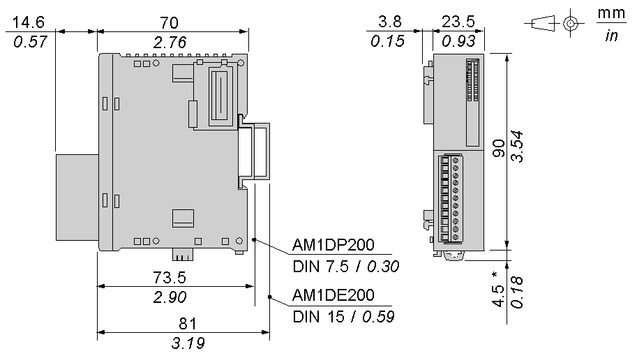

# Characteristics of the TM2AMM3HT Module

Characteristics of the TM2AMM3HT Module

Introduction

This section provides a description of the electrical and the I/O characteristics of the TM2AMM3HT module.

|  |
| --- |
| Danger_Color.gifDANGER |
| FIRE HAZARD |
| Use only the correct wire sizes for the maximum current capacity of the I/O channels and power supplies. |
| Failure to follow these instructions will result in death or serious injury. |

|  |
| --- |
| Warning_Color.gifWARNING |
| UNINTENDED EQUIPMENT OPERATION |
| Do not exceed any of the rated values specified in the environmental and electrical characteristics tables. |
| Failure to follow these instructions can result in death, serious injury, or equipment damage. |

Dimensions

The following diagrams show the dimensions for the TM2AMM3HT analog I/O module.

NOTE: \* 8.5 mm (0.33 in) when the clip-on lock is pulled out.

TM2AMM3HT General Characteristics

|  |  |
| --- | --- |
| Rated power supply voltage | 24 Vdc |
| Power supply range | 19.2 ... 30 Vdc including ripple |
| Connector insertion/removal durability | 100 times minimum |
| Internal 5 Vdc current draw | 50 mA |
| Internal 24 Vdc current draw | 0 mA |
| External 24 Vdc current draw | 50 mA |
| Weight | 85 g (3 oz) |

TM2AMM3HT Input Characteristics

| Characteristic | Voltage input | Current input |
| --- | --- | --- |
| Input range | 0...10 Vdc | 4...20 mA |
| Input impedance | 1 MΩ min. | 10 Ω |
| Sample duration time | 10 ms max. | |
| Total input system transfer time | 60 ms + 1 scan time | |
| Input type | Nondifferential | |
| Operating mode | Self-scan | |
| Conversion mode | ΣΔ type ADC | |
| Input tolerance - maximum deviation at 25°C (77°F) | ±0.2 % of full scale | |
| Input tolerance - temperature drift | ±0.006 % of full scale/°C | |
| Input deviation - repeatable after stabilization time | ±0.5 % of full scale | |
| Input tolerance - nonlinear | ±0.2 % of full scale | |
| Input tolerance - maximum deviation | ±1 % of full scale | |
| Resolution | 12  bits (4096 increments) | |
| Input value of LSB | 2.5 mV | 4.8 μA |
| Data type in application program | 0 to 4095  Scalable to -32768 to 32767 1 | |
| Input data out of range detection | Yes2 | |
| Noise resistance - maximum temporary deviation during perturbations | ±1 % of full scale when a 500 Vdc clamp voltage is applied to the power and I/O wiring | |
| Noise resistance - cable | Twisted-pair shielded cable is necessary | |
| Noise resistance - crosstalk | 2 LSB maximum | |
| Isolation between inputs | None | |
| Isolation between inputs and power supply | 500 Vac | |
| Isolation between inputs, external power supply and internal logic circuits | Photocoupler between input and internal circuit (500 Vac) | |
| Maximum continuous allowed overload (no damage) | 13 Vdc | 40 mA |
| Selection of analog input signal type | Choose current and voltage types using programming software | |
| Calibration or verification to maintain rated accuracy | Approximately 10 years | |

NOTE:

1.The 12-bit data (0 to 4095) processed in the Analog I/O module can be linear-converted to a value between -32768 and 32767. The optional range designation and analog I/O data minimum and maximum values can be selected using data registers allocated to analog I/O modules.

2.When an input error is detected, a corresponding error code is stored to a data register allocated to analog I/O operating status.

TM2AMM3HT Output Characteristics

| Characteristic | Voltage output | Current output |
| --- | --- | --- |
| Output range | 0...10 Vdc | 4...20 mA |
| Load impedance | 2 kΩ minimum | 300 Ω maximum |
| Application load type | Resistive load | |
| Settling time | 10 ms | |
| Total output system transfer Time | 10 ms + 1 scan time | |
| Output tolerance - maximum deviation at 25°C (77°F) | ±0.2 % of full scale | |
| Output tolerance- temperature drift | ±0.015 % of full scale/°C | |
| Output tolerance - repeatable after stabilization time | ±0.5 % of full scale | |
| Output tolerance - output voltage drop | ±1 % of full scale | |
| Output tolerance - nonlinear | ±0.2 % of full scale | |
| Output tolerance - output ripple | 1 LSB maximum | |
| Output tolerance - overshoot | 0% | |
| Output tolerance - total error | ±1% of full scale | |
| Resolution | 12 bits (4096 increments) | |
| Output value of LSB | 2.5 mV | 4.8 μA |
| Data type in application program | 0 to 4095  Scalable to -32768 to 32767 1 | |
| External power supply connection | Detected2 | Detected2 |
| Noise resistance - maximum temporary deviation during perturbations | 1% of full scale | |
| Noise resistance - cable | Twisted-pair shielded cable is necessary for improved noise immunity | |
| Isolation between output and external power supply | 500 Vac | |
| Isolation between output, external power supply and internal logic circuits | 500 Vac by photocoupler | |
| Selection of analog output signal type | Using programming software | |
| Calibration or verification to maintain rated accuracy | Approximately 10 years | |

NOTE:

1.The 12-bit data (0 to 4095) processed in the Analog I/O module can be linear-converted to a value between -32768 and 32767. The optional range designation and analog I/O data minimum and maximum values can be selected using data registers allocated to analog I/O modules.

2.When the external 24 Vdc is not connected, a corresponding error code is stored to a data register allocated to analog I/O operating status.

EIO0000000034.11

© 2020 Schneider Electric. All rights reserved.