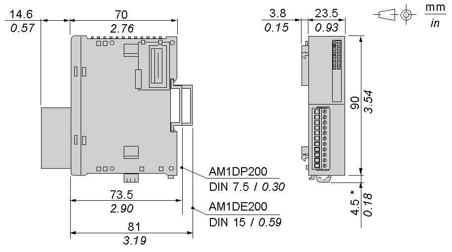

# Characteristics of the TM2ALM3LT Module

Characteristics of the TM2ALM3LT Module

Introduction

This section provides a description of the electrical and the I/O characteristics of the TM2ALM3LT module.

|  |
| --- |
| Danger_Color.gifDANGER |
| FIRE HAZARD |
| Use only the correct wire sizes for the maximum current capacity of the I/O channels and power supplies. |
| Failure to follow these instructions will result in death or serious injury. |

|  |
| --- |
| Warning_Color.gifWARNING |
| UNINTENDED EQUIPMENT OPERATION |
| Do not exceed any of the rated values specified in the environmental and electrical characteristics tables. |
| Failure to follow these instructions can result in death, serious injury, or equipment damage. |

Dimensions

The following diagrams show the dimensions for the TM2ALM3LT analog I/O module.

NOTE: \* 8.5 mm (0.33 in) when the clip-on lock is pulled out.

TM2ALM3LT General Characteristics

|  |  |
| --- | --- |
| Rated power voltage | 24 Vdc |
| Allowable voltage range | 19.2...30 Vdc including ripple |
| Connector insertion/removal durability | 100 times minimum |
| Internal 5 Vdc current draw | 50 mA |
| Internal 24 Vdc current draw | 0 mA |
| External 24 Vdc current draw | 80 mA |
| Weight | 85 g (3 oz) |

TM2ALM3LT Input Characteristics

| Characteristic | Thermocouple input | Temperature probe input |
| --- | --- | --- |
| Input range | Type K: 0...1300 °C  (32...2372 °F)  Type J: 0...1200 °C  (32...2192 °F)  Type T: 0...400 °C  (32...752 °F) | (RTD)  Pt 100  3-wire type  -100...500 °C (-148...932 °F) |
| Input impedance | 250 Ω min (TBC) | 1 MΩ min |
| Sample duration time | 20 ms max | |
| Total input system transfer time | 80 ms + 1 scan time | |
| Input type | Differential | |
| Operating mode | Self-scan | |
| Conversion mode | ΣΔ type ADC | |
| Input tolerance - maximum deviation at 25°C (77°F) | ±0.2 % of full scale plus reference junction compensation accuracy ±4°C max | ±0.2 % of full scale |
| Input tolerance - temperature drift | ±0.006 % of full scale/°C | |
| Input tolerance - repeatable after stabilization time | ±0.5 % of full scale | |
| Input tolerance - nonlinear | ±0.2 % of full scale | |
| Input tolerance - maximum deviation | ±1 % of full scale | |
| Resolution | Type K and J: 14 bits  Type T: 12 bits | |
| Input value of LSB | K: 0.1 °C (32.18 °F)  J: 0.1 °C (32.18 °F)  T: 0.1 °C (32.18 °F) | 0.1 °C (32.18 °F) |
| Data type in application program | 0 to 4095  Scalable to -32768 to 32767 1 | |
| Input data out of range detection | Yes2 | |
| Noise resistance - maximum temporary deviation during perturbations | ±3 % maximum when a 500 Vdc clamp voltage is applied to the power and I/O wiring | PT 100: ±1% of full scale |
| Noise resistance - cable | Twisted-pair shielded cable is necessary | |
| Isolation between output and external power supply | 500 Vac | |
| Isolation between output, power supply and internal logic circuits | 500 Vac by photocoupler | |
| Selection of analog input signal type | Using software programming. It is possible to mix the type of input on the module. | |
| Calibration or verification to maintain rated accuracy | Approximately 10 years | |

NOTE:

1.The 12, 13 or 14-bit data (0 to 4095) and 10-bit data (0 to 1023) processed in the Analog I/O module can be linear-converted to a value between -32768 and 32767. The optional range designation and analog I/O data minimum and maximum values can be selected using data registers allocated to analog I/O modules.

2.When an input error is detected, a corresponding error code is stored to a data register allocated to analog I/O operating status.

TM2ALM3LT Output Characteristics

| Characteristic | Voltage output | Current output |
| --- | --- | --- |
| Output range | 0...10 Vdc | 4...20 mA |
| Load impedance | > 2 kΩ | 300 Ω maximum |
| Application load type | Resistive load | |
| Settling time | 10 ms | |
| Total output system transfer Time | 10 ms + 1 scan time | |
| Output tolerance - maximum deviation at 25°C (77°F) | ±0.2% of full scale | |
| Output tolerance - temperature drift | ±0.015% of full scale/°C | |
| Output tolerance - repeatable after stabilization time | ±0.5 % of full scale | |
| Output tolerance - output voltage drop | ±1% of full scale | |
| Output tolerance - nonlinear | ±0.2% of full scale | |
| Output tolerance - output ripple | 1 LSB maximum | |
| Output tolerance - overshoot | 0% | |
| Output tolerance - total deviation | ±1% of full scale | |
| Resolution | 12 bits (4096 increments) | |
| Output value of LSB | 2.5 mV | 4.8 μA |
| Data type in application program | 0 to 4095  Scalable to -32768 to 32767 1 | |
| External power supply connection | Detected | Detected2 |
| Noise resistance - maximum temporary deviation during perturbations | ±1% of full scale | |
| Noise resistance - cable | Twisted-pair shielded cable is necessary | |
| Isolation between output and external power supply | 500 Vac | |
| Isolation between inputs, power supply and internal logic circuits | 500 Vac by photocoupler | |
| Selection of analog output signal type | Using programming software | |
| Calibration or verification to maintain rated accuracy | Approximately 10 years | |

NOTE:

1.The 12-bit data (0 to 4095) and 10-bit data (0 to 1023) processed in the Analog I/O module can be linear-converted to a value between -32768 and 32767. The optional range designation and analog I/O data minimum and maximum values can be selected using data registers allocated to analog I/O modules.

2.When an output error is detected, a corresponding error code is stored to a data register allocated to analog I/O operating status.

EIO0000000034.11

© 2020 Schneider Electric. All rights reserved.