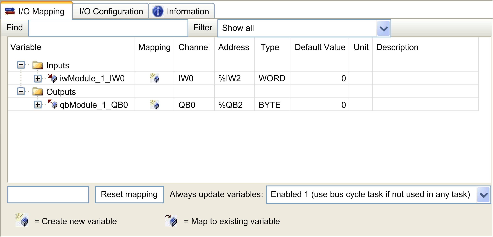
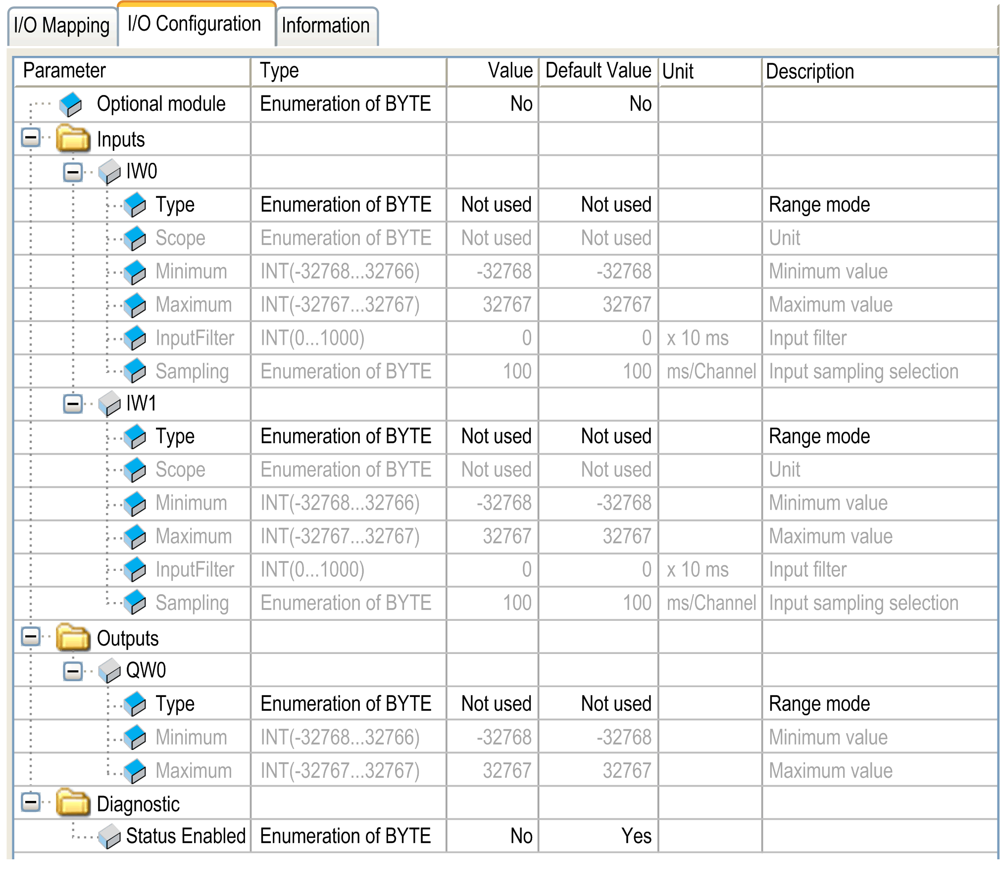

# Adding an Expansion Module

## Adding a Module

To add an expansion module to your controller or a bus coupler, select the expansion module in the Hardware Catalog, drag it to the Devices tree, and drop it on one of the highlighted nodes.

For more information on adding a device to your project, refer to:

• Using the [Drag-and-drop Method](../../../../../api/crossBook?lang=en-US&virtualBookName=SoMProg&topicID=D_SE_0083368)

• Using the [Contextual Menu or Plus Button](../../../../../api/crossBook?lang=en-US&virtualBookName=SoMProg&topicID=D_SE_0083370)

## I/O Mapping Tab

The I/O mapping of an expansion module is carried out through the I/O Mapping tab of the expansion module configuration.

This table describes how to configure an expansion module:

| Step | Action |
| --- | --- |
| 1 | Double-click the expansion module node in the Devices tree to display the I/O Mapping tab. |
| 2 | Edit the parameters of the I/O Mapping tab to configure the expansion module. |

This figure shows the I/O Mapping tab:

This table describes each parameter of the I/O Mapping tab:

| Parameter | Description |
| --- | --- |
| Variable | Allows you to map the channel on a variable.  NOTE: Expand the list of variables from the category Inputs or Outputs.  You can map a channel by either creating a new variable or mapping to an existing variable.  Create new variable:  Double-click the variable to enter the new variable name. A new variable is created if the variable does not already exist.  Map to existing variable:  Double-click the variable and click [...] to open the Input Assistant window. Select the variable from the list and press OK.  This figure shows the Input Assistant window: |
| Mapping | Indicates whether the channel is mapped on a new variable or an existing variable. |
| Channel | Displays the channel name of the device. |
| Address | Displays the address of the channel.  NOTE: If the channel is mapped to an existing variable, corresponding address appears as strikethrough text in the table. |
| Type | Displays the data type of the channel. |
| Default Value | Indicates the value taken by the output when the controller is in a STOPPED or HALT state.  Double-click the cell to change the default value.  You can toggle between the following values:   * No value (*empty cell*) * TRUE * FALSE |
| Unit | Displays the unit of the channel value. |
| Description | Allows you to enter a short description of the channel. |

## I/O Configuration Tab

This tab allows you to configure the module as an optional module. The following illustration is an example showing the I/O Configuration tab:

EIO0000003643.07