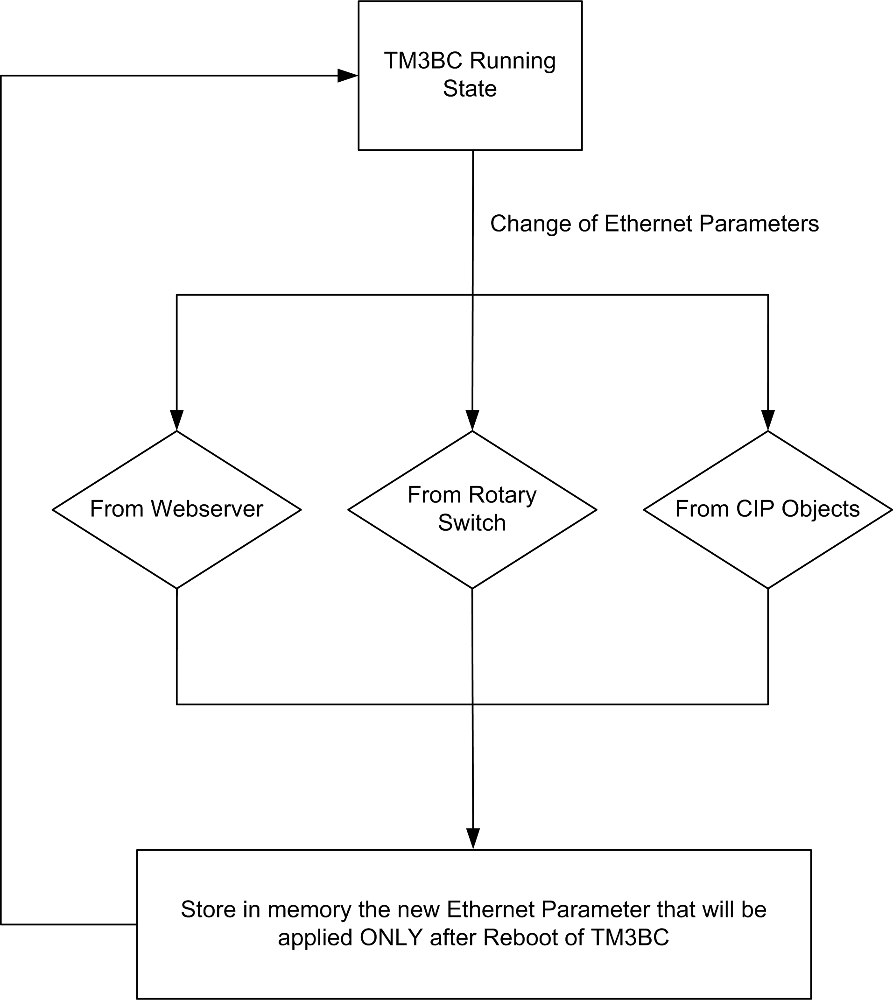
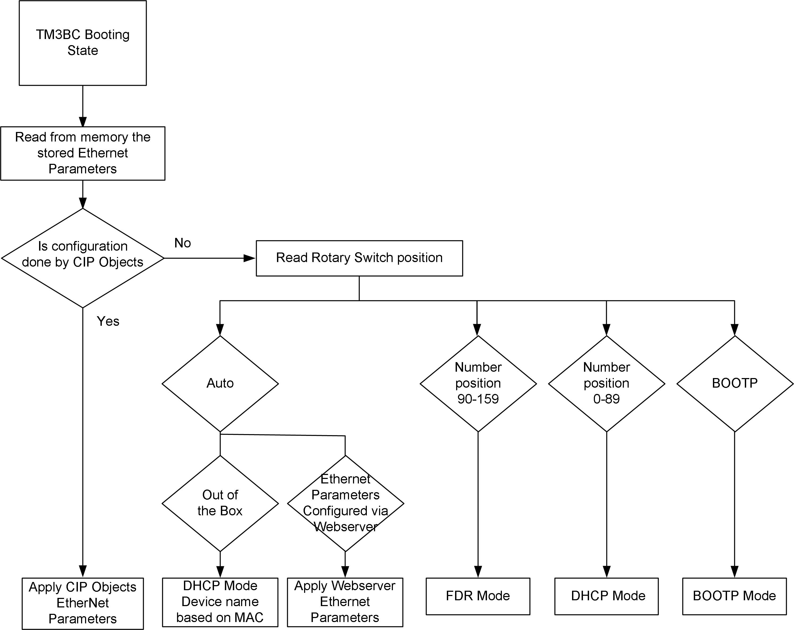

# Ethernet Parameters

## Ethernet Configuration During Running and Booting States

The following diagram shows the different ways to change the Ethernet parameters of the TM3 Ethernet bus coupler:

The following diagram shows boot process to apply the Ethernet parameters to the TM3 Ethernet bus coupler:

NOTE: After a reset to factory settings, TM3BCEIP has the following default values:

Mode: DHCP

Device Name: TM3BCEIP\_MAC4MAC5MAC6

For example, if the MAC address of the TM3BCEIP is 00:80:f4:91:bf:b1 then its device name is: TM3BCEIP\_91bfb1.

NOTE: If no DHCP server is present, bus coupler uses its default IP address: 10.10.MAC5.MAC6.

NOTE: If multiple changes have been made, only the last one is taken into account after reboot of the TM3 Ethernet bus coupler.

A change in rotary switch position during the running state of TM3 Ethernet Bus Coupler results in the replacement of the Ethernet configuration done with CIP object only after reboot.

A change in the Ethernet parameters through Web server during the running state of TM3 Ethernet Bus Coupler results in the replacement of the Ethernet configuration done with CIP object only after reboot.

A change in the Ethernet parameters with CIP objects during the running state of TM3 Ethernet Bus Coupler is applied after reboot, regardless of the position of the rotary switches.

EIO0000003643.07