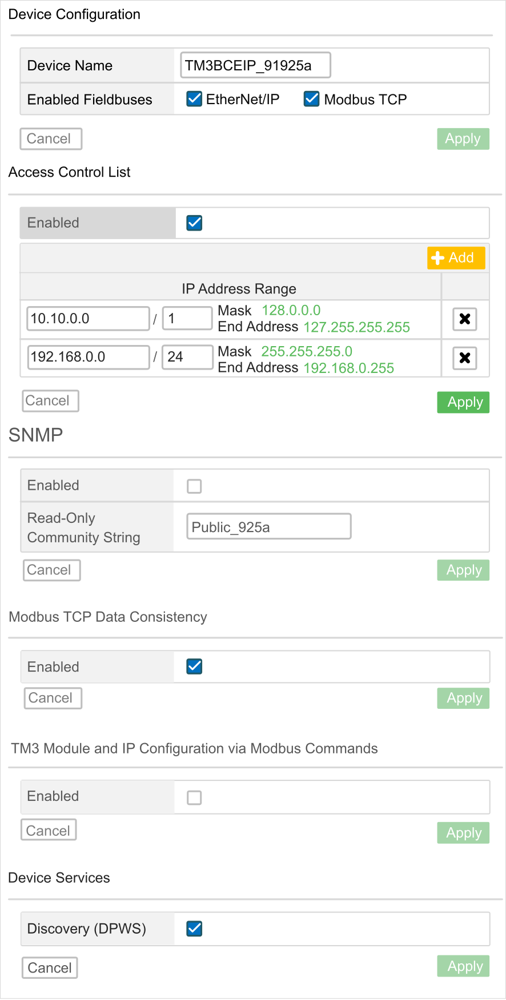

# Web Server

## Introduction

The TM3 bus coupler supports a Web server, offering access to information such as configuration data, module status, I/O data, network statistics, and diagnostic information.

In addition the Web server allows you to monitor this information, the bus coupler network and I/O remotely.

You can access the Web server with HTTPS (secured connections). HTTP (non secured connections) is not supported.

The Web server is accessible through the bus coupler [USB port](D-SE-0096089.html#D-SE-0096089__D-SE-0096089.3) and  Ethernet port by specifying the IP address or hostname in the address bar. You can use the pages of the Web server for network setup and control the I/O module outputs as well as application diagnostics and monitoring.

Use a PC providing a USB port and/or an  Ethernet interface to connect to the Web server by using a Web browser.

The Web server can be accessed by the web browsers listed below:

* Google Chrome (version ≥ 71)
* Mozilla Firefox (version ≥ 64)
* Microsoft Edge (version ≥ 42)

The Web server allows you to monitor a bus coupler remotely, to perform various maintenance activities including modifications to output modules data and network configuration parameters. Care must be taken to ensure that the immediate physical environment of the machine and process is in a state that will not present safety risks to people or property before exercising control remotely.

| WARNING | |
| --- | --- |
|  | UNINTENDED EQUIPMENT OPERATION  * Define a secure password for the Web server, and do not allow unauthorized or otherwise unqualified personnel to use this feature. * Ensure that there is a local, competent, and qualified observer present when operating on the controller from a remote location. * You must have a complete understanding of the application and the machine/process it is controlling before attempting to adjust data, stopping an application that is operating, or starting the controller remotely. * Take the precautions necessary to ensure that you are operating on the intended controller by having clear, identifying documentation within the controller application and its remote connection.  Failure to follow these instructions can result in death, serious injury, or equipment damage. |

NOTE: The Web server must only be used by authorized and qualified personnel. A qualified person is one who has the skills and knowledge related to the construction and operation of the machine and the process controlled by the application and its installation, and has received safety training to recognize and avoid the hazards involved.

## Web Server Access

You can manage the user accounts on the Web server on [MAINTENANCE / User Accounts](#D-SE-0089997__D-SE-0089997.37).

By default, the user name is Administrator, and the password is Administrator. You must change the password at the first login.

| WARNING | |
| --- | --- |
|  | UNAUTHORIZED DATA ACCESS  * Do not expose the device or device network to public networks and the Internet as much as possible. * Immediately change the default password to a new secure password. * Do not distribute passwords to unauthorized or otherwise unqualified personnel. * Restrict access to unauthorized personnel. * Use additional security layers like VPN for remote access and install firewall mechanisms. * Validate the effectiveness of these measurements regularly and frequently.  Failure to follow these instructions can result in death, serious injury, or equipment damage. |

NOTE: A secure password is one that has not been shared or distributed to any unauthorized personnel and does not contain any personal or otherwise obvious information. Further, a mix of upper and lower case letters and numbers offer greater security. You should choose a password length of at least ten characters.

## Resetting the Password

To reset the password:

| Step | Action |
| --- | --- |
| 1 | Connect to the bus coupler using the USB port. Ensure the Ethernet cable is disconnected. |
| 2 | Open the browser. |
| 3 | Enter the IP address 90.0.0.1. |
| 4 | Move the position of any rotary switch to any other position.  **Result:** **MS** LED is flashing red. The Restore user accounts button is displayed. |
| 5 | Click Restore user accounts. |
| 6 | Move the position of the changed rotary switch to its previous position.  **Result:** The Restore user accounts button is no longer displayed. |

## Login Page

The login page is the entry point to get authenticated by the Web server. [The certificate must be validated](D-SE-0104758.html#D-SE-0104758). To access the website login page shown in the following illustration, type in your navigator the IP address of the TM3 bus coupler or IP address 90.0.0.1 if you are connected by USB. To login to the Web server, enter the user name and password and click Login.

The Web server contains the following pages:

* [HOME](#D-SE-0089997__D-SE-0089997.30)
* [DIAGNOSTICS](#D-SE-0089997__D-SE-0089997.32)
* [CONFIGURATION](#D-SE-0089997__D-SE-0089997.50)
* [MONITORING](#D-SE-0089997__D-SE-0089997.31)
* [MAINTENANCE](#D-SE-0089997__D-SE-0089997.33)

NOTE: The timeout session for each login is ten minutes. When you do not perform any action after you logged in, it redirects you to the login page if you click any button. You need to log in again with user name and password to access the web pages.

## HOME Page

The HOME page shows the product details of TM3 bus coupler.

The identification section of HOME page consists of:

| Element | Description |
| --- | --- |
| Identification | |
| Vendor ID | Vendor ID of the bus coupler |
| Vendor Name | Vendor name of the bus coupler |
| Product ID | Product ID of the bus coupler |
| Product Name | Product name of the bus coupler |
| Product Reference | Product reference of the bus coupler |
| Serial Number | Serial number of the bus coupler |
| Locate Device | Click the button to locate the bus coupler. The LEDs of the bus coupler flash red for few seconds. |

## DIAGNOSTICS Page

The DIAGNOSTICS page displays the status of the bus coupler.

The DIAGNOSTICS page contains the following sub-pages:

* [Device](#D-SE-0089997__D-SE-0089997.42)
* [Ethernet](#D-SE-0089997__D-SE-0089997.43)
* [EtherNet/IP](#D-SE-0089997__D-SE-0089997.45)
* [Modbus TCP](#D-SE-0089997__D-SE-0089997.49)

## DIAGNOSTICS / Device

The Device sub-page displays the status of the bus coupler and details about [identification](#D-SE-0089997__D-SE-0089997.30):

| Element | Description |
| --- | --- |
| Status | |
| Last Stop Cause | Displays the cause of the last stop of the bus coupler. |
| USB Port | Displays whether a USB cable is connected to the bus coupler. |
| Operating Mode | Displays one of the following operating modes of the bus coupler:   * Idle * EtherNet/IP * Modbus TCP * Web interface * Firmware update in progress * Time Out |
| Configuration Status | Displays one of the following configuration status of the bus coupler:   * Not Configured * Configured |

## DIAGNOSTICS / Ethernet

The Ethernet sub-page displays the configuration and status of Ethernet connection:

| Element | Description |
| --- | --- |
| Configuration | |
| MAC Address | MAC address of the bus coupler. |
| Mode | Displays the IP mode of the bus coupler:   * DHCP * BOOTP * Manual * FDR |
| IP Address | IP address of the bus coupler |
| Subnet Mask | Subnet mask of the bus coupler |
| Gateway Address | Gateway address of the bus coupler |
| Reset | Resets all the counter values to zero. |
| Refresh | Refreshes the values. |
| Statistics | |
| TXBytes | Displays the number of the bytes transmitted. |
| TX Frames | Displays the number of frames transmitted. |
| ErroneousTXFrames | Displays the number of the frames transmitted in error. |
| RxBytes | Displays the number of the bytes received. |
| RX Frames | Displays the number of frames received. |
| ErroneousRXFrames | Displays the number of the frames received in error. |
| Reset | Resets all the counter values to zero. |
| Refresh | Refreshes the values. |
| Rapid Spanning-Tree Protocol (RSTP) | |
| Service Status | Displays one of the following status of the bus coupler:   * Running * Stopped |
| Bridge ID | Made from the Bridge Priority and the MAC address. |
| Bridge Priority | Read only. The Bridge Priority is defined in [MAINTENANCE / Ethernet](#D-SE-0089997__D-SE-0089997.39). |
| Port State (1) | Displays one of the following states of the **CN1** port:   * Disabled * Discarding * Learning * Forwarding |
| Port Role (1) | Displays one of the following roles of the **CN1** port:   * Root * Designated * Backup * Alternate * Disabled |
| Port State (2) | Displays one of the following states of the **CN2** port:   * Disabled * Discarding * Learning * Forwarding |
| Port Role (2) | Displays one of the following roles of the **CN2** port:   * Root * Designated * Backup * Alternate * Disabled |
| Refresh | Refreshes the values. |

## DIAGNOSTICS / EtherNet/IP

The EtherNet/IP sub-page displays the status information of EtherNet/IP:

| Element | Description |
| --- | --- |
| Reset | Resets all the counter values to zero. |
| Refresh | Refreshes the values. |
| Statistics | |
| TX I/O Messages | Displays the number of I/O messages transmitted through EtherNet/IP. |
| RX I/O Messages | Displays the number of I/O messages received through EtherNet/IP. |
| Failed TX I/O Messages | Displays the number of erroneous I/O messages that were not transmitted through EtherNet/IP. |
| Failed RX I/O Messages | Displays the number of erroneous I/O messages that were not received through EtherNet/IP. |
| UCMM Requests | Displays the number of UCMM requests. |

## DIAGNOSTICS / Modbus TCP

The Modbus TCP sub-page displays the status information of Modbus TCP:

| Element | Description |
| --- | --- |
| Reset | Resets all the counter values to zero. |
| Refresh | Refreshes the values. |
| Statistics | |
| TX Messages | Displays the number of Modbus messages transmitted through Modbus TCP. |
| RX Messages | Displays the number of Modbus messages received through Modbus TCP. |
| Error Messages | Displays the number of Modbus detected error messages transmitted through Modbus TCP. |

## CONFIGURATION

The CONFIGURATION page displays the I/O modules configuration imported from the TM3 Bus Coupler IO Configurator. The configuration file is an .SPF format.

| Element | Description |
| --- | --- |
| PROJECT toolbar | |
| New | Read only button. |
| Open | Allows you to import the I/O modules configuration files generated by the TM3 Bus Coupler IO Configurator. Click Open to import the files. |
| Save | Read only button. |
| CONFIGURATION toolbar | |
| Apply | Allows you to apply the I/O modules configuration files on the TM3 bus coupler. If the configuration mismatch the hardware, an error message is generated. |
| DEVICES toolbar | Read only toolbar. |

## MONITORING Page

The MONITORING page displays the TM2 and TM3 expansion modules that are connected to the TM3 bus coupler.

MONITORING page without detected modules:

MONITORING page with modules and details:

**1** Bus Monitoring

**2** Selected module

**3** Reconcile button

**4** Module details

The MONITORING page shows and describes all the modules detected by the bus coupler and allows you to:

* See the state of a selected module (running or not running) and the protocol used.
* Read the value of an input or output.
* Force a value to an output by clicking Force.
* Identify a module by clicking Reconcile.

| Element | Description |
| --- | --- |
| Detect | Allows you to detect the modules connected to the bus coupler. |
| Take Bus Ownership  Release Bus Ownership | Reserves the bus to allow you to force the module outputs. You can click the button when the bus coupler is configured and not controlled by a controller (EtherNet/IP or Modbus TCP)(1).  **Result**: You are notified that the I/O bus is controlled by the Web interface. You can edit the output values.  Click Release Bus Ownership to release the control of the I/O bus. |
| **(1)** When connected on EtherNet/IP, the I/O bus is controlled, no matter the controller state. When connected on Modbus TCP, the I/O bus is not controlled when the controller is in `STOPPED` state. | |

**Module Details**

The module details view provides the following data:

* Module name and description
* Module state
* A list of its I/Os

  This list of I/Os allows you to view a real-time value of an input and to write the value of an output.

The view has DISPLAY buttons to modify the format of the displayed values.

**Output Forcing**

1. When Take Bus Ownership is enabled, click a module to force its outputs.
2. Set the output values you wish to force for the module in the Prepared Values column of the list of its I/Os.
3. Click the Force button.

   **Result:** A message is displayed.
4. Click I agree to validate the modifications and send them to the bus coupler.

   Click I disagree to cancel the modifications.

As the modules are not identified automatically, click the Reconcile button to identify the modules.

## MAINTENANCE Page

The MAINTENANCE page allows you to view and edit the configuration of the bus coupler.

The MAINTENANCE page contains the following sub-pages:

* [User Accounts](#D-SE-0089997__D-SE-0089997.37)
* [Setup](#D-SE-0089997__D-SE-0089997.38)
* [Ethernet](#D-SE-0089997__D-SE-0089997.39)
* [Firmware](#D-SE-0089997__D-SE-0089997.40)
* [Modules Firmware](#D-SE-0089997__D-SE-0089997.51)
* [System Log Files](#D-SE-0089997__D-SE-0089997.41)
* [Fast Device Replacement (FDR)](#D-SE-0089997__D-SE-0089997.53)

## MAINTENANCE / User Accounts

The sub-page allows you to enter your login password to access the Web server:

| Element | Description |
| --- | --- |
| Account Management  Select an account to edit it | |
| User Name | List of the following user accounts:   * Administrator  The Administrator account is configured with a predefined password (Administrator / Administrator). Modify the predefined password after the first connection. * Operator  This account is disabled by default. * Viewer  This account is disabled by default.   NOTE: Depending on your account, you have access to some web pages. See the table below for the accessible web pages. |
| Enabled | Selected if the account is enabled. |
| Account Management  Provide a new password for account | |
| Current Password | Enter the current password of the user account. |
| New Password | Enter a password for the user account.  NOTE: Minimum ten characters, maximum 32 characters and use a...z, A...Z, 0...9 alphanumeric characters. To reset the password, refer to [Resetting the Password](#D-SE-0089997__D-SE-0089997.48). |
| Confirm New Password | Enter the password again of the selected account. |
| Apply | Saves your new password. |

This table describes the accessible pages depending on the user account:

| Web pages | Sub pages | Administrator | Operator | Viewer |
| --- | --- | --- | --- | --- |
| HOME | – | ✓ | ✓ | ✓ |
| MONITORING | – | ✓ | ✓ | – |
| DIAGNOSTICS | Device | ✓ | ✓ | ✓ |
| Ethernet | ✓ | ✓ | ✓ |
| EtherNet/IP | ✓ | ✓ | ✓ |
| Modbus TCP | ✓ | ✓ | ✓ |
| CONFIGURATION | – | ✓ | – | – |
| MAINTENANCE | Setup | ✓ | – | – |
| Ethernet | ✓ | – | – |
| User Accounts | ✓ | ✓(1) | ✓(1) |
| Firmware | ✓ | – | – |
| System Log Files  - Syslog Server | ✓ | ✓ | – |
| – |
| FDR | ✓ | – | – |
| **(1)** You can only modify your user account. | | | | |

System Use Notification

The sub-page allows you to define a System Use Notification message which is displayed to users at log-in:

| Element | Description |
| --- | --- |
| System Use Notification | |
| Enabled | When selected, you can define a message that is displayed at log-in. |
| Message | Displays the message defined. |
| Reset | Reset to default message. |
| Apply | Applies your changes. |

## MAINTENANCE / Setup

The following illustration shows the Setup sub-page:

The Setup sub-page allows you to change the configuration settings of the bus coupler:

| Page | Description |
| --- | --- |
| Device Configuration | |
| Device Name | Name of the bus coupler used in DHCP mode.  If you modified the Device Name, do a power cycle of the bus coupler to take it into account. |
| Enabled Fieldbuses | Allows you to select the communication types:   * EtherNet/IP * Modbus TCP |
| Cancel | Cancels the configuration settings. |
| Apply (1) | Saves the configuration settings. |
| Access Control List (ACL) | |
| Enabled | Enables or disables the ACL management. Enable it to configure the IP address ranges allowed to communicate with the bus coupler. |
| Add | Adds a line of IP address range. |
| IP Address Range | Shows the ranges of IP addresses.  Each line corresponds to an IP address range allowed to communicate with the bus coupler. The first field represents the starting IP address. The second one is the number of free bits.  The maximum number of ranges is 10. |
| Cancel | Cancels the configuration settings. |
| Apply (1) | Saves the configuration settings. |
| SNMP | |
| Enabled | Enables or disables the SNMP management. Disabled by default. |
| Read-Only Community String | Shows the community name. Allows you to change the community name. The maximum number of characters is 16. |
| Cancel | Cancels the configuration settings. |
| Apply (1) | Saves the configuration settings. |
| Modbus TCP Data Consistency | |
| Enabled | Allows an internal copy of the input data registers (3000-3499 or 13000-13499) to be kept since the first read request is received until the second read request is received OR until the monitoring timeout is elapsed.  Is enabled by default when the I/O modules configuration need more than 124 words to read the data of the input. |
| Cancel | Cancels the configuration settings. |
| Apply (1) | Saves the configuration settings. |
| TM3 Module and IP Configuration via Modbus Commands | |
| Enabled | Allows controller to send TM3 configuration through Modbus requests. |
| Cancel | Cancels the configuration settings. |
| Apply (1) | Saves the configuration settings. |
| Device Services | |
| Discovery (DPWS) | Allows the bus coupler to be located in the LAN using IPv6 or IPv4. Enabled by default. |
| Cancel | Cancels the configuration settings. |
| Apply (1) | Saves the configuration settings. |
| **(1)** Modifying the Setup configuration requires a power cycle of the bus coupler to apply the configuration settings. | |

## MAINTENANCE / Ethernet

The Ethernet sub-page allows you to change the network settings:

| Element | Description |
| --- | --- |
| Network Configuration | |
| Mode | Allows you to select the following [operating modes](../../../../../api/crossBook?lang=en-US&virtualBookName=tm3bchw&topicID=D_SE_0084865) of the bus coupler:   * Manual * DHCP * BOOTP |
| IP Address | IP address of the bus coupler. For more information, refer to [TM3 Bus Coupler - Hardware Guide](../../../../../api/crossBook?lang=en-US&virtualBookName=tm3bchw&topicID=D_SE_0084865). |
| Subnet Mask | Subnet mask of the bus coupler. |
| Gateway Address | Gateway address of the bus coupler. |
| Apply(1) | Saves the configuration settings. |
| Cancel | Cancels the configuration settings. |
| Ping Test | |
| Target IP Address | Allows you to enter the target IP address to check if the bus coupler can reach the device on the network. |
| Ping | Sends a message to the IP address. |
| RSTP Configuration | |
| Enabled | Enables or disables the RSTP configuration. |
| Bridge Priority | Configure the switch priority to be chosen as the root switch. A low number represents a high priority. |
| Hello Time (milliseconds) | Read only tab. Interval between the generation of spanning-tree configuration messages by the root switch. These messages mean that the switch is operational. |
| Maximum Age (milliseconds) | Read only tab. The number of seconds a switch waits without receiving spanning-tree configuration messages before attempting a configuration. |
| Forward Delay (milliseconds) | Read only tab. The number of seconds the port waits before changing from its spanning-tree learning and listening states to the forwarding state. |
| **(1)** Modifying the Ethernet configuration requires a power cycle of the bus coupler to apply the configuration settings. | |

## MAINTENANCE / Firmware

The Firmware sub-page shows the firmware version of the TM3 bus coupler and allows you to update its firmware:

| Element | Description |
| --- | --- |
| Current Firmware | |
| Firmware | Firmware version |
| Web interface | Web server version |
| Firmware Update  Select a new firmware version | |
| Select | Allows you to select the new firmware file for the bus coupler. |
| Apply | Allows you to apply the new firmware. |

NOTE: You cannot update the firmware when the TM3 bus coupler cyclically exchanges data with the logic/motion controller. To make sure the bus coupler is not exchanging data, see [**MONITORING**](#D-SE-0089997__D-SE-0089997.31).

To update the bus coupler firmware:

| Step | Action |
| --- | --- |
| 1 | Log into the Web server. Refer to the instructions provided by the Web server [Login Page](#D-SE-0089997__D-SE-0089997.29). |
| 2 | Verify in the MONITORING page that the bus coupler is not exchanging data with the controller. |
| 3 | Click MAINTENANCE > Firmware. |
| 4 | Click Select, then select the firmware file.  **Result**: The following information is displayed: |
| 5 | Read the information carefully and, if you agree, click I Agree.  **Result**: At the end of the download and verification of the file, a confirmation window is displayed. |
| 6 | Click Yes to close the confirmation window, then click Apply.  **Result**: At the end of the firmware update, a message is displayed to inform you whether the firmware update is completed successfully. |

NOTE: Do not remove power from the bus coupler while performing the firmware update. If the power is interrupted while installing the new firmware, you may need to wait a few minutes for the installation process to finalize at the next power-up. Until then the Web server may not be accessible.

## MAINTENANCE / Modules Firmware

The Modules Firmware sub-page shows the firmware version of the modules configured and allows you to update its firmware:

| Element | Description |
| --- | --- |
| Modules Firmware Overview | |
| Slot | Slot number of the module |
| Reference | Reference of the module |
| Current Firmware | Firmware version of the module |
| Modules Firmware Management  Select a new firmware version | |
| Select | Allows you to select the new firmware file for the module.  NOTE: You can select only a single firmware file. All modules on the bus corresponding to the selected firmware are updated. |
| Apply | Allows you to apply the new firmware. |

NOTE: You cannot update the firmware when the TM3 bus coupler cyclically exchanges data with the logic/motion controller. To make sure the bus coupler is not exchanging data, see [**MONITORING**](#D-SE-0089997__D-SE-0089997.31).

NOTE: Firmware update is not supported by TM3DM16R and TM3DM32R expansion modules.

To update the module firmware:

| Step | Action | |
| --- | --- | --- |
| 1 | Log into the Web server. Refer to the instructions provided by the Web server [Login Page](#D-SE-0089997__D-SE-0089997.29). | |
| 2 | Verify in the MONITORING page that the bus coupler is not exchanging data with the controller. | |
| 3 | Click MAINTENANCE > Modules Firmware. | |
| 4 | Click Select, then select the firmware file.  **Result**: The firmware file is selected. | |
| 5 | Click Apply.  **Result**: The following information is displayed: | |
| 6 | Read the information carefully and, if you agree, click I Agree.  **Result**: A restart window is displayed. | |
| 7 | Click Yes to proceed.  **Result**: The file is verified and downloaded. The TM3 bus coupler reboots and a confirmation message is displayed. | |
| 8 | After the confirmation message is displayed, remove power from the bus coupler (and TM3XREC1 receiver module, if any). | |
| 9 | Restore power to the bus coupler (and TM3XREC1 receiver module, if any).  **Result**: The module firmware is updated. | |

## MAINTENANCE / System Log Files

The System Log Files sub-page lists the log files. Some of the information in the log files comes from internal interactions of the firmware and is intended to be used by Schneider Electric Technical Support:

| Element | Description |
| --- | --- |
| Log Files | |
| Name | Shows the list of the log files. |
| Size | Displays the size of the log files. |
| Download | Allows you to download the log files. |
| SysLog Server | |
| Enabled | Enable or disable the **SysLog Client**. Disabled by default. |
| Port (TCP) | Read-only tab. TCP port number for SysLog Server. |
| IP Address | Allows you to set the SysLog Server IP Address. |
| Cancel | Cancels the configuration settings. |
| Apply | Saves the configuration settings. |
| Action | |
| Send Test Message | Allows you to send a test message stored under the folder /usr/Syslog. |

## MAINTENANCE / Fast Device Replacement (FDR)

FDR mode activation:

The Fast Device Replacement (FDR) service allows you to replace an inoperable device by a new one without the need to configure it.

| Mode | Rotary switches position | |
| --- | --- | --- |
| FDR mode enabled | **TENS**: 09 to 15 | **ONES**: 0 to 9 |

| Element | Description |
| --- | --- |
| Device Configuration | |
| Device Name | Name of the bus coupler. Syntax is TM3BCEIP\_+XXY (XX represents **TENS** switch position and Y represents **ONES** rotary switch position).  NOTE: If the bus coupler is in AUTO mode, the name might not respect this syntax. |
| Ethernet Mode | * Manual * DHCP * BOOTP * FDR |
| FDR Configuration | |
| Status | * Enabled * Disabled |
| Auto backup | Allows you to enable or disable the automatic backup. When the TM3BCEIP is selected, it sends the .prm file to the FDR server, respecting the timing configured in the automatic backup period. |
| Auto backup period (seconds) | Allows you to set the backup period (600-90000 seconds). Default value for the backup period is 1800 seconds. |
| ControlConfiguration | When FDR is enabled and Auto backup is unchecked   * Server: at boot, the TM3BCEIP requests for the prm.file and applies the configuration. * Stored: at boot, the TM3BCEIP does not request for the prm.file and applies the existing configuration.   When FDR is enabled and Auto backup is checked with a Backup period of 600 seconds:   * Server: at boot, the TM3BCEIP requests for the prm.file and applies the configuration. The TM3BCEIP generates and pushes the prm.file to the server each 600 seconds. * Stored: at boot, the TM3BCEIP does not request for the prm.file and applies the existing configuration. The TM3BCEIP generates and pushes the prm.file to the server each 600 seconds. |
| Cancel | Cancels any changes made to the values. |
| Apply | Saves the values to the Flash memory. |
| FDR Restore | |
| Current State | * Idle * RestoreInProgress * Error |
| LastError | * No Error * EmptyFile * NoFile * ServerNotFound * GenericError |
| Restore Config | Allows you to manually restore (by downloading) the device parameters file from the FDR server to the bus coupler and to apply the configuration received without restarting. This button cannot be clicked when the bus coupler is controlled by the controller or by the Web. |
| FDR Push | |
| Current State | * Idle * ConfigurationPushCompleted * Error |
| LastError | * No Error * EmptyFile * NoFile * ServerNotFound * GenericError |
| Push Config | Allows you to manually backup (by uploading) the device parameters file from the bus coupler to the FDR server. |

EIO0000003643.07