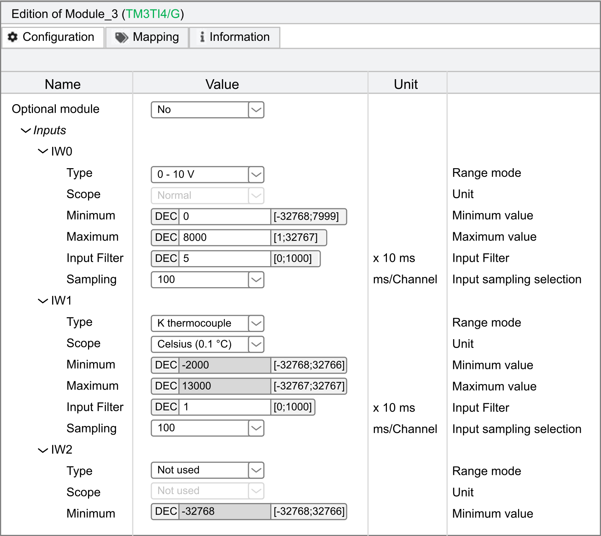

# TM3 Configuration through Modbus Command

## Introduction

This section describes how to send TM3 configuration through Modbus command from a controller. The tables used for this configuration mode are in the appendices. Refer to [Direct TM3 Configuration through Modbus Commands](TM3ConfigurationThroughModbusTables-03E85743.html#TM3ConfigurationThroughModbusTables-03E85743).

## TM3 Module Support

The following modules are supported:

* TM3 Digital (TM3D•) except TM3DM16R and TM3DM32R
* TM3 Analog (TM3A•/T•)
* TM3 Safety (TM3S•)
* TM3 TeSys (TM3XTYS4)
* TM3 Transmitter and Receiver (TM3XTRA1, TM3XREC1)

Limitations and specific notes:

* TM3 optional configuration are not supported by this feature
* Fallback configuration for TM3 analog output is also supported by bus coupler through this feature. Fallback values, if configured, is applied by the bus coupler to the output of analog expansion modules in the following scenarios:

  + fieldbus communication timeout
  + after releasing bus ownership in Web server
* The transmitter and receiver modules are transparent to the bus couplers. Therefore, you must define which is the first module after the TM3XREC1 module in a remote configuration by defining the value in First module after expander register.

| WARNING | |
| --- | --- |
|  | UNINTENDED Machine OPERATION  * Set the value in “First module after expander” register to match the physical configuration. * Refer to appropriate section on how to configure the transmitter and receiver modules.  Failure to follow these instructions can result in death, serious injury, or equipment damage. |

NOTE: For detailed description of the registers, refer to [How to Configure: Module Parameters Registers](#ConfigurationViaModbusRequests-00B6FC88__HowToConfigureModuleParametersRegis-01CBD81B).

## Enabling TM3 Configuration through Modbus Command

The Modbus command is disabled by default. You can enable the Modbus command by using the rotary switches or through the Web server.

To enable the Modbus command by using the rotary switches:

| Step | Action |
| --- | --- |
| 1 | Remove power from the bus coupler and disconnect all fieldbus communication cables. |
| 2 | Set both rotary switches **ONES** and **TENS** to the position **3**. |
| 3 | Apply power to the bus coupler. |
| 4 | Wait until the **MS** LED flashes green. |
| 5 | Within 60 seconds, set the rotary switch **ONES** to the position **BOOTP/AUTO** and the rotary switch **TENS** to the position **12**.  **Result:** The LED **MS**, **NS** and **I/O** flash green five times. |
| 6 | Wait until the LED **MS**, **NS** and **I/O** flash green five times, then hold solid.  **Result:** The feature is enabled successfully. The bus coupler is in STANDBY state and no operation is allowed. |
| 7 | Remove power from the bus coupler. |
| 8 | Connect the fieldbus communication cables. |
| 9 | Apply power to the bus coupler. |

To enable the Modbus command through the Web server:

| Step | Action |
| --- | --- |
| 1 | Log into the Web server as Administrator. |
| 2 | Click on MAINTENANCE > Setup. |
| 3 | Select the Modbus TCP checkbox in the Device Configuration view. |
| 4 | Select the Enabled checkbox in the TM3 Module and IP Configuration via Modbus Commands view. |
| 5 | Click Apply.  **Result:** The following information is displayed: |
| 6 | Read the information carefully and, if you agree, click I Agree.  **Result:** A message is displayed to inform you that the configuration applies after the next boot-up. |

See also [Maintenance/Setup](D-SE-0089997.html#D-SE-0089997__D-SE-0089997.38).

## How to Configure

Proceed as follows to configure the TM3 bus coupler:

| Step | Action | |
| --- | --- | --- |
| 1 | Write `1` to Register 15000 as a single Modbus write command.  NOTE: Using multiple register write commands will not affect the operation. | |
| 2 | Write the required configurations to the appropriate Modbus registers.  For detailed description of the registers, refer to [How to Configure: Module Parameters Registers](#ConfigurationViaModbusRequests-00B6FC88__HowToConfigureModuleParametersRegis-01CBD81B).  For the default values for each TM3 module, refer to [Direct TM3 Configuration through Modbus Commands: Registers and Default Values for Supported Modules](DirectConfigurationThroughModbusCom-828B4179.html#DirectConfigurationThroughModbusCom-828B4179). | |
| 3 | Write `0` to Register 15000 as a single Modbus write command.  NOTE: Using multiple register write commands will not affect the operation.  **Result:** The bus coupler applies the configuration. | |
|  |
| If valid, the configuration is applied and saved in non-volatile memory. Any pre-existing configuration stored in non-volatile memory is overwritten. | If an invalid configuration is detected, the configuration is not applied. Consult the Error Diagnostics Modbus registers and the [TM3/TM2 Bus and Modules Status](D-SE-0095001_1.html#D-SE-0095001__D-SE-0095001.28) registers for error information. Error description is also saved in log file, which can be retrieved through the Web server.  Delete configuration saved in non-volatile memory and send again the correct configuration. Refer to [Deleting Permanent Configuration](#ConfigurationViaModbusRequests-00B6FC88__DeletingPermanentConfiguration-00B68459). |

NOTE:

* Step 1 to 3 must be completed within 10 minutes. After 10 minutes, a configuration timeout occurs and the bus coupler interrupts the configuration process.
* Once a configuration is started, no further configuration initialization is allowed until the completion of the configuration, or a configuration timeout has occurred.
* For Analog channels, you must set the minimum and maximum values suitable for this application. The bus coupler firmware does not automatically adjust the minimum and maximum values according to type chosen. The analog values from module are scaled according to the range between the minimum and maximum configuration.

  For example, if channel type is 0 – 10 V, and minimum/maximum is set to 0 V and 10000 V respectively, this means the unit of measure would be 10 V / 10000 = 1 mV.
* For the following types of configuration, it is required to configure the specific minimum and maximum value as defined in the respective compatibility table. Configuring other values results in a detected configuration error.

  + TM3AI8 -> 0 – 20 mA extended range and 4 – 20 mA extended range.
  + A temperature input with scope set to either in Celsius or Fahrenheit, except for Type B and Type C thermocouple in Fahrenheit. For these two specific use cases, refer to the compatibility table for the configuration (see [Direct TM3 Configuration through Modbus Commands: Registers and Default Values for Supported Modules](DirectConfigurationThroughModbusCom-828B4179.html#DirectConfigurationThroughModbusCom-828B4179)).
  + Input is set to Ohmmeter

## Using Rotary Switch to Define the First Module after Expander Value

You can define this value through Modbus command or by using the **TENS** rotary switch.

To define the First Module After Expander Value by using the **TENS** rotary switch:

| Step | Action | |
| --- | --- | --- |
| 1 | Ensure that the **TENS** rotary switch is set to a position between **0** and **7**.  NOTE: The **MS** LED flashes red if the rotary switch position is changed after boot-up. You can return the rotary switch to its original position after the configuration process is complete. | |
| 2 | Start the configuration. | |
| 3 | During configuration process, write the value 254 to the Register 15001. | |
| 4 | When the required configuration values have been written, apply the configuration.  **Result:** The bus coupler replaces the value in the Register 15001 with the value defined by the **TENS** rotary switch after configuration is applied successfully. | |

## How to Configure: Module Parameters Registers

This table describes registers dedicated to the overall management of the feature:

| Register Address | Description | Access | Comments |
| --- | --- | --- | --- |
| 15000 | Control Start/Stop Configuration | RW | Write:   * 1 = Start configuration (start to accept modules configuration commands). * 0 = Apply configuration.   Other values result in “Illegal Data Value” exception.  Read:   * 1 = In configuration state * 0 = Not in configuration state |
| 15001 | First module after expander | RW | Index of the first module after the expander module   * 255 (default) = No modules after the expander * 0 = 1st physical module * 1 = 2nd physical module * 2 = 3rd physical module * 3 = 4th physical module * 4 = 5th physical module * 5 = 6th physical module * 6 = 7th physical module * 7 = 8th physical module * 254 = Use **TENS** rotary switch value. See [Using Rotary Switch to Define the First Module After Expander Value](#ConfigurationViaModbusRequests-00B6FC88__UsingRotarySwitchToDefineTheFirstMo-01E2DA97).   No other values allowed. |
| 15002 | Remove Permanent Configuration | RW | Allows you to remove saved configuration from non-volatile memory. See [Deleting Permanent Configuration](#ConfigurationViaModbusRequests-00B6FC88__DeletingPermanentConfiguration-00B68459). |
| 15003 | Monitoring Timeout | RW | Timeout value of the bus in millisecond.  Range value: 0 – 65535.  Default value: 10000. |
| 15004-15049 | Reserved | RO | The registers are reserved and the value is 0. |
| 15050 | Configurable | RO | 0 = The connected expansion modules are not configurable by using the Modbus command.  1 = The connected expansion modules are configurable by using the Modbus command. |
| 15051 | Number of modules | RO | Indicates the number of connected expansion modules. |
| 15052 | Enabling feature | RO | 0 = TM3 configuration through Modbus command is disabled.  1 = TM3 configuration through Modbus command is enabled. |
| 15053-15059 | Reserved | RO | The registers are reserved and the value is 0. |
| 15060 | Number of errors | RO | Number of errors detected.  NOTE: A maximum of 10 errors can be detected; subsequent errors are ignored. |
| 15061 | 1st Error - Error Code | RO | Error codes:   * Register value 0: RESERVED * Register value 1: Invalid Analog channel type * Register value 2: Invalid Analog minimum value * Register value 3: Invalid Analog maximum value * Register value 4: Configured Analog minimum value is greater than configured maximum value * Register value 5: RESERVED * Register value 6: Invalid filter value (TM3 Analog modules) * Register value 7: Invalid sampling value * Register value 8: Invalid fallback value (TM3 Analog modules) * Register value 9: Invalid Analog scope * Register value 10: Invalid resistance reference value R\_ref (used with NTC thermistor only) * Register value 11: Invalid temperature reference value T\_ref (used with NTC thermistor only) * Register value 12: Invalid sensitivity value Beta (used with NTC thermistor only) * Register value 13: Invalid value used to configure Functional Mode (TM3 Digital modules) * Register value 14: Invalid filter value (TM3 Digital modules) * Register value 15: Invalid fallback mode selected (TM3 Digital modules) * Register value 16: Invalid fallback value (TM3 Digital modules) * Register value 17: Invalid value used to enable or disable module diagnostics * Register value 18: Configured Functional mode value is not supported by TM3D• modules with SV < 2.0 * Register value 19: Invalid low threshold value (used with Threshold mode only in TM3 Analog modules) * Register value 20: Invalid high threshold value (used with Threshold mode only in TM3 Analog modules) * Register value 21: Configured low threshold value is greater than configured high threshold value (used with Threshold mode only in TM3 Analog modules) * Register value 22 – 99: RESERVED * Register value 100: Invalid "First module after expander" value * Register value 101: Connected module does not support direct configuration through Modbus commands * Register value 102: More than 10 TM3S• Safety modules are connected * Register value 103 – 65534: RESERVED * Register value 65535: Default value (No error) |
| 15062 | 1st Error - Module and channel | RO | * [Bits 0 – 4] Channel index (Value range: 0 – 31) * [Bits 5 – 7] Reserved * [Bit 8] 0 = Output, 1 = Input * [Bit 9] 0 = Channel error, 1 = Module error * [Bits 10 – 11] Reserved * [Bits 12 – 15] Module index (Value range: 0 – 13)   Module error is applicable to error code 13, 17, 18, 101 and 102.  Examples:  1st  physical module, 3rd physical output channel = 0002 hex  4th physical module, 3rd physical input channel = 3102 hex  5th physical module, 4th physical output channel = 4003 hex  14th physical module, 32nd physical input channel = D11F hex  8th physical module, Module error = 7200 hex |
| 15063-15080 | 2nd to 10th Error - Code, and Error - Module and channel | RO | See registers values Error Code and Error - Module and channel, above. |
| 15081-15099 | Reserved | RO | The registers are reserved and the value is 0. |

This table describes the configuration registers division:

| Address | Description |
| --- | --- |
| 15100 - 15199 | Configuration parameters of TM3 module at slot number 0 |
| 15200 - 15299 | Configuration parameters of TM3 module at slot number 1 |
| 15300 - 15399 | Configuration parameters of TM3 module at slot number 2 |
| 15400 - 15499 | Configuration parameters of TM3 module at slot number 3 |
| 15500 - 15599 | Configuration parameters of TM3 module at slot number 4 |
| 15600 - 15699 | Configuration parameters of TM3 module at slot number 5 |
| 15700 - 15799 | Configuration parameters of TM3 module at slot number 6 |
| 15800 - 15899 | Configuration parameters of TM3 module at slot number 7 |
| 15900 - 15999 | Configuration parameters of TM3 module at slot number 8 |
| 16000 - 16099 | Configuration parameters of TM3 module at slot number 9 |
| 16100 - 16199 | Configuration parameters of TM3 module at slot number 10 |
| 16200 - 16299 | Configuration parameters of TM3 module at slot number 11 |
| 16300 - 16399 | Configuration parameters of TM3 module at slot number 12 |
| 16400 - 16499 | Configuration parameters of TM3 module at slot number 13 |

For each section:

| Address Offset | Description | Access | Comments |
| --- | --- | --- | --- |
| 1XY00 | Module Type | RO | Module ID of TM3 module. |
| 1XY01 | Number of Configuration Parameters | RO | Depends on the module type. For example, “6” means addresses from [1XY08 - 1XY13] are available for configuration. |
| 1XY02 - 1XY07 | Reserved | RO | The registers are reserved and the value is 0. |
| 1XY08 - 1XY99 | Specific Configuration Parameters | RW | For specific parameter configuration FFFF hex = the register is not available or invalid for modification. |
| NOTE: XY indicates the slot to which module is connected. 51 ≤ XY ≤ 64. Example: For the first module, “Module Type” is at address 15100 and the 14th module is at address 16400. | | | |

## How to Configure: TM3 Module Specific Registers

| Module Type | Module ID (Read only 1XY00) | Configuration Size (Read only 1XY01)  (Read/Write Memory starts from 1XY08) |
| --- | --- | --- |
| [TM3DI8 / TM3DI8G](ThisTableDescribesTheSpecificAddres-ADD182D5.html) | 132 | 9 |
| TM3DI8A | 132 | 0 |
| [TM3DI16 / TM3DI16G, TM3DI16K](ThisTableDescribesTheSpecificAddres-ADD1DF08.html) | 128 | 17 |
| [TM3DI32K](ThisTableDescribesTheSpecificAddres-ADD22F42.html) | 130 | 33 |
| [TM3DQ8R / TM3DQ8RG, TM3DQ8T / TM3DQ8TG, TM3DQ8U / TM3DQ8UG](G-ADD40E0E.html) | 133 | 17 |
| [TM3DQ16R / TM3DQ16RG, TM3DQ16T / TM3DQ16TG, TM3DQ16TK, TM3DQ16U / TM3DQ16UG, TM3DQ16UK](ThisTableDescribesTheSpecificAddres-ADD80CDD.html) | 129 | 33 |
| [TM3DQ32TK, TM3DQ32UK](ThisTableDescribesTheSpecificAddres-ADD85BAA.html) | 131 | 65 |
| [TM3DM8R / TM3DM8RG](ThisTableDescribesTheSpecificAddres-ADD8AB22.html) | 134 | 13 |
| [TM3DM24R / TM3DM24RG](ThisTableDescribesTheSpecificAddres-ADD8F61C.html) | 135 | 33 |
| [TM3AI2H / TM3AI2HG](ThisTableDescribesTheSpecificAddres-ADD98E1F.html) | 192 | 11 |
| [TM3AI4 / TM3AI4G](ThisTableDescribesTheSpecificAddres-ADD9BE06.html) | 193 | 21 |
| [TM3AI8 / TM3AI8G](TheseTablesDescribeTheSpecificAddre-ADDAF457.html) | 194 | 41 |
| [TM3TI4 / TM3TI4G](TheseTablesDescribeTheSpecificAddre-ADDC2F1A.html) | 199 | 25 |
| [TM3TI4D / TM3TI4DG](TheseTablesDescribeTheSpecificAddre-ADDDC7C8.html) | 203 | 25 |
| [TM3TI8T / TM3TI8TG](TheseTablesDescribeTheSpecificAddre-ADDFD01A.html) | 200 | 89 |
| [TM3AQ2 / TM3AQ2G](ThisTableDescribesTheSpecificAddres-ADE0E18D.html) | 195 | 9 |
| [TM3AQ4 / TM3AQ4G](ThisTableDescribesTheSpecificAddres-ADE11464.html) | 196 | 17 |
| [TM3AM6 / TM3AM6G](ThisTableDescribesTheSpecificAddres-ADE14ACB.html) | 197 | 29 |
| [TM3TM3 / TM3TM3G](TheseTablesDescribeTheSpecificAddre-ADE2184F.html) | 198 | 17 |
| TM3SAC5R / TM3SAC5RG | 146 | 0 |
| TM3SAF5R / TM3SAF5RG | 145 | 0 |
| TM3SAFL5R / TM3SAFL5RG | 147 | 0 |
| TM3SAK6R / TM3SAK6RG | 144 | 0 |
| TM3XTYS4 | 136 | 0 |

## How to Configure: Example

This graphic shows the configuration for a TM3 bus coupler and a TM3TI4G:

This table shows the Modbus registers to write:

| TM3TI4/G | Address | Value | Description |
| --- | --- | --- | --- |
| Ch 0 - type | 15109 | 1 | 0 – 10 V |
| Ch 0 - Scope | 15110 | 1 | Unit in Normal |
| Ch 0 - Minimum | 15111 | 0 | Minimum |
| Ch 0 - Maximum | 15112 | 8000 | Maximum |
| Ch 0 - Input filter | 15113 | 5 | 50 ms filter time |
| Ch 0 - Sampling | 15114 | 0 | 100 ms sampling time |
| Ch 1 - type | 15115 | 7 | K Thermocouple |
| Ch 1 - Scope | 15116 | 2 | Unit in Celsius |
| Ch 1 - Minimum | 15117 | 63536 | Minimum (63536 equal to -2000 in signed value) |
| Ch 1 - Maximum | 15118 | 13000 | Maximum |
| Ch 1 - Input filter | 15119 | 1 | 10 ms filter time |
| Ch 1 - Sampling | 15120 | 0 | 100 ms sampling time |

Modbus Command done using “Write Single Register”

* Address: 15000
* Data bytes: [1]

Modbus Command done using “Write Multiple Registers”

* Address: 15108
* Number of registers: 12
* Data bytes: [1, 1, 0, 8000, 5, 0, 7, 2, 63536, 13000, 1, 0]

Modbus Command done using “Write Single Register”

* Address: 15000
* Data bytes: [0]

## Deleting Permanent Configuration

The configuration stored in the non-volatile memory can be deleted by using Modbus command. The following conditions are required:

* The configuration through Modbus command is enabled
* The connected modules are configurable through this command
* The bus coupler is not in configuring state (see **System State (register 932)**), controlled by the Web server or updating the firmware.

To delete the configuration by using Modbus command:

| Step | Action | |
| --- | --- | --- |
| 1 | Write `FF` hex to Register 15002. | |
| 2 | Within 30 seconds, write `0` to Register 15002.  **Result:** The bus coupler attempts to delete the stored configuration.  NOTE: If `0` is not written in the register within 30 seconds, a timeout occurs and the stored configuration is not deleted. Register 15002 is reset to `0` by the bus coupler. | |
| 3 | Verify the **System State (register 932)**:  **Result:** When the bus coupler state is in not configured state this indicates that the stored configuration has been deleted successfully. The default values are filled in and the error registers are cleared. | |

## Configure Network Settings through Modbus Command

You can update:

* The IP address configuration alone (IP address: 1051 - 1052)
* The IP address configuration and the subnet mask configuration (IP address: 1051 - 1052 and subnet mask: 1053 - 1054)
* The IP address configuration, the subnet mask configuration and the Gateway (IP address: 1051 - 1052, subnet mask: 1053 - 1054 and Gateway: 1055 - 1056)

To update the network parameters through Modbus command:

| Step | Action |
| --- | --- |
| 1 | Set the rotary switch **ONES** to the position **AUTO**. |
| 2 | Within 60 seconds:  * 2a: Write 1 to Register 1050 as a single write Modbus request * 2b: Write the required network configuration to Registers 1051 – 1056 * 2c: Write 0 to Register 1050 as a single write Modbus request.  .  **Result:** If the parameters set are valid, the bus coupler saves these parameters.  NOTE: If the parameters are not valid, the bus coupler updates the error register 1057 and indicates the detected error.  NOTE: A timeout occurs and the configuration is not set if the process described within this step is not completed within 60 seconds. When a timeout occurs, register 1050 is reset to 0 by the bus coupler. |
| 3 | Wait for 10 seconds. |
| 4 | Remove power from the bus coupler. |
| 5 | Apply power to the bus coupler.  **Result:** The new network parameters are applied. |

NOTE: Refer to the [Ethernet Communication Parameters](D-SE-0095001.html#D-SE-0095001__D-SE-0095001.31) table for more details on registers.

Example of a network settings for IP address of 10.10.0.136 (0A0A 0088 hex) with mask 255.0.0.0 (FF00 0000 hex) and Gateway 10.10.0.6 (0A0A 0006 hex):

| Step | Register | Value to write |
| --- | --- | --- |
| 2a | 1050 | 1 |
| 2b | 1051 | 0A0A |
| 1052 | 0088 |
| 1053 | FF00 |
| 1054 | 0000 |
| 1055 | 0A0A |
| 1056 | 0006 |
| 2c | 1050 | 0 |

## Error Management

If the physical setup is not compatible, the register 15050 is set to 0. The configuration using Modbus commands cannot be applied and the error is written in the log file. Incompatible physical setup includes the following scenarios:

* One or more TM2 modules are present in the bus
* One or more TM3X•HSC202• modules are present in the bus
* More than 10 safety modules are present in the bus

When the module configuration registers are written, the values are not validated until the configuration is applied. If an error is detected during the validation, the details about the first 10 errors (error code, module index and channel) are indicated in the registers 15061...15080. Validation stops after the first 10 errors. These 10 errors are logged in the log file. The default values for error registers 15061...15080 are FFFF hex.

During validation, if an analog channel type is set as Not Used, the subsequent register values associated with this channel are automatically set to default values. Any values configured are ignored, and no errors are detected.

During validation, if the digital module functional level is set to 1, subsequent configurations associated with functional level 2 (Fallback, Filter) are set to default values. Any values configured are ignored, and no errors are detected.

EIO0000003643.07