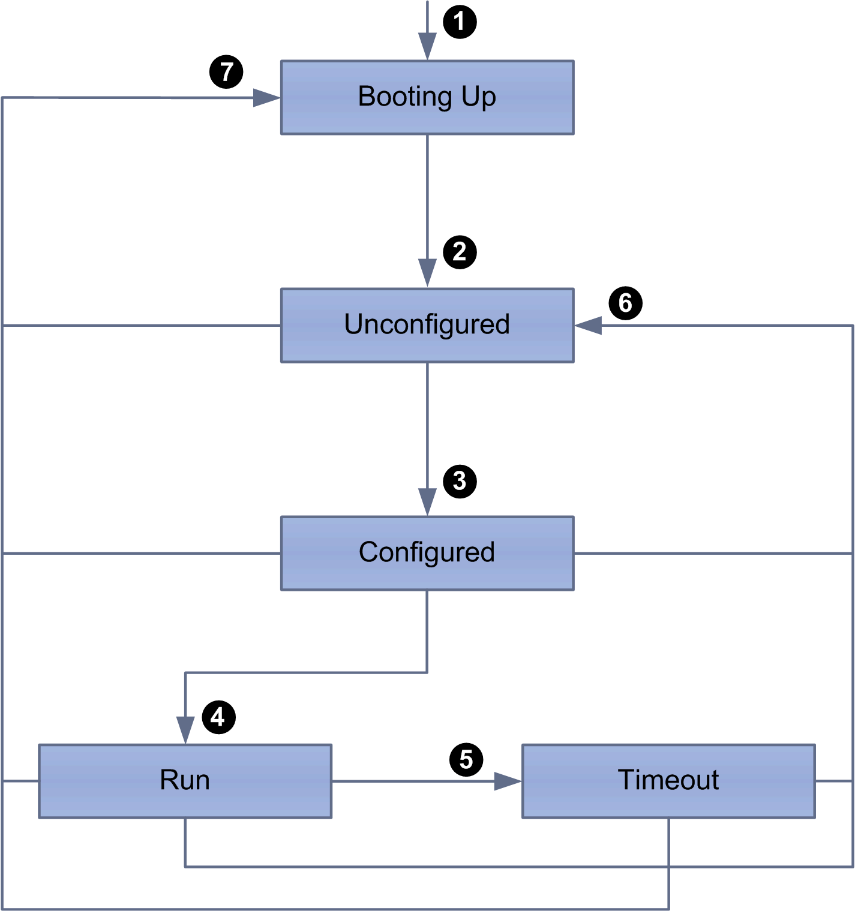

# TM3 Modbus Serial Line Bus Coupler Presentation

## Introduction

The TM3 Modbus Serial Line bus coupler is a device designed to manage serial line communication when using expansion modules with a controller in a distributed architecture. The TM3 Modbus Serial Line bus coupler supports the [TM3 expansion modules](D-SE-0027112.html#D-SE-0027112), except TM3DM16R and TM3DM32R, and the [TM2 expansion modules](D-SE-0006573.html#D-SE-0006573).

## Serial Line Profile

The TM3 Modbus Serial Line bus coupler can be physically connected to the serial port of a master device and it must be declared under a logical node representing the Modbus Serial IOScanner of a device inside EcoStruxure Machine Expert.

## Modbus Slave Profile

The TM3 Modbus Serial Line Bus Coupler conforms as a Modbus device.

The Modbus packet structure is as follows:

|  | Modbus Messages | | |
| --- | --- | --- | --- |
| Address | Function Code | Data | CRC |
| 1 byte | 1 byte | n-byte field | 2 bytes |

The Modbus RTU message frame is as follows:

| Slave Address | Function Code | Data | CRC |
| --- | --- | --- | --- |
| 1 byte | 1 byte | 0-252 bytes | 2 bytes  CRC Low, CRC High |

## Serial Line Boot-Up and Operating Mode

The following diagram shows the operating modes of the TM3 Modbus Serial Line Bus Coupler:

The following table describes the transitions during the boot-up process:

| Item | Description |
| --- | --- |
| 1 | Device boot-up |
| 2 | After boot-up, the device automatically enters the Unconfigured state. |
| 3 | The device begins configuration process. |
| 4 | The controller has taken control of the device. |
| 5 | A timeout error occurred. |
| 6 | A reconfiguration process is initialized. |
| 7 | An unrecoverable error caused a system reboot. |

## Serial Line Communication Configuration

The TM3 Modbus Serial Line bus coupler network interface configuration parameters are defined in the following table:

| Parameter | Value |
| --- | --- |
| Mode | RTU |
| Parity | EVEN |
| Stop bit | 1 |
| Data bit | 8 |

## Serial Line Command List

The list of supported commands is described in the following table:

| Modbus Function Code: Dec Index (Hex) | Sub-Function: Sub-Index | Command |
| --- | --- | --- |
| 3 (0003H) | - | Read n registers |
| 6 (0006H) | - | Write a single register |
| 16 (0010H) | - | Write n registers |
| 22 (0016H) | - | Mask write register |
| 23 (0017H) | - | Read/Write n registers |
| 43 (002BH) | 14 | Read slave device identification registers |

## Serial Line Identification Objects

The Device Identification Modbus command returns the following objects:

| Object ID (hex) | Description | Value | Type |
| --- | --- | --- | --- |
| 00 | VendorName | Schneider Electric | ASCII String |
| 01 | ProductCode | 1109 hex |
| 02 | MajorMinorRevision | XYxy (MAJORminor) |

## Serial Line Operating Limits

The TM3 Modbus Serial Line bus coupler supports address from 1 to 127, corresponding to rotary switch address settings. Using addresses outside of the address range may disrupt communications between other devices on that serial line.

| WARNING | |
| --- | --- |
|  | UNINTENDED EQUIPMENT OPERATION  Do not use an address outside of the specified range (from 1 to 127).  Failure to follow these instructions can result in death, serious injury, or equipment damage. |

EIO0000003643.07