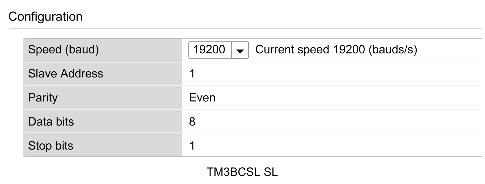

# Serial Line Configuration

## Introduction

This section describes the options available to setup up an operation with the TM3 Modbus Serial Line bus coupler.

## Serial Line Configuration

The following table shows the default configuration of the TM3 Modbus Serial Line bus coupler:

| Item | Default State | Empty Application State |
| --- | --- | --- |
| TM3 Bus | Inactive if not configured.  Outputs values = 0 | No module on TM3 Bus. |
| Modbus | - | No manager is configured. |
| Rotary Switch | TENS switch in position 0, ONES switch in position 0 (default speed). | - |

To configure the Serial Line using the Web server, click Maintenance on the Modbus Serial Line.

The Configuration window is displayed as below:

The following parameters must be identical for each serial device connected to the port.

| Element | Description | Configuration supported by the device |
| --- | --- | --- |
| Speed (baud) | Transmission speed in baud | 1200, 2400, 4800, 9600, 19200, 38400, 57600, 115200. Refer to [TM3 Bus Coupler Hardware Guide](../../../../../api/crossBook?lang=en-US&virtualBookName=tm3bchw&topicID=D_SE_0084312). |
| Parity | Used for error detection | Even. Refer to Serial Line communication configuration [table](D-SE-0097108.html#D-SE-0097108__D-SE-0097108.5). |
| Data bits | Number of bits for transmitting data | 8. Refer to Serial Line communication configuration [table](D-SE-0097108.html#D-SE-0097108__D-SE-0097108.5). |
| Stop bits | Number of stop bits | 1. Refer to Serial Line communication configuration [table](D-SE-0097108.html#D-SE-0097108__D-SE-0097108.5). |
| Physical Medium | Specify the medium to use:   * RS485 (using polarisation resistor or not) * RS232 | RS485 |
| Polarization Resistor | Polarization resistors are integrated in the controller. They are switched on or off by this parameter. | NOTE: For proper operation, you must have a single polarization resistor on the RS485 bus. |

The serial line ports of your controller are configured for the Machine Expert protocol by default when new or when you update the controller firmware. The Machine Expert protocol is incompatible with that of other protocols such as Modbus Serial Line. Connecting a new controller to, or updating the firmware of a controller connected to, an active Modbus configured serial line can cause the other devices on the serial line to stop communicating. Make sure that the controller is not connected to an active Modbus serial line network before first downloading a valid application having the concerned port or ports properly configured for the intended protocol.

| NOTICE | |
| --- | --- |
|  | INTERRUPTION OF SERIAL LINE COMMUNICATIONS  Be sure that your application has the serial line ports properly configured for Modbus before physically connecting the controller to an operational Modbus Serial Line network.  Failure to follow these instructions can result in equipment damage. |

EIO0000003643.07