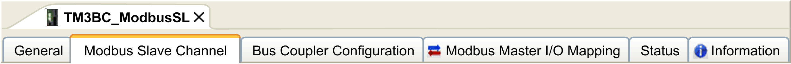

# Adding a TM3 Modbus Serial Line Bus Coupler on the Modbus Serial IOScanner

## Introduction

This section describes how to add a device on the Modbus IOScanner.

## Adding a TM3 Modbus Serial Line Bus Coupler on the Modbus IOScanner

To add a TM3 Modbus Serial Line bus coupler on the Modbus IOScanner, select the TM3BCSL in the Hardware Catalog, drag it to the Devices tree, and drop it on the Modbus\_IOScanner node of the Devices tree.

For more information on adding a device to your project, refer to:

• Using the [Drag-and-drop Method](../../../../../api/crossBook?lang=en-US&virtualBookName=SoMProg&topicID=D_SE_0083368)

• Using the [Contextual Menu or Plus Button](../../../../../api/crossBook?lang=en-US&virtualBookName=SoMProg&topicID=D_SE_0083370)

## TM3 Modbus Serial Line Bus Coupler Configuration

This figure shows the tabs for the module configuration:

## Tabs Description

| Tab | Description |
| --- | --- |
| General | You can access:   * Slave Address, which is the address configured on the bus coupler. It is limited to 1 - 127. * Response Timeout [ms], which is the amount of time in millisecond a master waits for the bus coupler to respond to a request before determining it is non-responsive and proceed to the next scan. |
| Modbus Slave Channel | Read only tab. It provides:   * Number of scans * Type of scans (read, read/write, write) * Amount of data transferred in each scan |
| Bus Coupler Configuration | You can access:   * Monitoring Timeout, which is the amount of time in millisecond the bus coupler waits to respond to a request from the master before determining there is a network and/or a master issue. Then the bus coupler fallback management is triggered.  The acceptable range of values is 0 - 65535 milliseconds.  A value of 0 disables:    + the monitoring timeout in the bus coupler   + the fallback management in the bus coupler   + the ability to manage the bus coupler through the Web server * Channels Cycle Time is the configured time of each scan for the bus coupler. |
| Modbus Master I/O Mapping | Provides information about the variable name and type associated with the bus coupler. |
| Status | You can access the state of I/O modules and communication between bus coupler and controller. The states are described by:   * Running: The bus coupler is running. * Not running: The bus coupler is not running and not exchanging data. * Module reports an error: At least one expansion module is in error (configuration or run-time error). * Bus failure: A bus communication error (either fieldbus or internal TM3 bus) has been detected. |

NOTE: When Modbus TCP is enabled, the values of the status registers (900...901, 930...932) reflect the state of the TM3 Bus Coupler and connected TM3 Expansion modules. Read these status registers before starting IO exchange and take any appropriate actions that might be necessary.

EIO0000003643.07