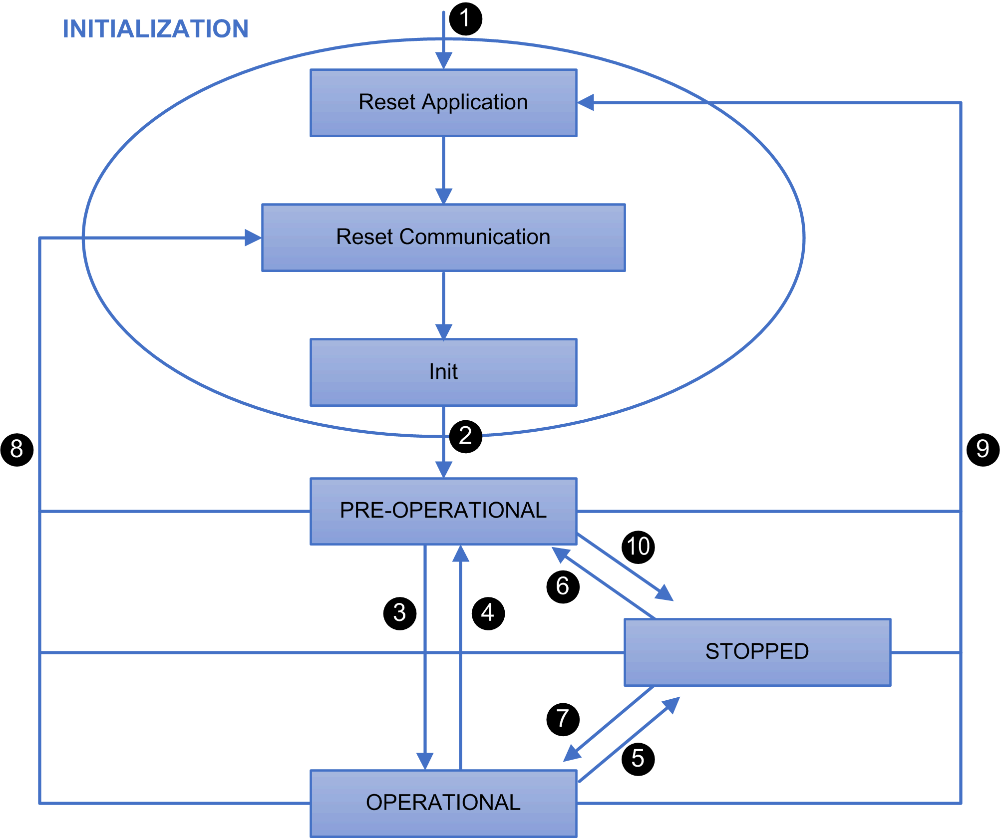

# TM3 CANopen Bus Coupler Presentation

## Introduction

The TM3 CANopen bus coupler is a device designed to manage CANopen communication when using expansion modules with a controller in a distributed architecture. The TM3 CANopen bus coupler supports the [TM3 expansion modules](D-SE-0027112.html#D-SE-0027112), except TM3DM16R and TM3DM32R, and the [TM2 expansion modules](D-SE-0006573.html#D-SE-0006573).

## CANopen profile

The TM3 CANopen bus coupler conforms to CiA 401 CANopen device profile for generic I/O modules, and supports the CANopen protocol as defined in CiA 301 CANopen application layer and communication profile. This coupler makes it possible to use PDO/SDO configuration to access and manage I/O values, parameters, and diagnostics.

## Device Profile

The table below shows functions supported by the TM3 CANopen bus coupler and their codes:

| Function | Function Code (Binary) | Function Code (Hex) | Resulting COB-ID (Decimal) |
| --- | --- | --- | --- |
| NMT | 0000 | 0 | 0 |
| SYNC | 0001 | 80 | 128 |
| EMERGENCY (EMCY) | 0001 | 81 – FF | 129 – 255 |
| TPDO1 (Tx) | 0011 | 181 – 1FF | 385 – 511 |
| RPDO1 (Rx) | 0100 | 201 – 27F | 513 – 639 |
| TPDO2 (Tx) | 0101 | 281 – 2FF | 641 – 767 |
| RPDO2 (Rx) | 0110 | 301 – 37F | 769 – 895 |
| TPDO3 (Tx) | 0111 | 381 – 3FF | 897 – 1023 |
| RPDO3 (Rx) | 1000 | 401 – 47F | 1025 – 1151 |
| TPDO4 (Tx) | 1001 | 481 – 4FF | 1153 – 1279 |
| RPDO4 (Rx) | 1010 | 501 – 57F | 1281 – 1407 |
| SDO (Tx) | 1011 | 581 – 5FF | 1409 – 1535 |
| SDO (Rx) | 1100 | 601 – 67F | 1537 – 1663 |
| NMT Error Control | 1110 | 701 – 77F | 1793 - 1919 |

NOTE: If additional TPDO/RPDO (from 5th to the last) are required, the COB-IDs are allocated automatically by EcoStruxure Machine Expert and can also be defined manually.

## CANopen Boot-up and Operating Modes

The following diagram shows the operating modes of the TM3 CANopen bus coupler:

| Number | Description |
| --- | --- |
| 1 | Device power up. |
| 2 | After initiation, the device automatically goes into PRE-OPERATIONAL state. |
| 3 | The device is configured and the controller takes control of the device.  NMT START NODE command received from the controller. |
| 4 | The following conditions can cause this transition:   * A timeout or a CANopen bus error has been detected and the value in the 1029H object is 00H (PRE-OPERATIONAL) * A NMT ENTER PRE-OPERATIONAL command is received from the controller |
| 5 | The following conditions can cause this transition:   * A timeout or a CANopen bus error has been detected and the value in the 1029H object is 02H (STOPPED) * A NMT STOP NODE command is received from the controller |
| 6 | The device has recovered and the controller sent a NMT ENTER PRE-OPERATIONAL command. |
| 7 | The device has recovered and the controller sent a NMT START NODE command. |
| 8 | A NMT RESET COMMUNICATION command is sent from the controller. Communication Profile Objects are reset to default values. |
| 9 | The controller sent a NMT RESET NODE command. All Objects are reset to default values. |
| 10 | The controller sent a NMT STOP NODE command. |

The Objects must be well-configured before entering OPERATIONAL state for bus coupler to be properly functional. Specifically, objects related to TM3 configuration must be re-configured prior to entering OPERATIONAL state. For relevant objects, refer to the object in Manufacturer-specific zone [section](D-SE-0097101.html#D-SE-0097101).

## CAN Bus Format

The supported CAN bus format is CAN2.0A for CANopen.

EIO0000003643.07