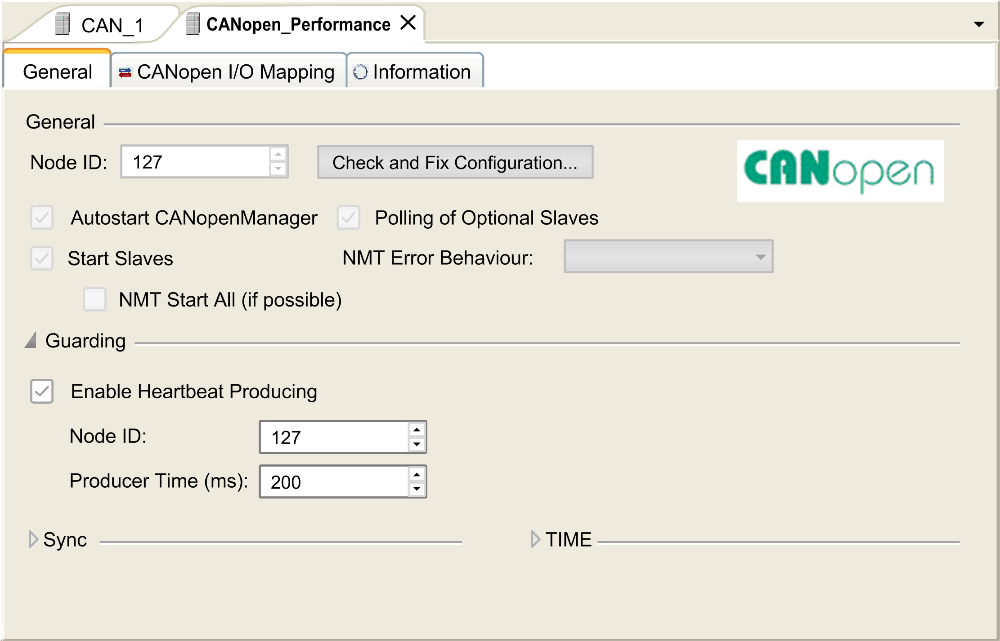

# Configuring the CANopen Interface of the Controller

## Introduction

This section describes the configuration of the CANopen interface of the controller.

## Configuring the CAN Bus

To configure the CAN bus of your controller, proceed in the following way:

| Step | Action |
| --- | --- |
| 1 | Under the controller, double-click the CAN\_1 (CANopen Bus) node. |
| 2 | Configure the baudrate (by default: 250000 bits/s):  NOTE: The Online Bus Access option allows you to block the sending of SDO, DTM, and NMT through the status screen. |

## Adding a CANopen Performance Manager

To add the CANopen Performance functionality on the CANopen bus, select the CANopen\_Performance in the Hardware Catalog, drag it to the Devices tree, and drop it on the CAN\_1 (CANopen Bus) node of the Devices tree.

For more information on adding a device to your project, refer to:

• Using the [Drag-and-drop Method](../../../../../api/crossBook?lang=en-US&virtualBookName=SoMProg&topicID=D_SE_0083368)

• Using the [Contextual Menu or Plus Button](../../../../../api/crossBook?lang=en-US&virtualBookName=SoMProg&topicID=D_SE_0083370)

## Configuring a CANopen Performance Manager

To configure CANopen\_Performance, double-click CAN\_1 > CANopen Performance in the Devices tree.

This dialog box appears:

The CANopen\_Performance configuration dialog is divided into four areas:

* General: General information containing node ID and enabled configuration options of the controller as a CANopen master.
* Guarding: If Enable Heartbeat Producing is selected, the controller is configured as a Heartbeat Producer. Refer to Heartbeat [Mechanism](D-SE-0097094.html#D-SE-0097094__D-SE-0097094.6). The default setting is heartbeat producing at 200 ms.
* Sync: When Enable Sync Producing is selected, the controller is configured as a sync producer.
* TIME: Not editable.

For more details to configure CANopen\_Manager tab, refer to Software / Communication / Device Editors / CAN-Based Fieldbuses / CANopen / CANopen Manager (Master) / Tab 'CANopen Manager - General’ found in the Machine Expert V1.2 online help.

EIO0000003643.07