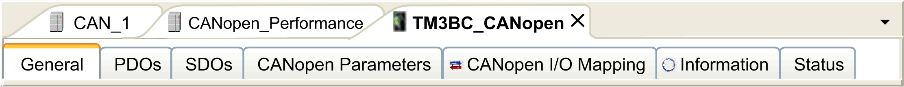
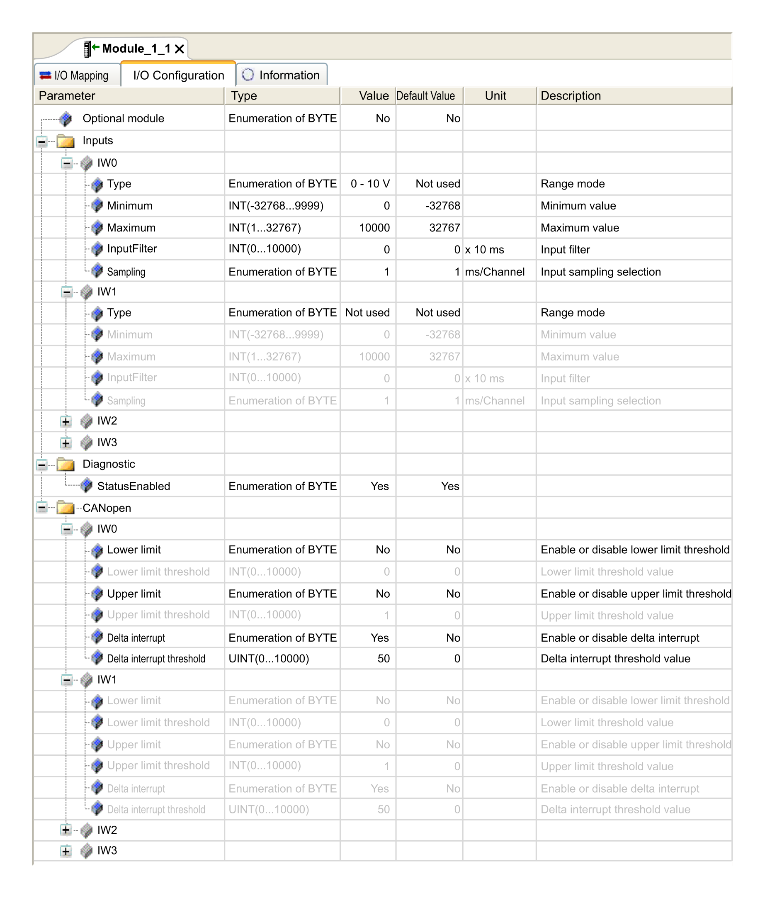

# Adding and Configuring of TM3 CANopen Bus Coupler and Expansion Modules on the CANopen bus

## Introduction

This section describes how to add a bus coupler on the CANopen bus.

## Adding a TM3 CANopen Bus Coupler and Expansion Modules on the CANopen bus

You must add a CANopen\_Performance CANopen manager under the CAN\_1 (CANopen Bus) node.

To add a TM3 CANopen bus coupler on the CANopen bus, select the TM3BCCO in the Hardware Catalog, drag it to the Devices tree, and drop it under CAN\_1 > CANopen\_Performance CANopen manager of the Devices tree.

For more information on adding a device to your project, refer to:

• Using the [Drag-and-drop Method](../../../../../api/crossBook?lang=en-US&virtualBookName=SoMProg&topicID=D_SE_0083368)

• Using the [Contextual Menu or Plus Button](../../../../../api/crossBook?lang=en-US&virtualBookName=SoMProg&topicID=D_SE_0083370)

Add the required expansion modules under TM3BCCO. Refer to [Adding a TM3 CANopen bus coupler](D-SE-0088591.html#D-SE-0088591__D-SE-0088591.10).

## TM3 CANopen Bus Coupler Configuration

This figure shows the tabs for the module configuration:

## Tabs Description

| Tab | Description |
| --- | --- |
| General | The Node ID of the bus coupler is configured here.  In addition, to access full options, such as node-guarding configuration, select Enable Expert Setting. For more details, refer to Software > Communication > Device Editors > CANbus Configuration Editor > CAN-Based Fieldbuses > CANopen > CANopen Manager (Master) > CANopen Remote Device Slave Tab 'CANopen Remote Device - General’ found in the EcoStruxure Machine Expert online help.  NOTE: TM3 CANopen bus coupler cannot be configured as a sync producer. |
| PDOs | EcoStruxure Machine Expert automatically creates, enables and maps the Receive PDOs and Transmit PDOs to match the expansion modules after the bus coupler. This enables the bus coupler to properly exchange I/O data with the controller without requiring manual mapping. Hence, no manual configuration (adding/deleting/editing of PDO mapping) is enabled.  Modification of the PDO properties is enabled. To do so, double-click the PDO to open the PDO Properties window. Refer to [CANopen Transmission and Monitoring](D-SE-0097094.html#D-SE-0097094).  NOTE: The bus coupler supports PDO transmission by Remote Transmission Request (RTR), hence this option is disabled. |
| SDOs | EcoStruxure Machine Expert generates automatically the SDOs commands that will properly configure the bus coupler. Hence, no manual configuration is required or enabled.  NOTE: Enable Expert Setting in General must be enabled to display the detailed comments. |
| CANopen parameters | Provides information about the parameters associated with the bus coupler. |
| CANopen I/O Mapping | Provides information about the variable name and type associated with the bus coupler. The bus coupler send information about its diagnostics to the controller. You can map this variable. |
| Status | You can access:   * NMT Commands if Block SDO, STM and NMT access while application is running is unselected in CAN\_1 window.   You can access the state of I/O modules and communication between bus coupler and controller. The states are described by:   * Running: The bus coupler is running. * Not running: The bus coupler is not running and not exchanging data. * Module reports an error: At least one expansion module is in error (configuration or run-time error). * Diagnostic message available: An error message has been issued by the bus coupler. * Redundancy Mode Passive: The fieldbus master is currently not sending data because another master is in active mode.   NOTE: While the controller is in HALT state, the CANopen bus cannot update status information. |

## Special Configuration Associated with all TM2 / TM3 modules with Analog Inputs

CANopen supports data transmission through specific events. For analog inputs, this can be when input values falls below a threshold value (lower limit), exceeds an upper threshold (upper limit), or when the change in value exceeds the last transmitted value by a specified amount (delta). The event configuration can be done singularly or in combination. For example, if both upper limit of 5000 and delta of 100 is enabled and configured, then a value must both exceed 5000 and have changed by more than +/- 100 before it will be sent.

NOTE: If all events (upper limit, lower limit and delta) are disabled and PDO transmission type is configured as acyclic or asynchronous type (0 or 255), no analog data will be transmitted.

To perform the configuration, after double-clicking on appropriate Analog device, under I/O Configuration tab, there will be a section titled CANopen. Each available channel will have an option to configure upper limit, lower limit and delta. Below shows an example. By default, upper and lower limit are disabled and delta is enabled with value of 50.

This graphic shows the configuration event when the channel IW0 is enabled and the channel IW1 is disabled in Input section:

Finally, analog input values intrinsically have some fluctuations over time. The level of fluctuations is partly dependent on the stability of the module input. Refer to the [TM3 Analog I/O Modules - Hardware Guide](../../../../../api/crossBook?lang=en-US&virtualBookName=tm3aiohw&topicID=D_SE_0034068) to understand the capabilities of the modules used so that proper values are configured for the events.

EIO0000003643.07