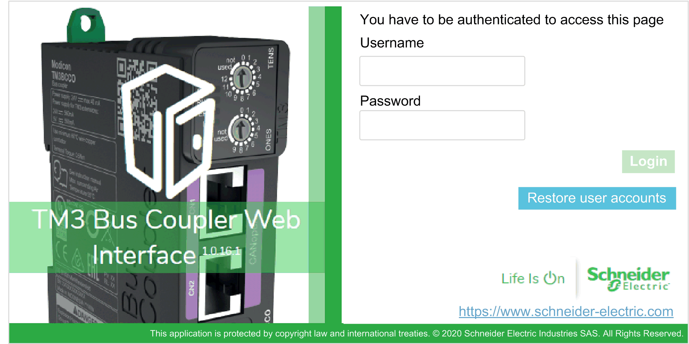
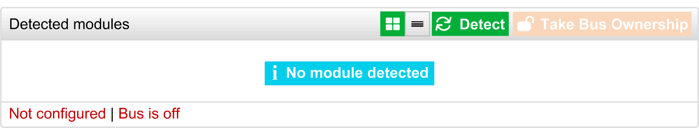
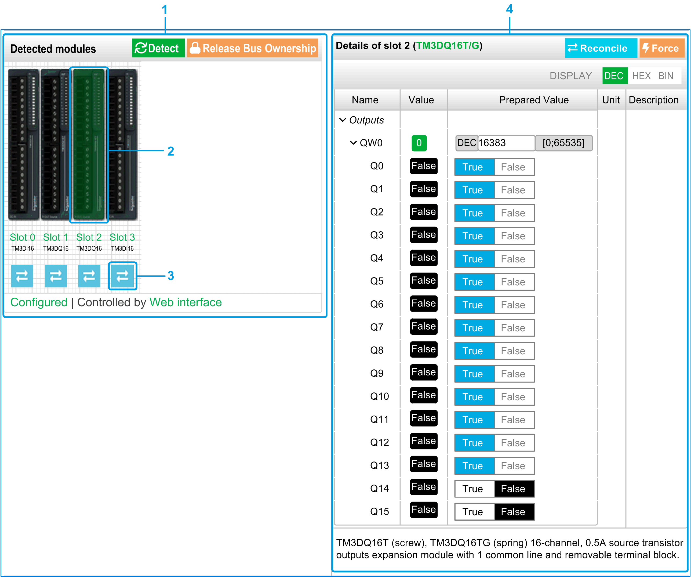

# Web Server

## Introduction

The TM3 bus coupler supports a Web server, offering access to information such as configuration data, module status, I/O data, network statistics, and diagnostic information.

In addition the Web server allows you to monitor this information, the bus coupler network and I/O remotely.

You can access the Web server with HTTPS (secured connections). HTTP (non secured connections) is not supported.

The Web server is accessible through the bus coupler [USB port](D-SE-0096089.html#D-SE-0096089__D-SE-0096089.3). You can use the pages of the Web server for setup and control as well as application diagnostics and monitoring.

Use a PC providing a USB port to connect to the Web server by using a Web browser.

The Web server can be accessed by the web browsers listed below:

* Google Chrome (version ≥ 71)
* Mozilla Firefox (version ≥ 64)
* Microsoft Edge (version ≥ 42)

The Web server allows you to monitor a bus coupler and its application remotely, to perform various maintenance activities including modifications to data and configuration parameters. Care must be taken to ensure that the immediate physical environment of the machine and process is in a state that will not present safety risks to people or property before exercising control remotely.

| WARNING | |
| --- | --- |
|  | UNINTENDED EQUIPMENT OPERATION  * Define a secure password for the Web server, and do not allow unauthorized or otherwise unqualified personnel to use this feature. * Ensure that there is a local, competent, and qualified observer present when operating on the controller from a remote location. * You must have a complete understanding of the application and the machine/process it is controlling before attempting to adjust data, stopping an application that is operating, or starting the controller remotely. * Take the precautions necessary to ensure that you are operating on the intended controller by having clear, identifying documentation within the controller application and its remote connection.  Failure to follow these instructions can result in death, serious injury, or equipment damage. |

NOTE: The Web server must only be used by authorized and qualified personnel. A qualified person is one who has the skills and knowledge related to the construction and operation of the machine and the process controlled by the application and its installation, and has received safety training to recognize and avoid the hazards involved.

## Web Server Access

You can manage the user accounts on the Web server on [MAINTENANCE / User Accounts](#D-SE-0098696__D-SE-0098696.37).

To access Web server, ensure that the rotary switch are in address setting location. For more information regarding address setting, refer to the Modicon TM3 Bus Coupler - Hardware Guide, [Setting the CANopen Address](../../../../../api/crossBook?lang=en-US&virtualBookName=tm3bchw&topicID=D_SE_0096908).

By default, the user name is Administrator, and the password is Administrator. You must change the password at the first login.

| WARNING | |
| --- | --- |
|  | UNAUTHORIZED DATA ACCESS  * Do not expose the device or device network to public networks and the Internet as much as possible. * Immediately change the default password to a new secure password. * Do not distribute passwords to unauthorized or otherwise unqualified personnel. * Restrict access to unauthorized personnel. * Use additional security layers like VPN for remote access and install firewall mechanisms. * Validate the effectiveness of these measurements regularly and frequently.  Failure to follow these instructions can result in death, serious injury, or equipment damage. |

NOTE: A secure password is one that has not been shared or distributed to any unauthorized personnel and does not contain any personal or otherwise obvious information. Further, a mix of upper and lower case letters and numbers offer greater security. You should choose a password length of at least ten characters.

## Resetting the Password

To reset the password:

| Step | Action |
| --- | --- |
| 1 | Connect to the bus coupler using the USB port. |
| 2 | Open the browser. |
| 3 | Enter the IP address 90.0.0.1. |
| 4 | Move the position of any rotary switch to any other position.  **Result:** **ERR** LED is flashing red. The Restore user accounts button is displayed. |
| 5 | Click Restore user accounts. |
| 6 | Move the position of the changed rotary switch to its previous position.  **Result:** The Restore user accounts button is no longer displayed. |

## Login Page

The login page is the entry point to get authenticated by the Web server. [The certificate must be validated](D-SE-0104758.html#D-SE-0104758). To access the website login page shown in the following illustration, type in your navigator the IP address 90.0.0.1. To login to the Web server, enter the user name and password and click Login.

The Web server contains the following pages:

* [HOME](#D-SE-0098696__D-SE-0098696.30)
* [DIAGNOSTICS](#D-SE-0098696__D-SE-0098696.32)
* [MONITORING](#D-SE-0098696__D-SE-0098696.31)
* [MAINTENANCE](#D-SE-0098696__D-SE-0098696.33)

NOTE: The timeout session for each login is ten minutes. When you do not perform any action after you logged in, it redirects you to the login page if you click any button. You need to log in again with user name and password to access the web pages.

## HOME / Equipment Overview

The HOME page displays the product details of TM3 bus coupler.

The identification section of HOME page consists of:

| Element | Description |
| --- | --- |
| Identification | |
| Vendor ID | Vendor ID of the bus coupler |
| Vendor Name | Vendor name of the bus coupler |
| Product ID | Product ID of the bus coupler |
| Product Name | Product name of the bus coupler |
| Product Reference | Product reference of the bus coupler |
| Serial Number | Serial number of the bus coupler |
| Locate Device | Click the button to locate the bus coupler. The LEDs of the bus coupler flash red for few seconds. |

## DIAGNOSTICS Page

The DIAGNOSTICS page shows the status of the bus coupler.

The DIAGNOSTICS page contains the following sub-pages:

* [Device](#D-SE-0098696__D-SE-0098696.42)
* [CANopen](#D-SE-0098696__D-SE-0098696.43)

## DIAGNOSTICS / Device

The Status section shows details about the status of the bus coupler:

| Element | Description |
| --- | --- |
| Status | |
| Last Stop Cause | Displays the cause of the last stop of the bus coupler. |
| USB Port | Displays whether a USB cable is connected to the bus coupler. |
| Operating Mode | Displays one of the following operating modes of the bus coupler:   * Idle * CANopen * Web interface * Firmware update in progress * Time Out |
| Configuration Status | Displays one of the following configuration status of the bus coupler:   * Not Configured * Configured |

## DIAGNOSTICS / CANopen

The Configuration section displays the status of CANopen connection:

| Element | Description |
| --- | --- |
| Bitrate (Kbits/s) | Current transmission speed in kilobits per second. |
| Node ID | Slave address of bus coupler. |

The Statistics section shows the current state and latest error messages for the bus coupler:

| Element | Description |
| --- | --- |
| Device State | Current CANopen state of the bus coupler. |
| Latest Error | Last 10 EMCY error codes issued by the bus coupler. The latest errors are displayed on top. Timestamp is in seconds since boot-up. |

## MONITORING Page

The MONITORING page displays the expansion modules that are connected to the TM3 bus coupler.

MONITORING page without detected modules:

MONITORING page with modules and details:

**1** Bus Monitoring

**2** Selected module

**3** Reconcile button

**4** Module details

The MONITORING page shows and describes all the modules detected by the bus coupler and allows you to:

* See the state of a selected module (running or not running) and the protocol used.
* Read the value of an input or output.
* Force a value to an output by clicking Force.
* Identify a module by clicking Reconcile.

| Element | Description |
| --- | --- |
| Detect | Allows you to detect the modules connected to the bus coupler. |
| Take Bus Ownership  Release Bus Ownership | Reserves the bus to allow you to force the module outputs. You can click the button when the bus coupler is configured and not controlled by a controller.  **Result**: You are notified that the I/O bus coupler is controlled by the Web interface when you are in Take Bus Ownership state. You can edit the output values.  Click Release Bus Ownership to release the control of the I/O bus. |

**Module Details**

The module details view provides the following data:

* Module name and description
* Module state
* Filter option to filter I/Os
* A list of its I/Os

  This list of I/Os allows you to view a real-time value of an input and to write the value of an output. You can also view the value in binary state, hexadecimal state and decimal state.

The view has DISPLAY buttons to modify the format of the displayed values.

**Output Forcing**

1. When Take Bus Ownership is enabled, click a module to force its outputs.
2. Set the output values you wish to force for the module in the Prepared Values column of the list of its I/Os.
3. Click the Force button.

   **Result:** A message is displayed.
4. Click I agree to validate the modifications and send them to the bus coupler.

   Click I disagree to cancel the modifications.

As the modules are not identified automatically or correctly, click the Reconcile button to identify the modules.

## MAINTENANCE Page

The MAINTENANCE page allows you to view and edit the configuration of the bus coupler.

The MAINTENANCE page contains the following sub-pages:

* [User Accounts](#D-SE-0098696__D-SE-0098696.37)
* [Firmware](#D-SE-0098696__D-SE-0098696.40)
* [Modules Firmware](#D-SE-0098696__D-SE-0098696.52)
* [System Log Files](#D-SE-0098696__D-SE-0098696.41)
* [CANopen](#D-SE-0098696__D-SE-0098696.50)

## MAINTENANCE / User Accounts

Account Management

The sub-page allows you to enter your login password to access the Web server:

| Element | Description |
| --- | --- |
| Account Management  Select an account to edit it | |
| User Name | List of the following user accounts:   * Administrator  The Administrator account is configured with a predefined password (Administrator / Administrator). Modify the predefined password after the first connection. * Operator  This account is disabled by default. * Viewer  This account is disabled by default.   NOTE: Depending on your account, you have access to some web pages. See the table below for the accessible web pages. |
| Enabled | Selected if the account is enabled. |
| Account Management  Provide a new password for account | |
| Current Password | Enter the current password of the user account. |
| New Password | Enter a password for the user account.  NOTE: Minimum ten characters, maximum 32 characters and use a...z, A...Z, 0...9 alphanumeric characters. To reset the password, refer to [Resetting the Password](#D-SE-0098696__D-SE-0098696.51). |
| Confirm New Password | Enter the password again of the selected account. |
| Apply | Saves your new password. |

This table describes the accessible pages depending on the user account:

| Web pages | Sub pages | Administrator | Operator | Viewer |
| --- | --- | --- | --- | --- |
| HOME | – | ✓ | ✓ | ✓ |
| MONITORING | – | ✓ | ✓ | – |
| DIAGNOSTICS | Device | ✓ | ✓ | ✓ |
| CANopen | ✓ | ✓ | ✓ |
| MAINTENANCE | User Accounts | ✓ | ✓(1) | ✓(1) |
| Firmware | ✓ | – | – |
| System Log Files | ✓ | ✓ | – |
| CANopen | ✓ | – | – |
| **(1)** You can only modify your user account. | | | | |

System Use Notification

The sub-page allows you to define a System Use Notification message which is displayed to users at log-in:

| Element | Description |
| --- | --- |
| System Use Notification | |
| Enabled | When selected, you can define a message that is displayed at log-in. |
| Message | Displays the message defined. |
| Reset | Reset to default message. |
| Apply | Applies your changes. |

## MAINTENANCE / Firmware

The Firmware sub-page shows the firmware version of the TM3 bus coupler and allows you to update its firmware:

| Element | Description |
| --- | --- |
| Current Firmware | |
| Firmware | Firmware version |
| Web interface | Web server version |
| Firmware Update  Select a new firmware version | |
| Select | Allows you to select the new firmware file for the bus coupler. |
| Apply | Allows you to apply the new firmware. |
| Cancel | Cancels firmware modifications. |

NOTE: You cannot update the firmware when the TM3 bus coupler cyclically exchanges data with the logic/motion controller. To make sure the bus coupler is not exchanging data, see [**MONITORING**](#D-SE-0098696__D-SE-0098696.31).

To update the bus coupler firmware:

| Step | Action |
| --- | --- |
| 1 | Remove power from the bus coupler. |
| 2 | Ensure that rotary switches are in address setting position, **TENS** to 0, **ONES** to 1. |
| 3 | Connect USB cable to PC then to bus coupler. |
| 4 | Apply power to the bus coupler. |
| 5 | Log into the Web server as Administrator. |
| 6 | Verify in the MONITORING page that the bus coupler is not exchanging data with the controller. |
| 7 | Click MAINTENANCE > Firmware. |
| 8 | Click Select, then select the firmware file.  **Result**: The following information is displayed: |
| 9 | Read the information carefully and, if you agree, click I Agree.  **Result**: At the end of the download and verification of the file, a confirmation window is displayed. |
| 10 | Click Yes to close the confirmation window, then click Apply.  **Result**: At the end of the firmware update, a message is displayed to inform you whether the firmware update is completed successfully. |

NOTE: Do not remove power from the bus coupler while performing the firmware update. If the power is interrupted while installing the new firmware, you may need to wait a few minutes for the installation process to finalize at the next power-up. Until then the Web server may not be accessible.

## MAINTENANCE / Modules Firmware

The Modules Firmware sub-page shows the firmware version of the modules configured and allows you to update its firmware:

| Element | Description |
| --- | --- |
| Modules Firmware Overview | |
| Slot | Slot number of the module |
| Reference | Reference of the module |
| Current Firmware | Firmware version of the module |
| Modules Firmware Management  Select a new firmware version | |
| Select | Allows you to select the new firmware file for the module.  NOTE: You can select only a single firmware file. All modules on the bus corresponding to the selected firmware are updated. |
| Apply | Allows you to apply the new firmware. |

NOTE: You cannot update the firmware when the TM3 bus coupler cyclically exchanges data with the logic/motion controller. To make sure the bus coupler is not exchanging data, see [**MONITORING**](#D-SE-0098696__D-SE-0098696.31).

To update the module firmware:

| Step | Action | |
| --- | --- | --- |
| 1 | Remove power from the bus coupler. | |
| 2 | Connect the USB cable. | |
| 3 | Apply power to the bus coupler. | |
| 4 | Log into the Web server. | |
| 5 | Verify in the MONITORING page that the bus coupler is not exchanging data with the controller. | |
| 6 | Click MAINTENANCE > Modules Firmware. | |
| 7 | Click Select, then select the firmware file.  **Result**: The firmware file is selected. | |
| 8 | Click Apply.  **Result**: The following information is displayed: | |
| 9 | Read the information carefully and, if you agree, click I Agree.  **Result**: A restart window is displayed. | |
| 10 | Click Yes to proceed.  **Result**: The file is verified and downloaded. The TM3 bus coupler reboots and a confirmation message is displayed. | |
| 11 | After the confirmation message is displayed, remove power from the bus coupler (and TM3XREC1 receiver module, if any). | |
| 12 | Restore power to the bus coupler (and TM3XREC1 receiver module, if any).  **Result**: The module firmware is updated. | |

## MAINTENANCE / System Log Files

The System Log Files sub-page lists the log files. Some of the information in the log files comes from internal interactions of the firmware and is intended to be used by Schneider Electric Technical Support:

| Element | Description |
| --- | --- |
| Log Files  Select one or more log files to download | |
| Select | Allows you to select one or more log files. |
| Name | Shows the list of the log files. |
| Size | Displays the size of the log files. |
| Download | Allows you to download the log files. |

## MAINTENANCE / CANopen

The Configuration sub-page allows you to configure the speed of the TM3 bus coupler:

| Element | Description |
| --- | --- |
| Speed (kbits/s) | Allows you to set the transmission speed in kilobits per second. You can also set the baud rate using the rotary switch. Refer to [Modicon TM3 Bus Coupler Hardware Guide](../../../../../api/crossBook?lang=en-US&virtualBookName=tm3bchw&topicID=D_SE_0096907). |
| Node ID | Displays the Slave Address value for your device. |
| Apply | Saves the configuration settings.  NOTE: Upon confirmation, the bus coupler will automatically reset and new speed will be applied. |
| Cancel | Cancels configuration modifications. |

EIO0000003643.07