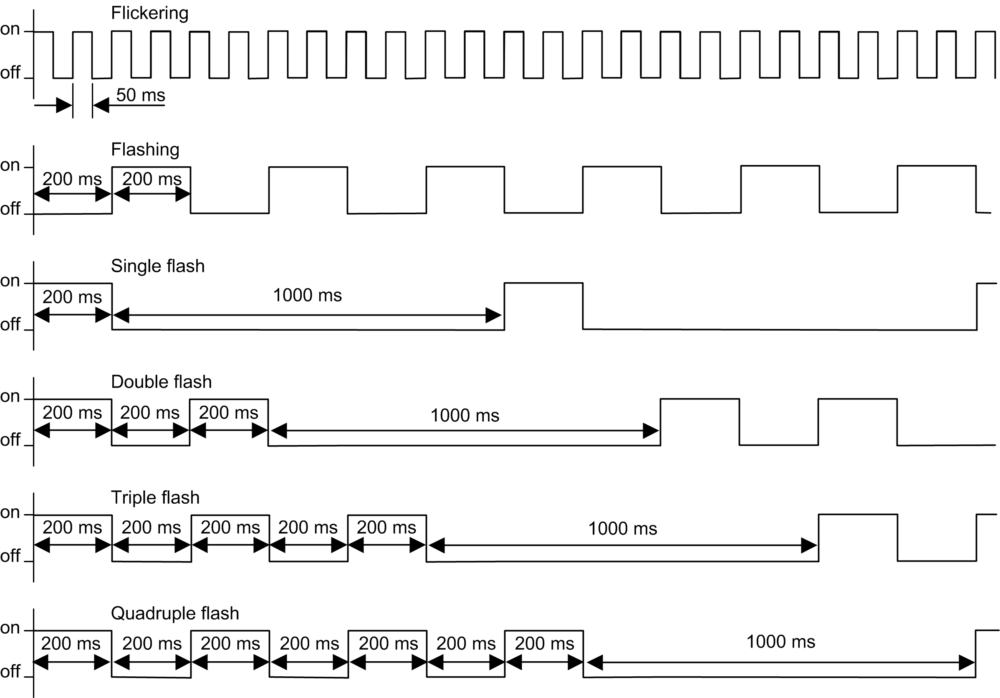

# Diagnostic

## Overview

In online mode, the Status tab of the bus coupler provides monitoring and diagnostics information for the bus coupler and connected modules.

## Displaying Diagnostic Information

The bus coupler status register (object 1002) is accessible as a variable in EcoStruxure Machine Expert. Select the CANopen I/O Mapping tab to access the variable.

In addition, bus coupler and expansion module status information is also displayed under the Status tab of the bus coupler in EcoStruxure Machine Expert [tabs description](D-SE-0101444.html#D-SE-0101444__D-SE-0101444.11).

## EMCY Telegram

The bus coupler will send an EMCY telegram under certain internal error situations. The telegram is 8-bytes long and its structure is shown in table below:

| EMCY Telegram Structure | | | | | | | | |
| --- | --- | --- | --- | --- | --- | --- | --- | --- |
| Byte | 7 | 6 | 5 | 4 | 3 | 2 | 1 | 0 |
|  | Manufacture status register | | | | Affected module number | Error register | EMCY error code | |
|  | Object 1002H | | | | Object 1003H | | | |

For example, in the following diagnostic message `'EMCY Code:7002; Register 80; Field:40 00 01 00 05.'` (displayed in Status tab of the bus coupler in EcoStruxure Machine Expert).

* `7002` matches the bytes 1 and 0 (EMCY error code)
* `80` matches the byte 2 (EMCY Error register)
* `40 00 01 00` matches the bytes 7, 6, 5 and 4 (Manufacture status register)
* `05` matches the byte 3 (Affected module number)

For details of each portion of the telegram, refer to the [Object Dictionary](D-SE-0097095.html#D-SE-0097095).

If an EMCY telegram is generated, the EMCY error code is displayed in the [Web server](D-SE-0098696.html#D-SE-0098696__D-SE-0098696.43). The full EMCY telegram can be seen in EcoStruxure Machine Expert, under TM3BC\_CANopen > Status tab.

## Status LEDs

The following graphic shows the LEDs of TM3 CANopen bus coupler:

The following table describes the status LEDs:

| LED | Color | Status | Description |
| --- | --- | --- | --- |
| **PWR** | Green | On | Power is applied. |
| Off | Power is removed. All LED indicators are off. |
| **RUN** | Green | On | Device status is operational. |
| Flickering | In conjunction with a flickering **ERR** LED, automatic search for the bus communication speed. |
| Flashing | Device status is pre-operational. |
| Single flash | Device status is stopped. |
| Triple flash | Firmware upgrade. |
| **ERR** | Red | On | Bus off. |
| Flickering | In conjunction with a flickering **RUN** LED, automatic search for the bus communication speed. |
| Flashing | Invalid CANopen stack configuration. |
| Single flash | An internal error counter in the CAN controller has reached or exceeded the error frame limit threshold (error frame). |
| Double flash | Error control event detected. Detection of a guard event (NMT-Slave or NMT-master) or a heartbeat event (Heartbeat consumer). |
| Triple flash | Synchronization error detected: message not received from sync producer within the defined period. |
| Quadruple flash | Event Time error detected: An expected PDO has not been received before the Event Time elapsed. |
| Off | No error detected. |
| **I/O** | Green | Flashing | Device has received and applied the expansion modules configuration. |
| On | Device is communicating with the expansion modules. |
| Red | Single flash | Expansion module configuration transfer timeout. |
| Green  Red | Flashing  On | The physical configuration is inconsistent with the software configuration. No data exchange (status and I/O) is occurring. |
| Green  Red | On  On | The physical configuration is inconsistent with the software configuration. I/O data is not applied. |
| Green  Red | On  Flashing | At least one TM2 or TM3 expansion module did not respond to the bus coupler for 10 consecutive cycles. |
| Off | No configuration. Device is not communicating with the expansion modules. |

This timing diagram shows the different LED flashing behaviors:

NOTE: With the exception of the **PWR** LED, each LED is ON for a few seconds, then OFF during the boot sequence. The LED behavior rules apply when the boot is completed successfully.

EIO0000003643.07