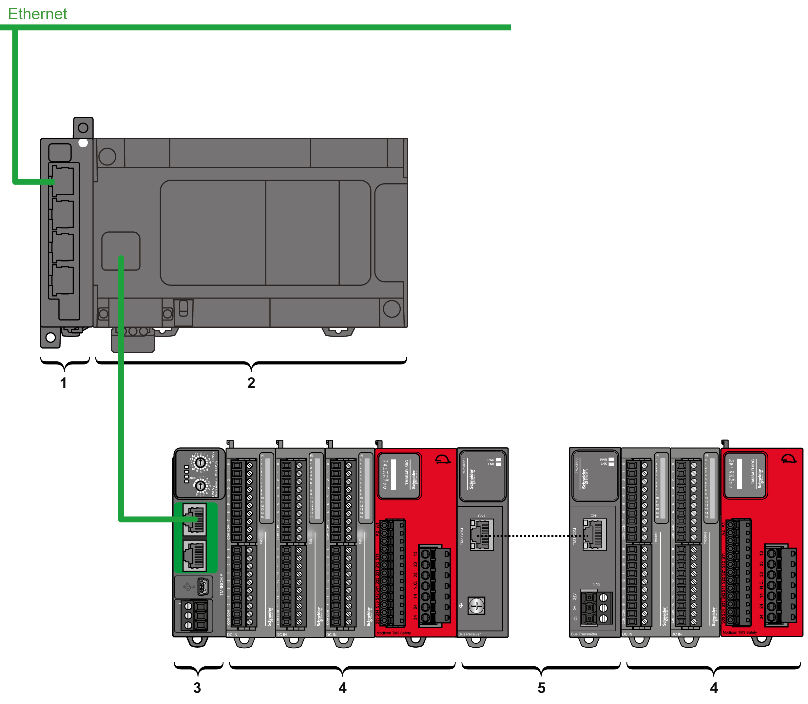
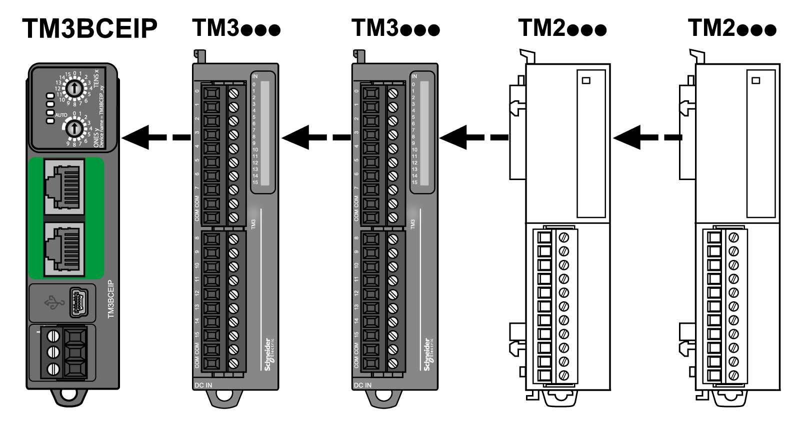
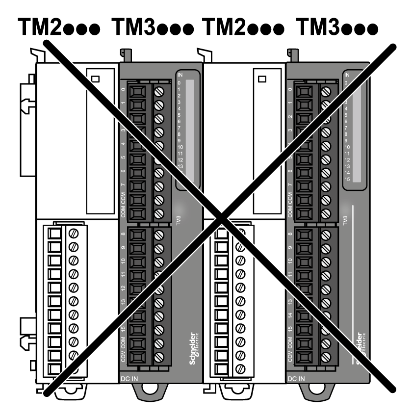

# Maximum Hardware Configuration

## Distributed Configuration Principle

The following illustration defines an example of a distributed configuration using a TM3BCEIP with a controller:

**1** Communication expansion module

**2** Controller

**3** TM3 bus coupler

**4** TM3 expansion modules

**5** TM3 transmitter and receiver

## TM3 Bus Coupler Distributed Configuration Architecture

Optimized distributed configuration and flexibility are provided by the association of:

* Controller
* TM3 bus coupler
* TM3 expansion modules
* TM2 expansion modules

The following illustration is an example of an association:

NOTE: Do not mount a TM2 module before any TM3 module as indicated in the following illustration:

## Maximum Number of Modules

Each TM3 bus coupler supports up to:

| Module type | Maximum number of modules |
| --- | --- |
| TM2 | 7 |
| TM2 - TM3 | 7 |
| TM3 | 7 without transmitter and receiver.  14 with transmitter and receiver. |

NOTE: EcoStruxure Machine Expert and EcoStruxure Machine Expert - Basic software validate the configuration to the extent possible. However, although EcoStruxure Machine Expert may allow certain configurations, the maximum configuration populated by high energy consuming modules, coupled with the maximum distance allowable between the TM3 transmitter and receiver modules, may present bus communication issues in some environments. If this occurs, you will need to analyze the energy consumption of the modules chosen for your configuration, minimize the cable distance required by your application, and otherwise consider optimizing your choices.

EIO0000003635.06