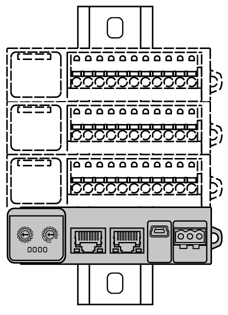
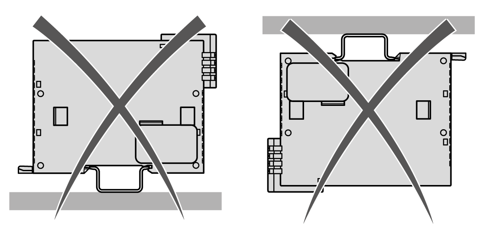
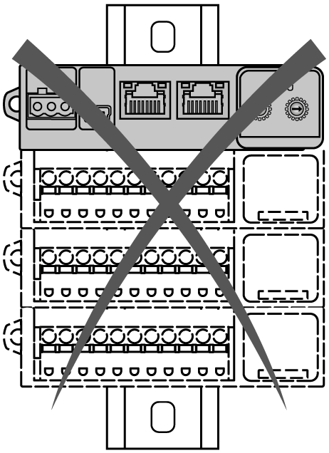
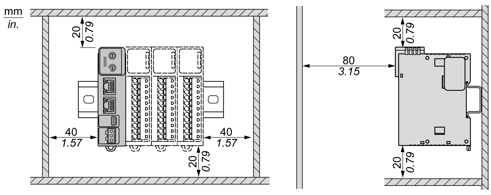

# Installation Guidelines

## Introduction

The TM3 bus coupler is connected to a controller using a fieldbus communication cable.

The TM3 bus coupler can be installed on a top hat section rail (DIN rail).

## Correct Mounting Position

Whenever possible, the TM3 bus coupler should be mounted horizontally on a vertical plane as shown in the illustrations below:

|  |  |
| --- | --- |
|  |  |

## Acceptable Mounting Position

Whenever possible, the TM3 bus coupler can also be mounted vertically with a temperature derating on a vertical plane as shown below:

NOTE: Expansion modules must be mounted above the TM3 bus coupler.

## Incorrect Mounting Position

The TM3 bus coupler should only be positioned as shown in [Correct Mounting Position](#D-SE-0087833__D-SE-0087833.8). The following illustrations show the incorrect mounting positions:

## Minimum Clearances

| WARNING | |
| --- | --- |
|  | UNINTENDED EQUIPMENT OPERATION  * Place devices dissipating the most heat at the top of the cabinet and ensure adequate ventilation. * Avoid placing this equipment next to or above devices that might cause overheating. * Install the equipment in a location providing the minimum clearances from all adjacent structures and equipment as directed in this document. * Install all equipment in accordance with the specifications in the related documentation.  Failure to follow these instructions can result in death, serious injury, or equipment damage. |

The TM3 bus coupler has been designed as an IP20 product and must be installed in an enclosure. Clearances must be respected when installing the product.

There are 3 types of clearances between:

* The TM3 bus coupler and all sides of the cabinet (including the panel door).
* The TM3 bus coupler terminal blocks and the wiring ducts. This distance reduces electromagnetic interference between the controller and the wiring ducts.
* The TM3 bus coupler and other heat generating devices installed in the same cabinet.

The following illustration shows the minimum clearances that apply to all TM3 bus coupler references:

EIO0000003635.06