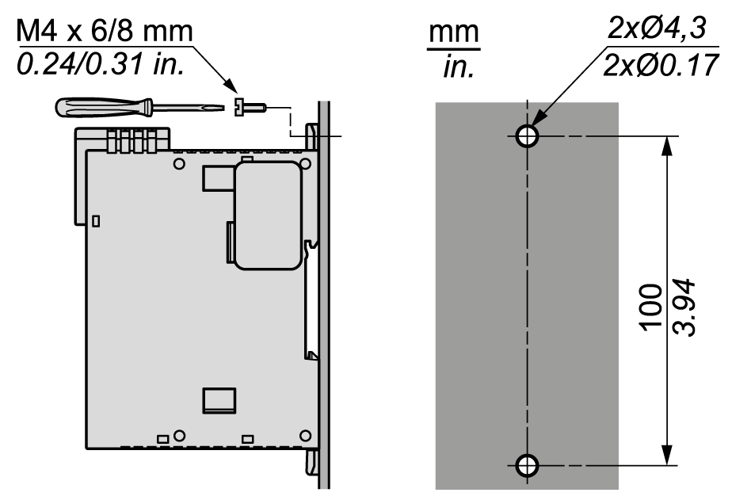

# Direct Mounting on a Panel Surface

## Overview

This section shows how to install TM3 bus coupler using the Panel Mounting Kit. This section also provides mounting hole layout.

## Installing the Panel Mounting Kit

The following procedure shows how to install a mounting strip:

| Step | Action |
| --- | --- |
| 1 | Insert the mounting strip TMAM2 into the slot at the top of the module. |

## Mounting Hole Layout

The following diagram shows the mounting holes for TM3 bus coupler:

EIO0000003635.06