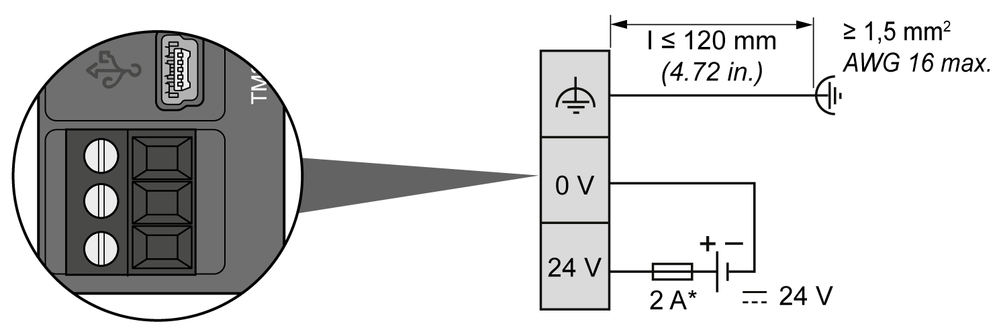

# DC Power Supply Characteristics and Wiring

## Overview

This section provides the characteristics and the wiring diagrams of the DC power supply.

## DC Power Supply Voltage Range

| DANGER | |
| --- | --- |
|  | FIRE HAZARD  Use only the correct wire sizes for the maximum current capacity of the power supplies.  Failure to follow these instructions will result in death or serious injury. |

| WARNING | |
| --- | --- |
|  | UNINTENDED EQUIPMENT OPERATION  Do not exceed any of the rated values specified in the environmental and electrical characteristics tables.  Failure to follow these instructions can result in death, serious injury, or equipment damage. |

## DC Power Supply Requirements

The TM3 bus coupler and the associated expansion modules require power supplies with a nominal voltage of 24 Vdc. The 24 Vdc power supplies must be rated Protective Extra Low Voltage (PELV) according to UL 61010-2-201 or IEC 60950 or Class 2 of NEC. These power supplies are isolated between the electrical input and output circuits of the power supply.

| WARNING | |
| --- | --- |
|  | POTENTIAL OF OVERHEATING AND FIRE  * Do not connect the equipment directly to line voltage. * Use only isolating PELV power supplies and circuits to supply power to the equipment1.  Failure to follow these instructions can result in death, serious injury, or equipment damage. |

1 For compliance to UL (Underwriters Laboratories) requirements, the power supply must also conform to the various criteria of NEC Class 2, and be inherently current limited to a maximum power output availability of less than 100 VA (approximately 4 A at nominal voltage), or not inherently limited but with an additional protection device such as a circuit breaker or fuse meeting the requirements of clause 9.4 Limited-energy circuit of UL 61010-1. In all cases, the current limit should never exceed that of the electric characteristics and wiring diagrams for the equipment described in the present documentation. In all cases, the power supply must be grounded, and you must separate Class 2 circuits from other circuits. If the indicated rating of the electrical characteristics or wiring diagrams are greater than the specified current limit, multiple Class 2 power supplies may be used.

## Modicon TM3 Bus Coupler DC Characteristics

The following table shows the DC power supply characteristics required for the TM3 bus coupler:

| Characteristic | | Value | |
| --- | --- | --- | --- |
| Rated voltage | | 24 Vdc | |
| Power supply voltage range | | 20.4...28.8 Vdc | |
| Power interruption time | | 1 ms at 24 Vdc | |
| Maximum inrush current | | 50 A | |
| Input current | | Maximum 800 mA | |
| Power consumption | | 14.4 W | Maximum 19.2 W |
| Isolation | between DC power supply and internal bus | Not isolated | |
| between DC power supply and grounding | Not isolated | |

## Power interruption

The TM3 bus coupler must be supplied by an external 24 V power supply equipment. During power interruptions, the TM3 bus coupler, associated to the suitable power supply, is able to continue normal operation for a minimum of 10 ms as specified by IEC standards.

When planning the management of the power supplied to the controller, you must consider the power interruption duration due to the fast cycle time of the controller.

There could potentially be many scans of the logic and consequential updates to the I/O image table during the power interruption, while there is no external power supplied to the inputs, the outputs or both depending on the power system architecture and power interruption circumstances.

| WARNING | |
| --- | --- |
|  | UNINTENDED EQUIPMENT OPERATION  * Individually monitor each source of power used in the controller system including input power supplies, output power supplies and the power supply to the controller to allow appropriate system shutdown during power system interruptions. * The inputs monitoring each of the power supply sources must be unfiltered inputs.  Failure to follow these instructions can result in death, serious injury, or equipment damage. |

## DC Power Supply Wiring Diagram

The following illustration shows the power supply terminal block:

**\*** Type T fuse

For more information, refer to the 5.08 pitch [Rules for Removable Screw Terminal block](D-SE-0026685.html#D-SE-0026685__D-SE-0026685.14).

EIO0000003635.06