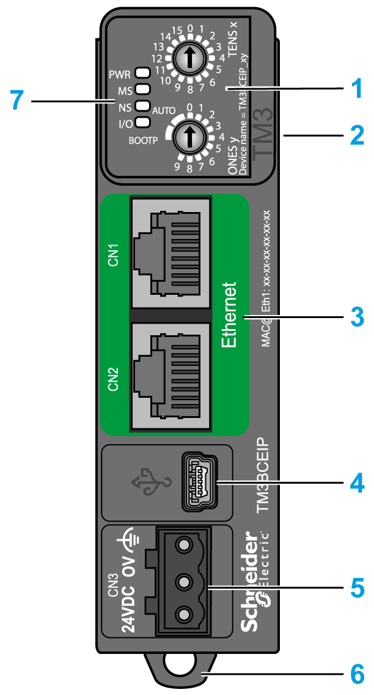

# TM3 Ethernet Bus Coupler Presentation

## Overview

The TM3 bus coupler is a device designed to manage EtherNet/IP or Modbus TCP communication when using TM2/TM3 expansion modules in a distributed architecture.

The main elements of the TM3 bus coupler are:

**1** Rotary switches

**2** Expansion connector for TM2/TM3 expansion modules

**3** Two (2) isolated switched Ethernet ports

**4** USB mini-B configuration port

**5** 24 Vdc power supply

**6** Clip-on lock for 35 mm (*1.38 in.*) top hat section rail (DIN rail)

**7** Status LEDs

## Main Characteristics

| Characteristic | Value |
| --- | --- |
| Rated power supply | 24 Vdc |
| Weight | 100 g (3.53 oz) |
| Rotary switch | 2 |
| Ethernet | 2 (isolated switched Ethernet ports: 10 Mbps / 100 Mbps) |
| Power supply connection type | Removable screw terminal block |

## Status LEDs

The following graphic shows the LEDs of TM3 bus coupler:

The following table describes the status LEDs:

| LED | Color | Status | Description |
| --- | --- | --- | --- |
| **PWR** | Green | On | Power is applied. |
| Off | Power is removed. All LED indicators are off. |
| **MS** | Green/Red | Flashing | Device is performing a self-test. |
| Green | Solid | Device is running. |
| Flashing | Device detected an invalid configuration or is not configured. |
| Red | Solid | Device detected an error that is, under most circumstances, unrecoverable. |
| Flashing | Device detected an error that is, under most circumstances, recoverable.  For example:   * Rotary switch position changed during operational mode. * Error detected during firmware update. |
| **NS** | Green/Red | Off | IP address is not configured. |
| Flashing | Device is performing a self-test. |
| Green | Solid | At least one CIP connection is established, and an exclusive owner connection has not timed out. |
| Flashing | The IP address is configured, but CIP connections are not established and an exclusive owner connection has not timed out. |
| Red | Solid | Device detected that the IP address is already in use. |
| Flashing | An IP address is configured, and an exclusive owner connection for which this device is the target has timed out. |
| **I/O** | Green | Solid | Device is communicating with the expansion modules. |
| Flashing | The physical configuration matches the software configuration, but no communication exists between the bus coupler and the expansion modules. |
| Red | Solid | The physical configuration is inconsistent with the software configuration. |
| Flashing | At least one TM2 or TM3 expansion module did not respond to the bus coupler for three consecutive cycles. |

NOTE: With the exception of the **PWR** LED, each LED is ON for a few seconds, then OFF during the boot sequence. The LED behavior rules apply when the boot is completed successfully.

EIO0000003635.06