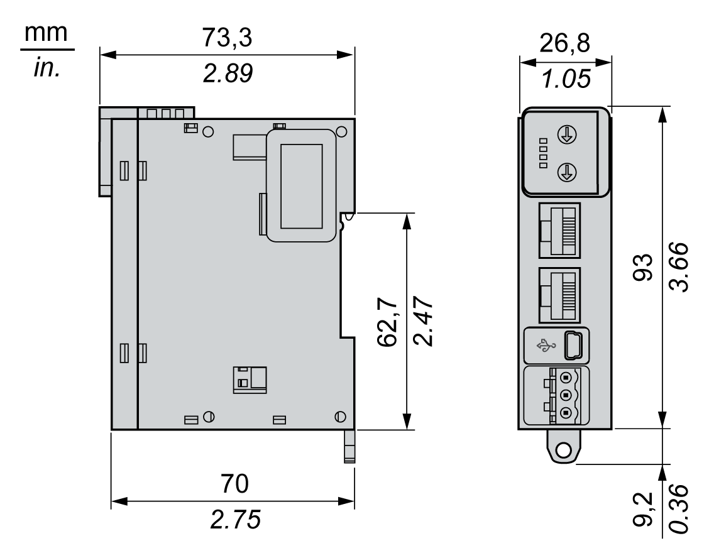

# TM3 Ethernet Bus Coupler Characteristics

## Introduction

This section provides a general description of the characteristics of the TM3 Ethernet bus coupler.

| WARNING | |
| --- | --- |
|  | UNINTENDED EQUIPMENT OPERATION  Do not exceed any of the rated values specified in the environmental and electrical characteristics tables.  Failure to follow these instructions can result in death, serious injury, or equipment damage. |

## Dimensions

The following graphic shows the external dimensions for the Modicon TM3 Bus Coupler:

## General Characteristics

The following table shows the characteristics of TM3 Ethernet Bus Coupler:

| Characteristics | Value |
| --- | --- |
| Connector insertion/removal durability | Over 100 times |
| Supplied power available for connected inputs and outputs modules  Current draw on 5 Vdc and 24 Vdc internal bus | 600 mA maximum |

EIO0000003635.06