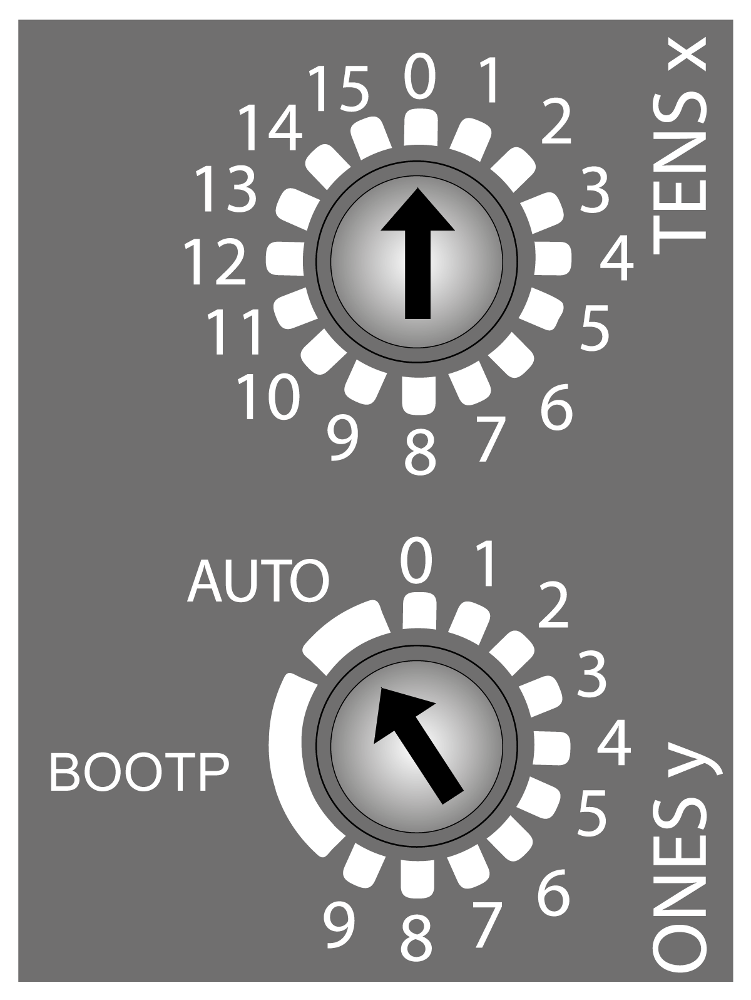
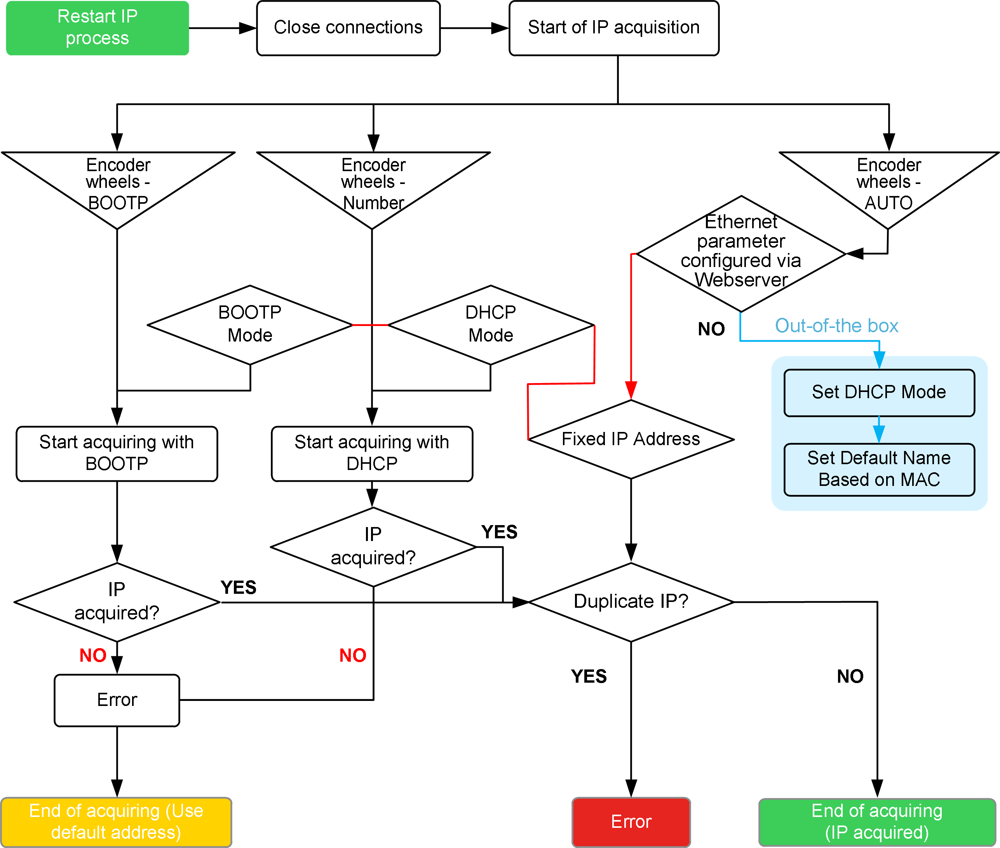

# Rotary Switch

## Overview

The two rotary switches located on the front panel of the TM3 Ethernet Bus Coupler are used to set an IP address.

The default values on the rotary switches are:

* **0** for **TENSx**
* **AUTO** for **ONESy**

NOTE: You can also set the IP address using the web server. The web server configured IP address is only taken into account when the rotary switch is in the **AUTO** position. If you use EcoStruxure Machine Expert - Basic, refer to the Modicon TM3 Bus Coupler (EcoStruxure Machine Expert - Basic) - Programming Guide. If you use EcoStruxure Machine Expert, refer to the Modicon TM3 Bus Coupler - Programming Guide.

## Setting an IP Address

Set the rotary switches before:

* Applying power to the module.
* Downloading the application.

NOTE: Any modification of the rotary switch position is taken into account after power up.

This table describes the configuration of the rotary switches:

| Position of the rotary switches | | Description |
| --- | --- | --- |
| Tens | Ones |
| **0...15** | **0...9** | Allows you to configure the device name. Use both switches to select a numeric value from 0...159.  For example, if **TENS x** = 08 and **ONES y** = 6, the device name is TM3BCEIP\_086.  NOTE: Device names TM3BCEIP\_091...TM3BECIP\_159 are reserved. |
| Any | **AUTO** | The default IP address (10.10.x.x) is used. The last two fields in the default IP address are composed of the last two hexadecimal bytes of the MAC address of the port.  You can change the network configuration with the embedded web server.  NOTE: A MAC address is always written in hexadecimal format and an IP address in decimal format. Convert the MAC address to decimal format. For example, if the MAC address is 00.80.F4.01.80.F2, the default IP address is 10.10.128.242.  If you use EcoStruxure Machine Expert - Basic, refer to the Modicon TM3 Bus Coupler (EcoStruxure Machine Expert - Basic) - Programming Guide. If you use EcoStruxure Machine Expert, refer to the Modicon TM3 Bus Coupler - Programming Guide. |
| Any | **BOOTP** | Uses the MAC address to request the IP parameters. |

Carefully manage the IP addresses because each device on the network requires a unique address. Having multiple devices with the same IP address can cause unintended operation of your network and associated equipment.

| WARNING | |
| --- | --- |
|  | UNINTENDED EQUIPMENT OPERATION  * Verify that there is only one master controller configured on the network or remote link. * Verify that all devices have unique addresses. * Obtain your IP address from your system administrator. * Confirm that the IP address of the device is unique before placing the system into service. * Do not assign the same IP address to any other equipment on the network. * Update the IP address after cloning any application that includes Ethernet communications to a unique address.  Failure to follow these instructions can result in death, serious injury, or equipment damage. |

NOTE: This device comes pre configured with an IP address of 10.10.xxx.xxx. Change this default address before using the device on the network.

It is good practice to ensure that your system administrator maintains a record of all assigned IP addresses on the network and subnetwork, and to inform the system administrator of all configuration changes performed.

## Applying the IP Address

The device reads the position of the rotary switches at power up.

If your device does not communicate, verify that the position of the rotary switches is correct. If you change the position of the rotary switches when in operation mode, the **MS** flashes red. You must do a power cycle to apply the new address.

EIO0000003635.06