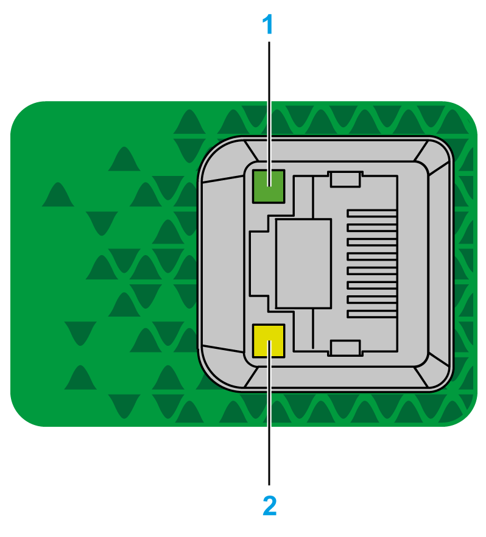

# Ethernet Port

## Overview

The TM3BCEIP is equipped with two isolated switched Ethernet ports (**CN1**, **CN2**) enabling easy daisy-chain configuration.

## Characteristics

This table describes the Ethernet characteristics:

| Characteristic | Description |
| --- | --- |
| Function | Modbus TCP, EtherNet/IP |
| Connector type | RJ45 |
| Auto negotiation | From 10 Mbps half duplex to 100 Mbps full duplex |
| Cable type | Shielded |
| Automatic cross-over detection | Yes |
| Topology | Ring type |

## Pin Assignment

This graphic shows the RJ45 Ethernet connector pin assignment:

This table describes the RJ45 Ethernet connector pins:

| Pin N° | Signal |
| --- | --- |
| 1 | TD+ |
| 2 | TD- |
| 3 | RD+ |
| 4 | - |
| 5 | - |
| 6 | RD- |
| 7 | - |
| 8 | - |

NOTE: The TM3 Ethernet Bus Coupler supports the MDI/MDIX auto-crossover cable function. It is not necessary to use special Ethernet crossover cables to connect devices directly to this port (connections without an Ethernet hub or switch).

NOTE: Ethernet cable disconnection is detected every second. In case of disconnection of a short duration (< 1 second), the network status may not indicate the disconnection.

## Status LEDs

This graphic shows RJ45 connectors status LEDs:

This table describes the Ethernet status LEDs:

| Label | Description | LED | | |
| --- | --- | --- | --- | --- |
| Color | Status | Description |
| 1 | Ethernet activity | Green | Off | No activity |
| Flashing | Transmitting or receiving data |
| 2 | Ethernet link | Green/Orange | Off | No link |
| Orange on | Link at 10 Mbit/s |
| Green on | Link at 100 Mbit/s |

EIO0000003635.06