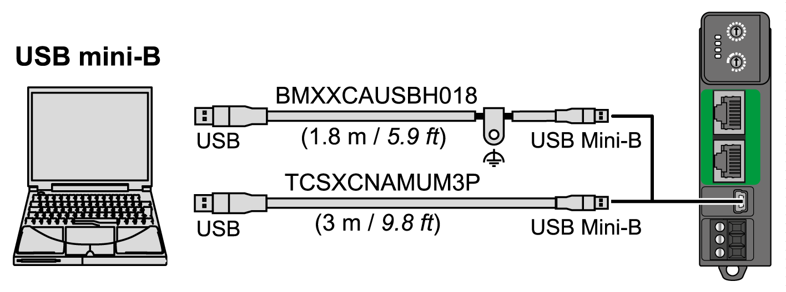
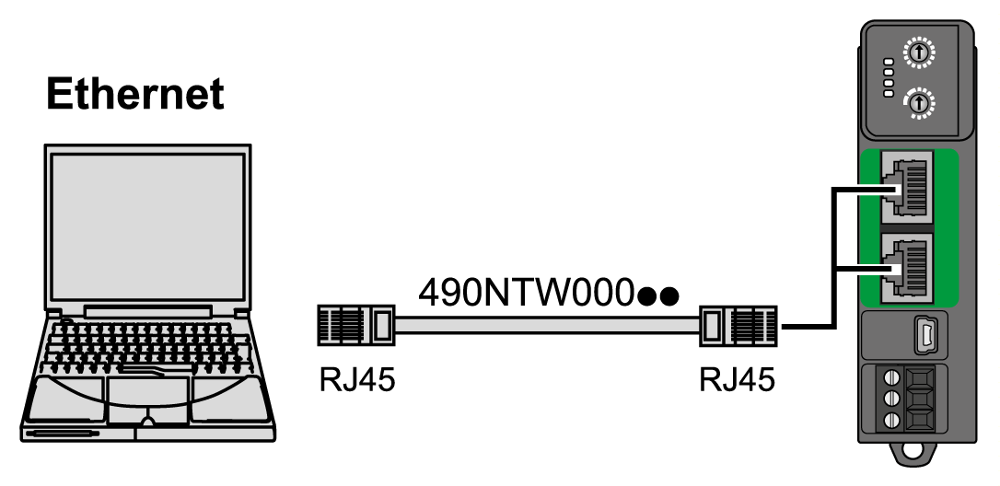

# Connecting the Modicon TM3 Bus Coupler to a PC

## Overview

You can connect the TM3 bus coupler to a PC through the following ports:

* USB
* Ethernet

## USB Mini-B Port Connection

The USB Mini-B port is dedicated for firmware update, configuration download and web server access.

| Cable Reference | Details |
| --- | --- |
| BMXXCAUSBH018 | Grounded and shielded, this USB cable is suitable for long duration connections. |
| TCSXCNAMUM3P | This USB cable is suitable for short duration connections such as quick updates or retrieving data values. |

NOTE: You can only connect one TM3 bus coupler or any other device associated with EcoStruxure Machine Expert and its component to the PC at any one time.

Using a typical USB cable, this connection is suitable for short duration connections to perform maintenance and inspect data values. It is not suitable for long-term connections such as commissioning or monitoring without the use of specially adapted cables to help minimize electromagnetic interference.

| WARNING | |
| --- | --- |
|  | UNINTENDED EQUIPMENT OPERATION OR INOPERABLE EQUIPMENT  * You must use a shielded USB cable such as a BMX XCAUSBH0•• secured to the functional ground (FE) of the system for any long-term connection. * Do not connect more than one controller or bus coupler at a time using USB connections. * Do not use the USB port(s), if so equipped, unless the location is known to be non-hazardous.  Failure to follow these instructions can result in death, serious injury, or equipment damage. |

The communication cable should be connected to the PC first to minimize the possibility of electrostatic discharge affecting the TM3 bus coupler.

Grounded and shielded, this USB cable is suitable for long-term connections.

The following illustration shows the USB connection to a PC:

To connect the USB cable to your TM3 bus coupler, follow the steps below:

| Step | Action |
| --- | --- |
| 1 | **1a**. If making a long-term connection using the cable BMXXCAUSBH018, or other cable with a ground shield connection, be sure to securely connect the shield connector to the functional ground (FE) or protective ground (PE) of your system before connecting the cable to your controller and your PC.  **1b**. If making a short-term connection using the cable TCSXCNAMUM3P or other non-grounded USB cable, proceed to step 2. |
| 2 | Connect your USB cable to the PC. |
| 3 | Connect the Mini connector of your USB cable to the TM3 bus coupler USB connector. |

## Ethernet Port Connection

To connect the TM3 bus coupler to a PC using the Ethernet ports:

To connect the TM3 bus coupler to the PC, do the following:

| Step | Action |
| --- | --- |
| 1 | Connect the Ethernet cable to the PC. |
| 2 | Connect the Ethernet cable to one of the Ethernet ports on the TM3 bus coupler. |

EIO0000003635.06