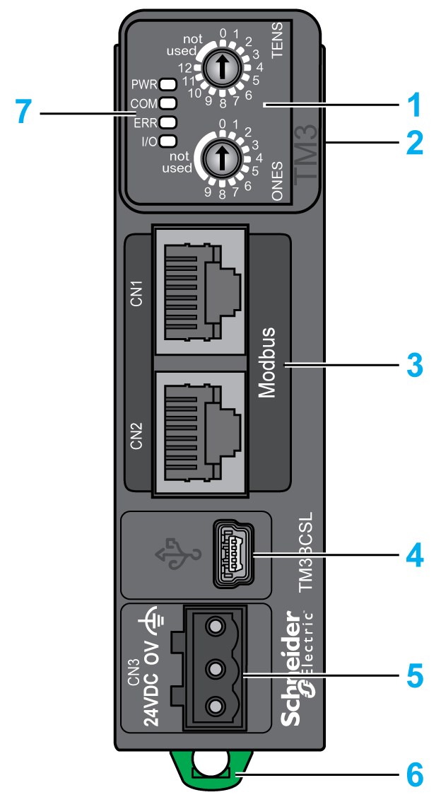

# TM3 Modbus Serial Line Bus Coupler Presentation

## Overview

The TM3 Modbus Serial Line bus coupler is a device designed to manage Serial Line communication when using TM2/TM3 expansion modules in a distributed architecture.

The main elements of the TM3 Modbus Serial Line bus coupler are:

**1** Rotary switches

**2** Expansion connector for TM2/TM3 expansion modules

**3** Two (2) isolated RJ45 (RS-485) ports (daisy-chained)

**4** USB mini-B configuration port

**5** 24 Vdc power supply

**6** Clip-on lock for 35 mm (*1.38 in.*) top hat section rail (DIN rail)

**7** Status LEDs

## Main Characteristics

| Characteristic | Value |
| --- | --- |
| Rated power supply | 24 Vdc |
| Weight | 100 g (3.53 oz) |
| Rotary switch | 2 |
| Serial line | 2 isolated RJ45 (RS-485) ports (daisy-chained) |
| Power supply connection type | Removable screw terminal block |

## Status LEDs

The following graphic shows the LEDs of TM3 Modbus Serial Line bus coupler:

The following table describes the status LEDs:

| LED | Color | Status | Description |
| --- | --- | --- | --- |
| **PWR** | Green | On | Power is applied. |
| Off | Power is removed. All LED indicators are off. |
| **COM** | Green | Flashing | Data sending and receiving. |
| Off | No data exchanged. |
| Red | Flashing | Device is receiving an incorrect data frame. |
| **ERR** | Red | Flashing | Device has detected an error that is, under most circumstances, recoverable. For example:   * Rotary switch position changed during operational mode. Return to the initial position to reset the LED behavior. * Error detected during firmware update. * Communication and configuration errors. |
| Off | No error detected. |
| **I/O** | Green | Flashing | Device has received and applied the expansion modules configuration. |
| Solid | Device is communicating with the expansion modules. |
| Green  Red | Flashing  Solid | The physical configuration is inconsistent with the software configuration. No data exchange (status and I/O) is occurring. |
| Green  Red | Solid  Solid | The physical configuration is inconsistent with the software configuration. I/O data is not applied. |
| Green  Red | Solid  Flashing | At least one TM2 or TM3 expansion module did not respond to the bus coupler for 10 consecutive cycles. |
| Off | No configuration. Device is not communicating with the expansion modules. |

NOTE: With the exception of the **PWR** LED, each LED is ON for a few seconds, then OFF during boot sequence. The LED behavior rules apply when the boot is completed successfully.

EIO0000003635.06