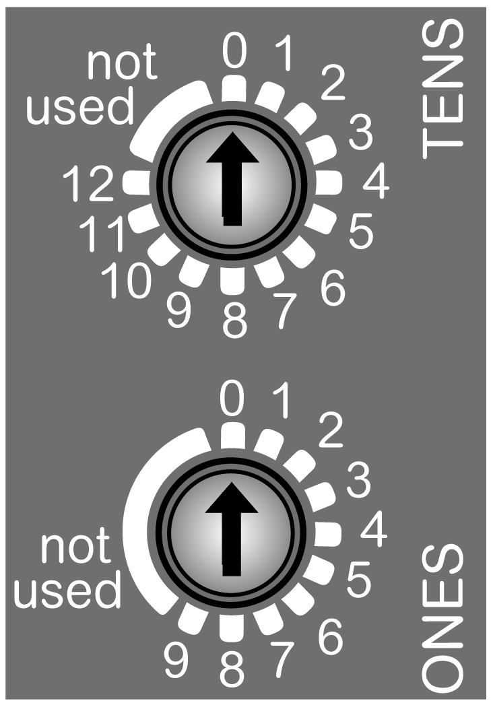
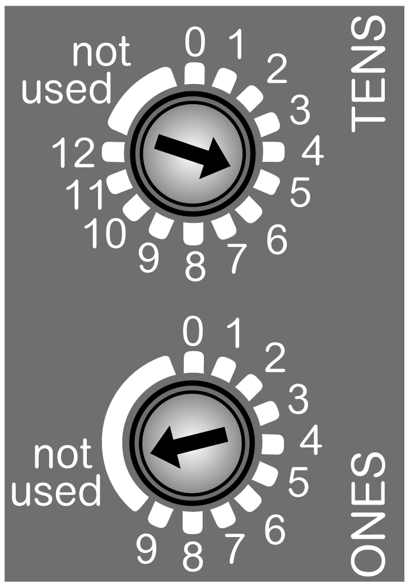
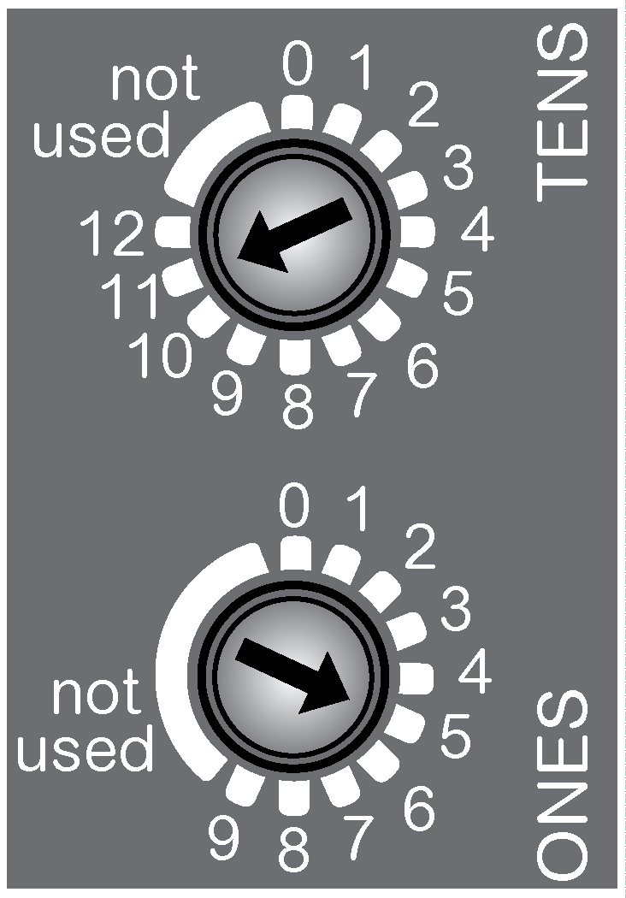

# Rotary Switch

## Overview

The two rotary switches located on the front panel of the TM3 Modbus Serial Line bus coupler are used to set the serial line baud rate and to set the serial line address.

Default values on the rotary switches are:

* **0** for **TENS**
* **0** for **ONES**

**(TENS)** Set the baud rate/represents the tens numbered 0 to 120.

**(ONES)** Authorize to set the baud rate when set to **not used** position/represents the numbers 0 to 9.

## Setting the Baud rate

The TM3 Modbus Serial Line bus coupler detects a new baud rate selection by the rotary switches only during power up. The baud rate is written to non-volatile memory.

Set the **ONES** rotary switch to any of the unnumbered positions (**not used**) to set a particular baud rate with the **TENS** rotary switch.

NOTE: Any modification of the rotary switch position during operational mode is not taken into account. The **ERR** LED flashes red. See [status LEDs](D-SE-0096862.html#D-SE-0096862__D-SE-0096862.6) table.

NOTE: Baud rate can also be set and verified via the web server. If you use EcoStruxure Machine Expert - Basic, refer to the Modicon TM3 Bus Coupler (EcoStruxure Machine Expert - Basic) - Programming Guide. If you use EcoStruxure Machine Expert, refer to the Modicon TM3 Bus Coupler - Programming Guide.

To set the baud rate, follow the steps below:

| Step | Action | Comment |
| --- | --- | --- |
| 1 | Remove power to the bus coupler. | The bus coupler detects the changes only at the next power up cycle. |
| 2 | With a 2 mm or 2.5 mm slotted (flathead) screwdriver, set the **ONES** rotary switch to any of the unnumbered positions (**not used**).  NOTE: Rotary switch is designed to be torqued normally by hand. Axial force must be inferior to 2 N. | Setting the rotary switch to any of these unnumbered positions prepares the bus coupler to accept a new baud rate. |
| 3 | With a 2 mm or 2.5 mm slotted (flathead) screwdriver, set the **TENS** rotary switch to the position that corresponds to your selected baud rate. | Use the baud rate selection table below to determine the position of the rotary switch. |
| 4 | Apply power to the bus coupler. | The bus coupler reads the rotary switch settings only during power up. |
| 5 | Wait for the **COM** and the **ERR** LEDs to flash 3 times, then remain solid. | The bus coupler has written the new baud rate setting to memory. |
| 6 | Remove power to the bus coupler and set the serial line address using the rotary switches, as described below in [Setting the Serial Line address](#D-SE-0096907__D-SE-0096907.7). | The baud rate has been established for the bus coupler. It must be followed by the address setting to operate. |

## Baud Rate Selection Table

The following table shows the rotary switch positions and the baud rate:

| Position **TENS** rotary switch | Baud rate |
| --- | --- |
| 0 | 19200 bps (default) |
| 1 | 1200 bps |
| 2 | 2400 bps |
| 3 | 4800 bps |
| 4 | 9600 bps |
| 5 | 19200 bps |
| 6 | 38400 bps |
| 7 | 57600 bps |
| 8 | 115200 bps |
| 9...12 | Not used |

NOTE: Setting the **TENS** rotary switch between 9 and 12 and unnumbered part generates an error detected at the next power up.

## Baud Rate Setting Example

The following figure shows an example when the serial line baud rate is configured to 19200 bps.

**(TENS)** Set to 5 to configure the serial line baud rate to 19200 bps.

**(ONES)** Set to the **not used** position to authorize the baud rate setting.

## Setting the Serial Line Address

The TM3 Modbus Serial Line bus coupler address (from 1 to 127, decimal) is configured using the two serial line address settings rotary switches.

| WARNING | |
| --- | --- |
|  | UNINTENDED EQUIPMENT OPERATION  Do not use an address outside of the specified range (from 1 to 127).  Failure to follow these instructions can result in death, serious injury, or equipment damage. |

To reset the bus coupler, remove power and provide a correct address before reapplying power to the bus coupler.

Set the serial line address using the **TENS** rotary switch to represent the hundreds and tens digits and the **ONES** rotary switch to represent the units digits.

Carefully manage the addresses because each device on the network requires a unique address. Having multiple devices with the same address can cause unintended operation of your network and associated equipment.

| WARNING | |
| --- | --- |
|  | UNINTENDED EQUIPMENT OPERATION  * Do not connect the serial line cable and apply power to the TM3 Modbus Serial Line Bus Coupler on a serial line that is operational (other devices connected in an ongoing control scheme) unless you first set the appropriate, unique address for the Bus Coupler. * Assure that unique Modbus addresses are assigned to the TM3 Modbus Serial Line Bus Coupler, and that those addresses are also unique from all other devices connected to the serial line.  Failure to follow these instructions can result in death, serious injury, or equipment damage. |

## Serial Line Address Setting Example

The following figure shows an example when the serial line address is set to 115:

**(TENS)** Represents the tens numbered 0 to 120, set to 110.

**(ONES)** Represents the numbers 0 to 9, set to 5.

EIO0000003635.06