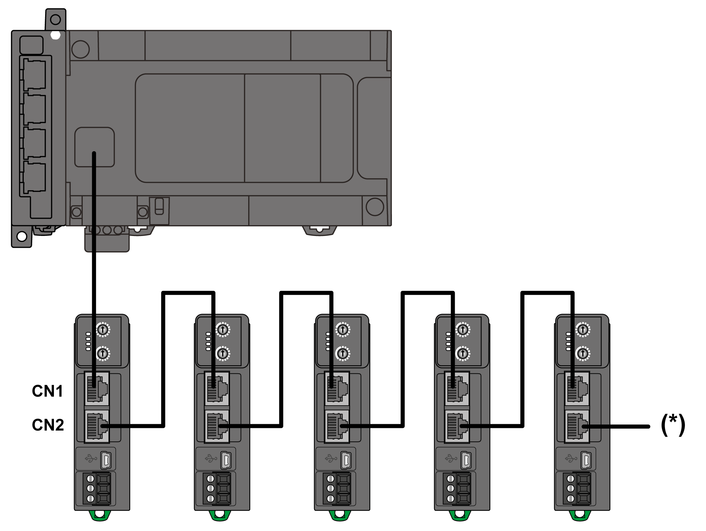

# Serial Line Port

## Overview

The TM3 Modbus Serial Line bus coupler is equipped with two isolated RJ45 ports (**CN1**, **CN2**) enabling easy daisy-chain configuration, as shown in following graphic:

**\*** You can connect a maximum of 32 Modbus devices. The last device must be terminated by terminating resistor.

## Characteristics

This table describes the serial line characteristics:

| Characteristic | Description |
| --- | --- |
| Function | Serial line, Modbus, TIA-485 |
| Connector type | RJ45 |
| Cable type | Shielded |
| Topology | Bus Type |

## Pin Assignment

This graphic shows the RJ45 (RS-485) connector pin assignment:

This table describes the RJ45 (RS-485) connector pins:

| Pin N° | Signal | Description |
| --- | --- | --- |
| 1 | N.C. | No Connection |
| 2 | N.C. | No Connection |
| 3 | N.C. | No Connection |
| 4 | D1 | Transmit/receive data Low |
| 5 | D0 | Transmit/receive data High |
| 6 | N.C. | No Connection |
| 7 | N.C. | No Connection |
| 8 | C | Common |

| WARNING | |
| --- | --- |
|  | UNINTENDED EQUIPMENT OPERATION  Do not connect wires to unused terminals and/or terminals indicated as “No Connection (N.C.)”.  Failure to follow these instructions can result in death, serious injury, or equipment damage. |

EIO0000003635.06