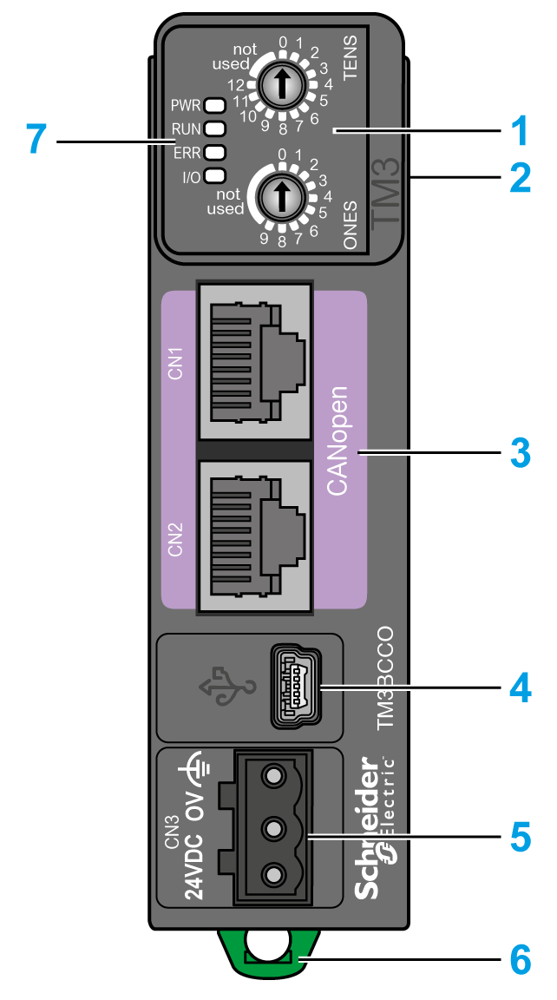

# TM3 CANopen Bus Coupler Presentation

## Overview

The TM3 CANopen bus coupler is a device designed to manage CANopen communication when using TM2/TM3 I/O expansion modules in a distributed architecture.

The main elements of the TM3 CANopen bus coupler are:

**1** Rotary switches

**2** Expansion connector for TM2/TM3 I/O expansion modules

**3** Two (2) isolated RJ45 CANopen ports (daisy-chained)

**4** USB mini-B configuration port

**5** 24 Vdc power supply

**6** Clip-on lock for 35 mm (*1.38 in.*) top hat section rail (DIN rail)

**7** Status LEDs

## Main Characteristics

| Characteristic | Value |
| --- | --- |
| Nominal supply voltage | 24 Vdc |
| Weight | 100 g (3.53 oz) |
| Rotary switch | 2 |
| CANopen port | 2 isolated RJ45 ports for CANopen (daisy-chained). |
| Power supply connection type | Removable screw terminal block |

## Status LEDs

The following graphic shows the LEDs of TM3 CANopen bus coupler:

The following table describes the status LEDs:

| LED | Color | Status | Description |
| --- | --- | --- | --- |
| **PWR** | Green | On | Power is applied. |
| Off | Power is removed. All LED indicators are off. |
| **RUN** | Green | On | Device status is operational. |
| Flickering | In conjunction with a flickering **ERR** LED, automatic search for the bus communication speed. |
| Flashing | Device status is pre-operational. |
| Single flash | Device status is stopped. |
| Triple flash | Firmware upgrade. |
| **ERR** | Red | On | Bus off. |
| Flickering | In conjunction with a flickering **RUN** LED, automatic search for the bus communication speed. |
| Flashing | Invalid CANopen stack configuration. |
| Single flash | An internal error counter in the CAN controller has reached or exceeded the error frame limit threshold (error frame). |
| Double flash | Error control event detected. Detection of a guard event (NMT-Slave or NMT-master) or a heartbeat event (Heartbeat consumer). |
| Triple flash | Synchronization error detected: message not received from sync producer within the defined period. |
| Quadruple flash | Event-timer error detected: An expected PDO has not been received before the event-timer elapsed. |
| Off | No error detected. |
| **I/O** | Green | Flashing | Device has received and applied the expansion modules configuration. |
| On | Device is communicating with the expansion modules. |
| Red | Single flash | Expansion module configuration transfer timeout. |
| Green  Red | Flashing  On | The physical configuration is inconsistent with the software configuration. No data exchange (status and I/O) is occurring. |
| Green  Red | On  On | The physical configuration is inconsistent with the software configuration. I/O data is not applied. |
| Green  Red | On  Flashing | At least one TM2 or TM3 expansion module did not respond to the bus coupler for 10 consecutive cycles. |
| Off | No configuration. Device is not communicating with the expansion modules. |

This timing diagram shows the different LEDs flashing behaviors:

NOTE: With the exception of the **PWR** LED, each LED is ON for a few seconds, then OFF during the boot sequence. The LED behavior rules apply when the boot is completed successfully.

EIO0000003635.06