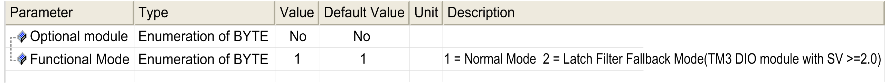

# Adding an Expansion Module

## Adding a Module

To add an expansion module to your controller, select the expansion module in the Hardware Catalog, drag it to the Devices tree, and drop it on one of the highlighted nodes.

For more information on adding a device to your project, refer to:

• Using the [Drag-and-drop Method](../../../../../api/crossBook?lang=en-US&virtualBookName=SoMProg&topicID=D_SE_0083368)

• Using the [Contextual Menu or Plus Button](../../../../../api/crossBook?lang=en-US&virtualBookName=SoMProg&topicID=D_SE_0083370)

## I/O Mapping Tab

The I/O mapping of an expansion module is carried out through the I/O Mapping tab of the expansion module configuration.

This table describes how to configure an expansion module:

| Step | Action |
| --- | --- |
| 1 | Double-click the expansion module node in the Devices tree to display the I/O Mapping tab. |
| 2 | Edit the parameters of the I/O Mapping tab to configure the expansion module. |

This figure shows the I/O Mapping tab:

This table describes each parameter of the I/O Mapping tab:

| Parameter | Description |
| --- | --- |
| Variable | Allows you to map the channel on a variable.  NOTE: Expand the list of variables from the category Inputs or Outputs.  You can map a channel by either creating a new variable or mapping to an existing variable.  Create new variable:  Double-click the variable to enter the new variable name. A new variable is created if the variable does not already exist.  Map to existing variable:  Double-click the variable and click [...] to open the Input Assistant window. Select the variable from the list and press OK.  This figure shows the Input Assistant window: |
| Mapping | Indicates whether the channel is mapped on a new variable or an existing variable. |
| Channel | Displays the channel name of the device. |
| Address | Displays the address of the channel.  NOTE: If the channel is mapped to an existing variable, corresponding address appears as strikethrough text in the table. |
| Type | Displays the data type of the channel. |
| Default Value | Indicates the value taken by the output when the controller is in a STOPPED or HALT state.  Double-click the cell to change the default value.  You can toggle between the following values:   * No value (*empty cell*) * TRUE * FALSE |
| Unit | Displays the unit of the channel value. |
| Description | Allows you to enter a short description of the channel. |
| Bus cycle options | Depending on the controller reference, you can configure the Bus cycle options.  This configuration setting is the parent for all Bus cycle task parameters used in the application device tree.  Some devices with cyclic calls, such as a CANopen manager, can be attached to a specific task. In the device, when this setting is set to Use parent bus cycle setting, the setting set for the controller is used.  The selection list offers all tasks currently defined in the active application. The default setting is Use parent bus cycle setting. |

## I/O Configuration Tab

This tab allows you to configure the I/O module:

NOTE: With SV >=2.0, the firmware version of the digital I/O module is greater than or equal to 28.

NOTE: To configure the module as an optional module, refer to [Optional I/O Expansion Modules](D-SE-0057492.html#D-SE-0057492).

## Configuring the Latch and Filter Parameters

You can select the type of edge for the latch parameter, refer to [Latch Principles](LatchPrinciples-3AFDCEE6.html):

* Rising edge
* Falling edge
* Both edge
* None

The filter parameter reduces the effect of bounce on a controller digital input.

NOTE: The more the filter value is low, the more the effects of electromagnetic interference are maximized.

You can configure these parameters on the following modules:

* TM3DI• except TM3DI8A
* TM3DM• except TM3DM16R and TM3DM32R
* TM3XHSC202 / TM3XHSC202G and TM3XFHSC202 / TM3XFHSC202G

This table describes how to configure the latch and filter parameters.

| Step | Action |
| --- | --- |
| 1 | Click the module node  > I/O Configuration tab. |
| 2 | Select 2 as Value for Functional Mode. |
| 3 | Select an input. |
| 4 | Configure the parameters. |

This table describes the latch and filter parameters:

| Parameter | Type | Value | Unit | Description |
| --- | --- | --- | --- | --- |
| Fonctional Mode | Enumeration of BYTE | 1\*  2 | – | Fonctional Mode 2 allows you to configure latch and filter parameters. |
| Inputs | | | | |
| Latch | Enumeration of BYTE | No\*  Both edges  Rising edge  Falling edge | – | Latching allows incoming pulses with amplitude widths shorter than controller scan time to be captured and recorded.  NOTE: Latch is not supported when the expansion module is used with a Modicon TM3 Bus Coupler. |
| Filter | Enumeration of BYTE | 0  0.3  0.5  1  2  4\*  12 | ms | Integrator filtering value reduces the effect of bounce on a controller input.  NOTE: TM3XHSC202 / TM3XHSC202G expansion modules have different filter values, see [Configuration of Inputs](D-SE-0094027.html#D-SE-0094027__D-SE-0094027.4).  NOTE: TM3XFHSC202 / TM3XFHSC202G expansion modules have different filter values, see [Configuration of Inputs](D-SE-0094028.html#D-SE-0094028__D-SE-0094028.4). |
| **\*** Parameter default value | | | | |

## Configuring the Outputs

This table describes how to configure the fallback parameters:

| Step | Action |
| --- | --- |
| 1 | Click the module node  > I/O Configuration tab. |
| 2 | Select 2 as Value for Functional Mode. |
| 3 | Select an output. |
| 4 | Configure the parameters. |

This table presents the function of the different parameters:

| Parameter | Value | Description | |
| --- | --- | --- | --- |
| Fallback mode | Fallback Value\*  Maintain | Allows you to set the fallback mode when the connection between the controller and the module is lost. | |
|  |
| Force value | 0\*  1 | Allows you to set the force value. Only available if the Fallback mode is set to Fallback Value. | |
| **\*** Parameter default value | | | |

NOTE: TM3DM16R and TM3DM32R expansion modules do not support fallback mode.

NOTE: Additional configuration options are available for the following expansion modules:

* TM3XHSC202 / TM3XHSC202G, refer to [Configuration of Outputs](D-SE-0094027.html#D-SE-0094027__D-SE-0094027.7)
* TM3XFHSC202 / TM3XFHSC202G, refer to [Configuration of Outputs](D-SE-0094028.html#D-SE-0094028__D-SE-0094028.7)

EIO0000003119.03