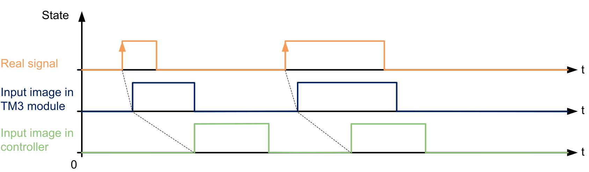
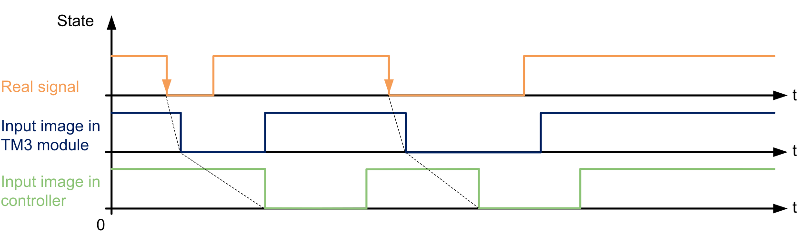
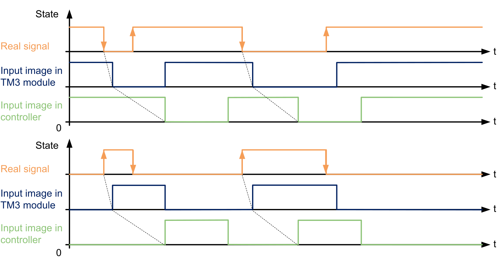

# Latch Principles

## Introduction

The Latch parameter allows incoming pulses with amplitude widths shorter than the controller scan time to be captured and recorded.

The following timing diagram illustrates the latching effects:

Several edge types can be selected for this parameter.

## Rising edge

Latch rising edge allows the detection of a positive pulse whose width corresponds to the bounce filter value.

## Falling edge

Latch falling edge allows the detection of a negative pulse whose width corresponds to the bounce filter value.

## Both edge

Latch both edge allows the detection of an inverted pulse whose width corresponds to the bounce filter value.

When the I/O module is read by the controller, the level-state of the input is taken as reference to detect the next pulse.

EIO0000003119.03