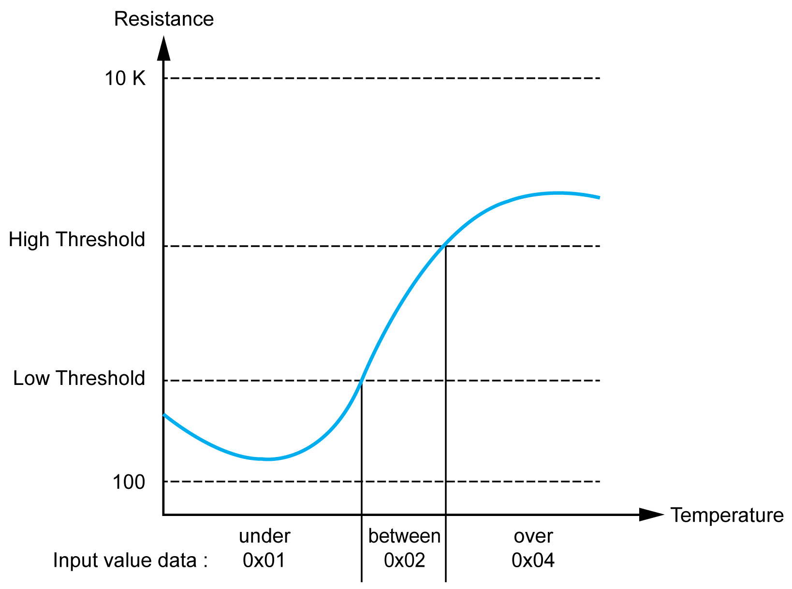
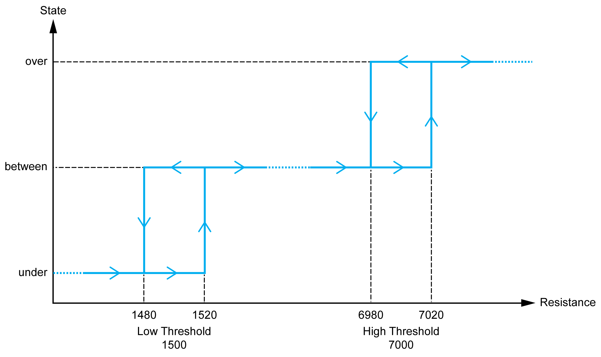

# TM3TI8T / TM3TI8TG

## Introduction

The TM3TI8T (screw terminal block) / TM3TI8TG (spring terminal block) expansion module features 8 analog input channels with 16-bit resolution.

The channel input types are:

* K thermocouple
* J thermocouple
* R thermocouple
* S thermocouple
* B thermocouple
* E thermocouple
* T thermocouple
* N thermocouple
* C thermocouple
* NTC thermistor
* PTC thermistor
* Ohmmeter

For information on the diagnostic codes produced by each input type, refer to [Analog I/0 Modules Diagnostics](D-SE-0038125.html#D-SE-0038125).

For further hardware information, refer to [TM3TI8T / TM3TI8TG](../../../../../api/crossBook?lang=en-US&virtualBookName=tm3aiohw&topicID=D_SE_0035001).

NOTE:

If you have physically wired the analog channel for a voltage signal and you configure the channel for a current signal in EcoStruxure Machine Expert, you may damage the analog circuit.

| NOTICE | |
| --- | --- |
|  | INOPERABLE EQUIPMENT  Verify that the physical wiring of the analog circuit is compatible with the software configuration for the analog channel.  Failure to follow these instructions can result in equipment damage. |

## Configuring the Module

For each input, you can define the following parameters:

| Parameter | | Value | Default Value | Description |
| --- | --- | --- | --- | --- |
| Type   * Not used | | - | Not used | Choose the parameter type and scope for the channel. |
| Type   * K Thermocouple * J Thermocouple * R Thermocouple * S Thermocouple * E Thermocouple * T Thermocouple * N Thermocouple * NTC Thermistor | | Scope   * Customized * Celsius (0.1 °C) * Fahrenheit (0.1 °F) | Celsius (0.1 °C) |
| Type   * B Thermocouple * C Thermocouple | | Scope   * Customized * Celsius (0.1 °C) * Fahrenheit (0.2 °F) | Celsius (0.1 °C) |
| Type   * PTC Thermistor | | Scope   * Customized * Threshold | Threshold |
| Type   * Ohmmeter | | Scope   * Resistance (Ω) | Resistance |
| Minimum | | See the table below | | Specifies the low measurement limit. |
| Maximum | | See the table below | | Specifies the high measurement limit. |
| Rref (used only with [NTC probe](#D-SE-0037087__D-SE-0037087.10)) | | 1...65535 | 330 | Reference resistance in Ohm at temperature Tref. |
| Tref (used only with NTC probe) | | 1...1000 | 25 | Reference temperature value in Celsius. |
| Beta (used only with NTC probe) | | 1...32767 | 3569 | Sensitivity of NTC probe in Kelvin. |
| Input Filter | | 0...1000 | 0 | Specifies the first order filter time constant (0...10 s) in increments of 10 ms. |
| Sampling | | 100ms/Channel | 100ms/Channel | Specifies the sampling period of the channel. |
| Status Enabled | | Yes  No | Yes | Enables the diagnostic byte of each channel.  If the status is disabled (value = No), the status bytes `IBStatusIWx` do not contain relevant information. |
| High Threshold (used only with [PTC probe](#D-SE-0037087__D-SE-0037087.12)) | | 100...10000 | 3100 | Activation threshold |
| Low Threshold (used only with PTC probe) | | 100...10000 | 1500 | Reactivation threshold |

The following table indicates the possible range values for the selected type of thermocouple:

| Type | Customized | Range in Celsius | Range in Fahrenheit |
| --- | --- | --- | --- |
| K Thermocouple | -32768...32767 | -2000...13000 (0.1°C) | -3280...23720 (0.1°F) |
| J Thermocouple | -2000...10000 (0.1°C) | -3280...18320 (0.1°F) |
| R Thermocouple | 0...17600 (0.1°C) | 320...32000 (0.1°F) |
| S Thermocouple | 0...17600 (0.1°C) | 320...32000 (0.1°F) |
| B Thermocouple | 0...18200 (0.1°C) | 160...16540 (0.2°F) |
| E Thermocouple | -2000...8000 (0.1°C) | -3280...14720 (0.1°F) |
| T Thermocouple | -2000...4000 (0.1°C) | -3280...7520 (0.1°F) |
| N Thermocouple | -2000...13000 (0.1°C) | -3280...23720 (0.1°F) |
| C Thermocouple | 0...23150 (0.1°C) | 160...20995 (0.2°F) |
| NTC Thermistor | -900...1500 (0.1°C) | -1300...3020 (0.1°F) |
| PTC Thermistor | – | – |

## NTC Thermistor

The temperature (Tm) varies in relation to the resistance (r) following the equation below:

Where:

* Tm = temperature measured by the probe, in Kelvin
* r = physical value of the resistance in Ohm
* R = reference resistance in Ohm at temperature T
* T = reference temperature in Kelvin
* B = sensitivity of the NTC probe in Kelvin

R, T and B must be greater or equal to 1.

NOTE: 25 °C = 77 °F = 298.15 K

## PTC Thermistor

This table describes the read value according to the resistance:

| Resistance Value | Read Value |
| --- | --- |
| Under the low threshold | 1 |
| Between thresholds | 2 |
| Over the high threshold | 4 |

This figure represents the threshold operation:

This figure represents an example hysteresis curve:

## Ohmmeter

This table describes the minimum and maximum values:

| Parameter | Value |
| --- | --- |
| Minimum | 100 Ω |
| Maximum | 32 kΩ |

## I/O Mapping Tab

Variables can be defined and named in the I/O Mapping tab. Additional information such as topological addressing is also provided in this tab.

This table describes the I/O Mapping tab:

| Variable | Channel | Type | Description |
| --- | --- | --- | --- |
| Inputs | IW0 | INT | Current value of the input 0 |
| IW1 | INT | Current value of the input 1 |
| IW2 | INT | Current value of the input 2 |
| IW3 | INT | Current value of the input 3 |
| IW4 | INT | Current value of the input 4 |
| IW5 | INT | Current value of the input 5 |
| IW6 | INT | Current value of the input 6 |
| IW7 | INT | Current value of the input 7 |
| Diagnostic | IBStatusIW0 | BYTE | [Status of input 0](D-SE-0038125.html#D-SE-0038125__D-SE-0038125.10) |
| IBStatusIW1 | BYTE | [Status of input 1](D-SE-0038125.html#D-SE-0038125__D-SE-0038125.10) |
| IBStatusIW2 | BYTE | [Status of input 2](D-SE-0038125.html#D-SE-0038125__D-SE-0038125.10) |
| IBStatusIW3 | BYTE | [Status of input 3](D-SE-0038125.html#D-SE-0038125__D-SE-0038125.10) |
| IBStatusIW4 | BYTE | [Status of input 4](D-SE-0038125.html#D-SE-0038125__D-SE-0038125.10) |
| IBStatusIW5 | BYTE | [Status of input 5](D-SE-0038125.html#D-SE-0038125__D-SE-0038125.10) |
| IBStatusIW6 | BYTE | [Status of input 6](D-SE-0038125.html#D-SE-0038125__D-SE-0038125.10) |
| IBStatusIW7 | BYTE | [Status of input 7](D-SE-0038125.html#D-SE-0038125__D-SE-0038125.10) |

For further generic descriptions, refer to [I/O Mapping Tab Description](D-SE-0032519.html#D-SE-0032519__D-SE-0032519.17).

EIO0000003119.03