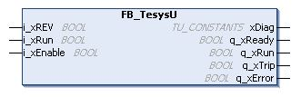

# FB\_TesysU: Control the TM3 Expert I/O Module

## Overview

The FB\_TeSysU function block is included in the TM3 library.

## Graphical Representation

## I/O Variable Description

This table describes the input variables:

| Input | Type | Comment |
| --- | --- | --- |
| xRev | BOOL | State determines the direction command:   * FALSE: forward direction (DIR1) * TRUE: reverse direction (DIR2) |
| xRun | BOOL | Activates/deactivates the direction command to the associated motor starter:   * FALSE: no direction command is activated (neither DIR1 nor DIR2) * TRUE: depending on the state of the xRev input, the corresponding command (DIR1 or DIR2) is activated |
| xEnable | BOOL | True enables the function block. |

This table describes the output variables:

| Output | Type | Comment |
| --- | --- | --- |
| xDiag | TU\_CONSTANTS | The current status when q\_xError is set to True:   * TU\_STDBY. Tesys: off, xRun: on * TU\_OFF. Tesys: off, xRun: off * TU\_RUN. Tesys: on, xRun: on * TU\_RDY. Tesys: on, xRun: off * TU\_TRIP. Tesys: on, xRun: on * TU\_ERR\_REV\_ON\_DOL. Tesys: on, xRun: on * TU\_ERR\_REV\_AT\_RUN. Tesys: on, xRun: on * TU\_ERR\_OVERCURRENT. Tesys: on, xRun: on * FB\_DISABLED. Tesys: on, xRun: on |
| q\_xReady | BOOL | True sets the selector of the module to the ON position. |
| q\_xRun | BOOL | True closes the power contacts of the module. |
| q\_xTrip | BOOL | True sets the selector of the module to the TRIP position. |
| q\_xError | BOOL | True retrieves the current detected error status. |

EIO0000003119.03