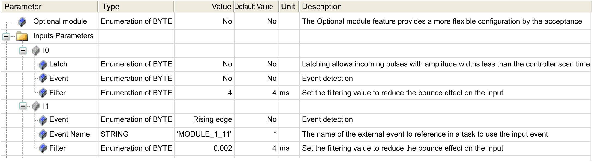
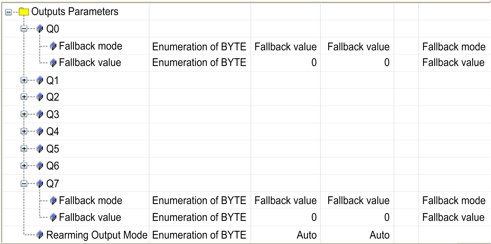

# TM3XFHSC202 / TM3XFHSC202G Module Configuration

## Overview

The embedded I/O function allows configuration of the inputs and outputs.

## Accessing the I/O Configuration Window

Follow these steps to access the I/O configuration window:

| Step | Description |
| --- | --- |
| 1 | In the [Devices tree](../../../../../api/crossBook?lang=en-US&virtualBookName=m262prg&topicID=D_SE_0080027), under the IO\_Bus node, double-click the module name. |
| 2 | Select the I/O Configuration tab. |

## Configuration of Inputs

This figure shows the I/O Configuration tab for inputs:

For each input not used by a counting function, you can configure the following parameters:

| Parameter | Value | Description | Constraint |
| --- | --- | --- | --- |
| Latch | No\*  Yes | Allows incoming pulses with amplitude widths shorter than the controller scan time to be captured and recorded. | Available if Event is disabled.  Use latch inputs in MAST task only. |
| Event | No\*  Rising edge  Falling edge  Both edges | Event detection | Available if:   * Latch is disabled AND * The module is one of the two first TM3XFHSC202 / TM3XFHSC202G modules on the [bus](../../../../../api/crossBook?lang=en-US&virtualBookName=tm3eiohw&topicID=D_SE_0090331). |
| Event Name | – | Allows a unique name to be created for this event, and this unique name can then be referenced in a task. | Available if the value of Event is different from No.  49 characters maximum.  To use this event, create an External Event task and give it the same name as the Event Name. |
| Filter | 0.000 ms  0.001 ms  0.002 ms  0.005 ms  0.01 ms  0.05 ms  0.08 ms  0.5 ms  1 ms  4 ms\*  12 ms | Reduces the effect of noise on a controller input. | – |
| **\*** Parameter default value | | | |

## Configuration of Outputs

This figure shows the I/O Configuration tab for outputs:

This table presents the function of the different parameters:

| Parameter | Value | Description | |
| --- | --- | --- | --- |
| Fallback mode | Maintain  Fallback Value\* | Reflex Output configured | Reflex Output not configured |
| Allows you to set the fallback mode when:   * The controller is in `STOPPED` or `HALTED` state. * The connection between the controller and the module is lost.   NOTE: Maintain is disabled. | Allows you to set the fallback mode when the connection between the controller and the module is lost.  NOTE: When the controller is in `STOPPED` state, the behavior is defined in PLC Settings [tab](../../../../../api/crossBook?lang=en-US&virtualBookName=m241prg&topicID=D_SE_0006801). |
| Fallback value | 0\*  1 | Allows you to set the fallback value.  Available if Fallback mode set to Fallback Value. | |
| Rearming Output Mode | Auto\*  Manual | Select the [rearming output mode](../../../../../api/crossBook?lang=en-US&virtualBookName=m241prg&topicID=D_RU_0004567):   * **Automatic rearming**: as soon as the detected error is corrected, the output is set again according to the current value assigned to it and the diagnostic value is reset. * **Manual rearming**: when an error is detected, the status is memorized and the output is forced to tri-state until user manually clears the status (see I/O mapping channel). | |
| **\*** Parameter default value | | | |

In the case of a short-circuit or current overload, the common group of outputs automatically enters into thermal protection mode (all outputs in the group are set to 0), and are then periodically rearmed (each 10 seconds) to test the connection state. However, you must be aware of the effect of this rearming on the machine or process being controlled.

| WARNING | |
| --- | --- |
|  | UNINTENDED MACHINE START-UP  Inhibit the automatic rearming of outputs if this feature is an undesirable behavior for your machine or process.  Failure to follow these instructions can result in death, serious injury, or equipment damage. |

## I/O Mapping Tab

For more information on the I/O Mapping tab, refer to the [EcoStruxure Machine Expert Programming Guide](../../../../../api/crossBook?lang=en-US&virtualBookName=SoMProg&topicID=D_SE_0083399).

EIO0000003119.03