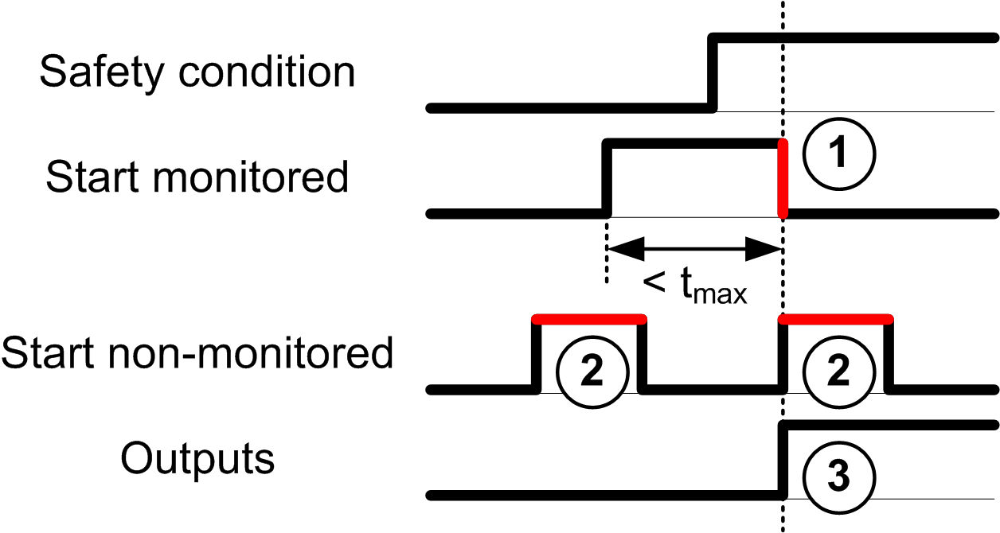
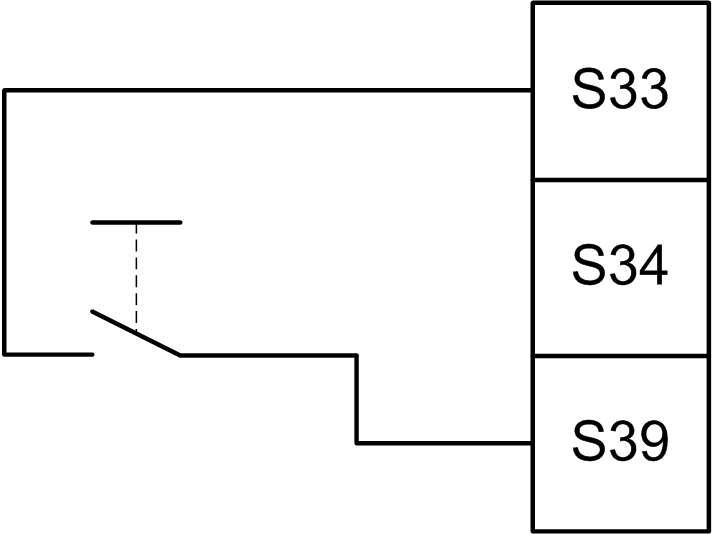
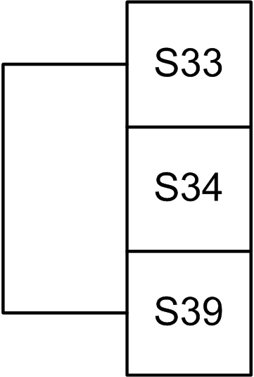
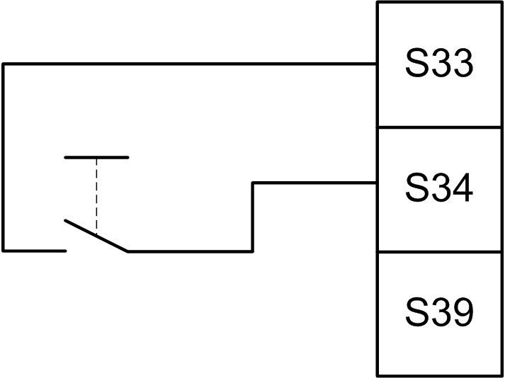

# Start

## Description

Two modes are available for the start functionality:

| Non-monitored start: | When non-monitored, the start mode can be:   * Manually controlled (conditioned by the input state) * Automatic (hardwired) |
| Monitored start: | When monitored, the start mode is manually controlled (conditioned by the input edge). |

This figure represents the events sequence for the two start modes available:

Events description:

1. Monitored start condition is triggered by a falling edge on the **start** input.
2. Non-monitored start condition is available as long as the **start** input is on.

   The start condition can be valid before the safety-related input.
3. The outputs get activated only if start + safety-related input conditions are valid.

NOTE: For a monitored start, the falling edge on the **start** input must appear within 20 seconds (± 5 seconds) after activation of the start input at nominal supply voltage.

Both the safety-related conditions and the start conditions must be valid before allowing the activation of outputs.

| WARNING | |
| --- | --- |
|  | UNINTENDED EQUIPMENT OPERATION  Do not use either the monitored start or the non-monitored start as a safety function.  Failure to follow these instructions can result in death, serious injury, or equipment damage. |

## Manual Non-Monitored Start

The start condition is valid when the **start** input is closed (start switch is pressed).

This figure represents how to connect a switch on a TM3 safety module to configure a manual non-monitored start:

## Automatic Start

There is no start interlock when automatic start is used. After a power cycle, the output behavior depends solely on the state of the inputs.

| WARNING | |
| --- | --- |
|  | UNINTENDED EQUIPMENT OPERATION  Do not use automatic start if a start interlock is required in your application after a power cycle.  Failure to follow these instructions can result in death, serious injury, or equipment damage. |

The module is in automatic start mode if the **start** input is permanently closed (hardwired).

This figure represents how to connect a switch on a TM3 safety module to configure an automatic start:

NOTE: There is no start interlock in automatic start after a power cycle.

## Monitored Start

In monitored start mode, the outputs are activated when:

* All required inputs are closed
* A falling edge is applied to the **start** input. A falling edge means that the start switch is pressed and released again.

At nominal supply voltage, the start switch must be released within 20 seconds (± 5 seconds) after it has been closed. The exact delay depends on supply voltage and ambient temperature.

This figure represents how to connect a switch on a TM3 safety module to configure a monitored start (when available on the module):

EIO0000003119.03