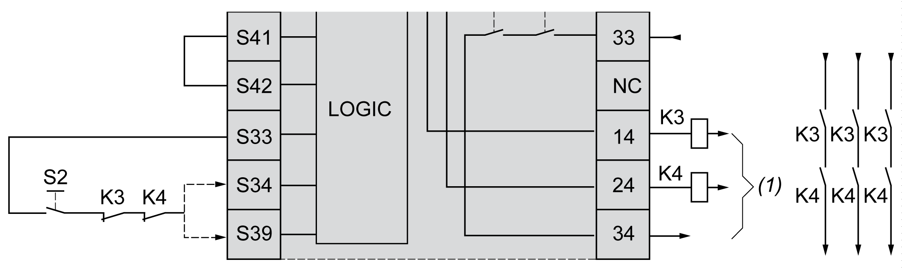
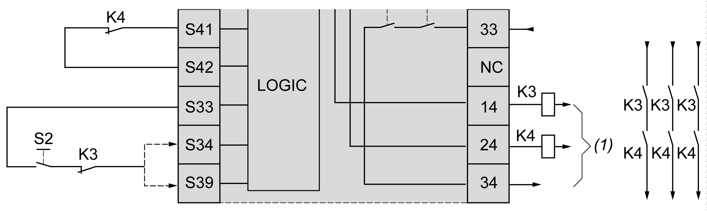

# External Device Monitoring (EDM)

## Description

External device monitoring functionality is used to help ensure that external contactors controlled by the safety module outputs are able to interrupt the safety-related circuit. This functionality is implemented by adding the external contactor feedback to the start condition of the safety module.

The external contactor must provide a feedback through a normally closed auxiliary contact forcibly guided by its normally open safety-related contact. The start condition is valid only when the external feedback (normally closed) is closed.

External device monitoring can be performed on:

* 1 channel.

  External feedback is provided to the start condition.
* 2 channels for short circuit detection.

  External feedback is provided to the start condition and to the **S4** input.

NOTE: The state of the external device is only monitored when the safety module is analyzing the start condition validity. When outputs are activated, the external device is not monitored.

## EDM Configuration With One Channel

This figure shows an example of 1 channel EDM with the external feedback (**K3** and **K4**) added to the start condition, and **S41** directly connected to **S42**:

**K3** External contactor with a normally closed feedback and normally open safety-related contact

**K4** External contactor with a normally closed feedback and normally open safety-related contact

**S2** Start switch

***(1)*** Safety-related outputs

## EDM Configuration With Two Channels

This figure shows an example of 2 channels EDM with one external feedback added to the start condition (**K3**), and the other feedback (**K4**) connected to **S41** and **S42**:

**K3** External contactor with a normally closed feedback and normally open safety-related contact

**K4** External contactor with a normally closed feedback and normally open safety-related contact

**S2** Start switch

***(1)*** Safety-related outputs

EIO0000003119.03