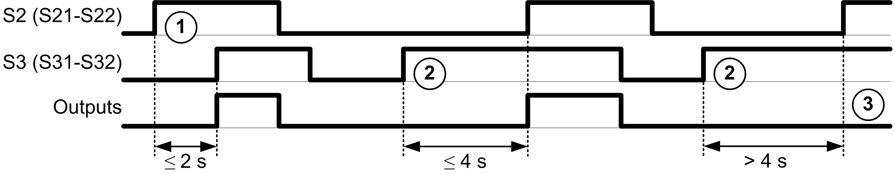

# Synchronization Time Monitoring for TM3SAK6R / TM3SAK6RG

## Description

The synchronization time monitoring is relevant for 2-channel applications. It monitors both inputs to determine that they are activated simultaneously (within a defined time). The synchronization time monitoring allows to detect a contact error (short-circuit) before the activation of the other input.

When the synchronization time monitoring is enabled, the outputs are allowed to be activated if both input S21-S22 and input S31-S32 are activated within 2 or 4 seconds. The defined time depends on which input is activated first as explained in the following figure. The outputs are not activated if the synchronization time is expired.

This figure represents the synchronization time monitoring chronogram on a TM3SAK6R• module in a 2-channel application:

Events description:

1. **S21-S22** operated before **S31-S32**
2. **S31-S32** operated before **S21-S22**
3. Outputs are not activated because the synchronization time is expired.

## Synchronization Time Monitoring Control

The synchronization time monitoring is enabled or disabled by the system controller through a communication with the safety module on the TM3 Bus.

The synchronization time monitoring is an additional feature that contributes to the safety-related system, but cannot itself provide for functional safety.

| WARNING | |
| --- | --- |
|  | INCORRECT USE OF THE INTERNAL SYNCHRONIZATION TIME CONDITION  Do not use the synchronization time monitoring to control safety-related operations.  Failure to follow these instructions can result in death, serious injury, or equipment damage. |

When enabled, the synchronization time is monitored by the module internal safety-related microcontroller.

In a 2-channel application, **S21-S22** and **S31-S32** simultaneous activation is monitored if `SyncOn` bit is set to 1.

EIO0000003119.03