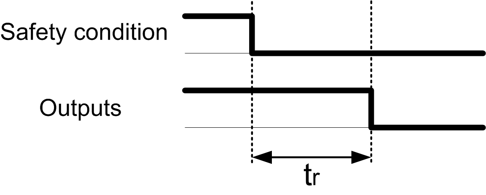

# Output Response Time

## Description

This figure represents the response time (tr) between the opening of one input (safety-related condition invalid) and all outputs deactivation:

NOTE: tr ≤ 20 ms

EIO0000003119.03