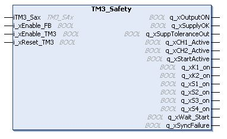

# TM3\_Safety: Control the TM3 Safety Module

## Overview

The TM3\_Safety function block is included in the TM3 Safety library.

The IEC Objects tab is only available if a function block instance of a device has been created, which can be accessed by the application. To access the IEC objects, double click the module node  > I/O Mapping tab.

## Graphical Representation

## I/O Variable Description

This table describes the input variables:

| Input | Type | Comment |
| --- | --- | --- |
| iTM3\_Sax | TM3\_SAx | Reference to the local TM3 safety modules. |
| i\_xEnable\_FB | BOOL | TRUE enables the function block. |
| i\_xEnable\_TM3 | BOOL | TRUE enables the activation of the hardware module outputs.  NOTE: Enable/disable i\_xEnable\_FB before enabling/disabling i\_xEnable\_TM3. |
| i\_xReset\_TM3 | BOOL | TRUE deactivates the module: the current source is switched off, the outputs are deactivated, and the interlock is reset. |

This table describes the output variables:

| Output | Type | Comment |
| --- | --- | --- |
| q\_xOutputON | BOOL | 0: safety-related output is off.  1: safety-related output is on. |
| q\_xSupplyOK | BOOL | Supply is available. |
| q\_xSuppToleranceOut | BOOL | Supply is out of tolerance. |
| q\_xCH1\_Active | BOOL | Channel 1 is active. |
| q\_xCH2\_Active | BOOL | Channel 2 is active. |
| q\_xStartActive | BOOL | Start is active. |
| q\_xK1\_on | BOOL | Relay K1 is activated. |
| q\_xK2\_on | BOOL | Relay K2 is activated. |
| q\_xS1\_on | BOOL | S1 is active. |
| q\_xS2\_on | BOOL | S2 is active. |
| q\_xS3\_on | BOOL | S3 is active. |
| q\_xS4\_on | BOOL | S4 is active. |
| q\_xWait\_Start | BOOL | Waiting for [start condition](D-SE-0038326.html#D-SE-0038326). |
| q\_xSyncFailure | BOOL | [Synchronization time expired](D-SE-0039071.html#D-SE-0039071). |

NOTE: Not all outputs are valid for all TM3 safety module references. To determine which outputs are valid for which TM3 safety module references, see the [I/O mapping for the individual references](D-SE-0045258.html#D-SE-0045258).

EIO0000003119.03