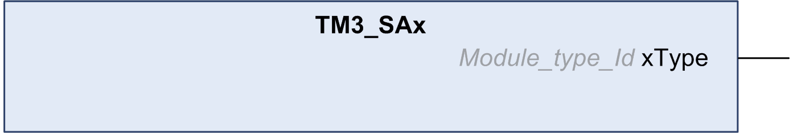

# TM3\_SAx: Get the name of the I/O

## Function Block Description

The TM3\_SAx function block gets the name of the I/O.

After you get the name of the I/O, TM3\_SAx  becomes an input parameter of the TM3\_Safety function block.

## Graphical Representation

EIO0000003119.03