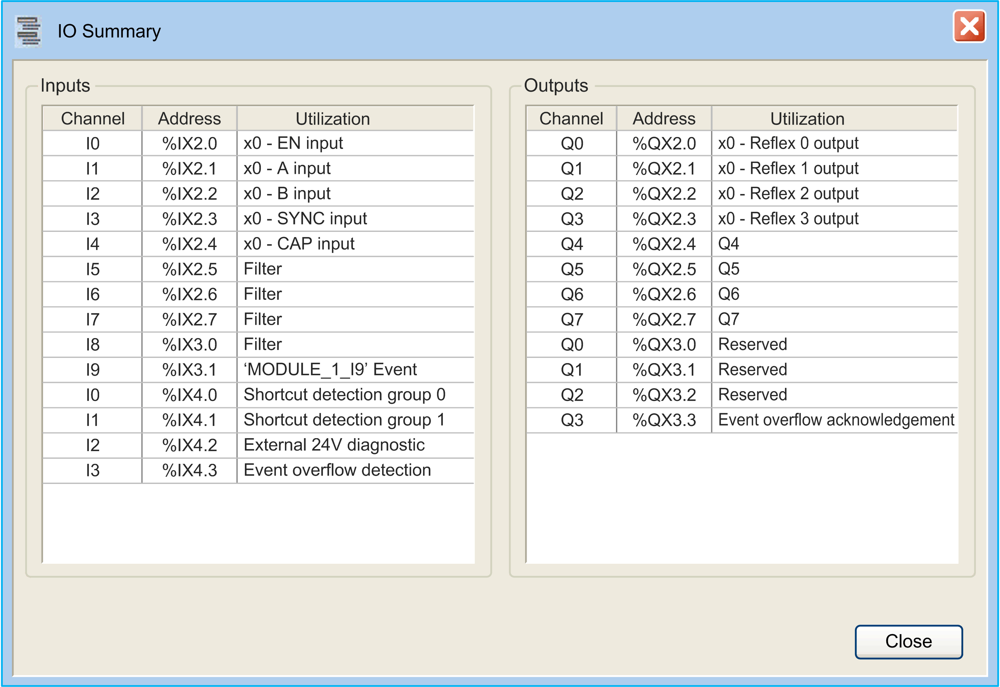

# Expert Functions Overview

## Introduction

The inputs and outputs available on TM3 HSC expansion modules can be configured to use High Speed Counter (HSC) expert functions.

I/O characteristics:

| I/O Type | TM3XFHSC202 | TM3XHSC202 |
| --- | --- | --- |
| Fast inputs | 10 | |
| Fast outputs | 8 | |
| External Events | 8 | None |

The HSC functions execute fast counts of pulses from sensors, switches, or other equipment connected to the fast inputs.

For more information about the HSC functions, refer to [High Speed Counter Types](D-SE-0094417.html#D-SE-0094417).

## Maximum Number of Expert Functions

The maximum number of expert functions that can be configured depends on the expert function type and number of [optional functions](D-SE-0006693.html#D-SE-0006693) configured. Refer to [I/O Assignment](#D-SE-0094414__D-SE-0094414.16). You can configure up to two HSC Main, and if you do not configure all the options, you can configure HSC Simple counters for those inputs that remain.

Maximum number of expert functions by TM3 reference:

| Expert Function Type | | TM3XFHSC202  TM3XHSC202 |
| --- | --- | --- |
| Total number of HSC functions | | 10 |
| HSC Simple | | 10 |
| HSC Main | Single Phase | 2 |
| Dual Phase |
| Frequency Meter |
| Period Meter |

The maximum number of expert functions possible is further limited by the number of inputs used by each expert function.

Example configurations:

* 10 HSC Simple on TM3XHSC202
* 2 HSC Main Single Phase with EN, CAP and SYNC configured + 2 HSC Simple

## Configuring an Expert Function

To configure an expert function, proceed as follows:

| Step | Description |
| --- | --- |
| 1 | Add a TM3 expert module to your configuration. |
| 2 | In the Devices tree, double-click MyController > IO\_Bus > Module\_x > Counters, where x is the module number.  **Result:** The Counters configuration window appears: |
| 3 | Double-click None in the Value column and choose the counter type to assign.  **Result:** The default configuration of the counter type appears when you click anywhere in the configuration window. |
| 4 | Configure the expert function parameters, as described in the following chapters. |
| 5 | To configure an additional expert function, click the + tab that appears when you have configured an expert function.  NOTE: If the maximum number of expert functions is already configured, a message appears at the bottom of the configuration window informing you that you can now add only HSC Simple functions. |

## I/O Configured as Expert Functions

When I/Os are configured as expert functions:

* I/O can be read through memory variables.
* Short-circuit management applies on the outputs. Status of outputs are available.
* When inputs are used in HSC expert functions, the integrator filter is replaced by an anti-bounce filter. The filter value is configured in the configuration screen.

I/Os that are not used by expert functions can be configured as regular I/Os.

## I/O Assignment

The following I/Os can be configured for use by expert functions:

|  | TM3XFHSC202  TM3XHSC202 |
| --- | --- |
| Inputs | 10 fast inputs (I0...I9) |
| Outputs | 8 fast outputs (Q0...Q7) |

NOTE: All I/Os are by default disabled in the configuration window.

The following table shows the I/Os that can be configured for expert functions:

| Expert Function | Name | Fast Input | Fast Output |
| --- | --- | --- | --- |
| HSC Simple | A input | M | – |
| HSC Main Single Phase | A input | M | – |
| HSC Main Dual Phase | A input  B input | M  M | –  – |
| Frequency Meter | A Input | M | – |
| Period Meter | A Input | M | – |
| Optional Functions | EN input | C | – |
| SYNC input | C | – |
| CAP input | C | – |
| Reflex 0 output | – | C |
| Reflex 1 output | – | C |
| Reflex 2 output | – | C |
| Reflex 3 output | – | C |
| **M** Mandatory  **C** Optionally configurable | | | |

## I/O Summary

The IO Summary window displays the I/Os and external events being used by the expert functions or the expansion modules.

To display the IO Summary window:

| Step | Action |
| --- | --- |
| 1 | In the Devices tree tab, right-click the Module\_x node and choose IO Summary. |

Example of IO Summary window:

EIO0000003683.02

© 2022

Schneider Electric.

All rights reserved.