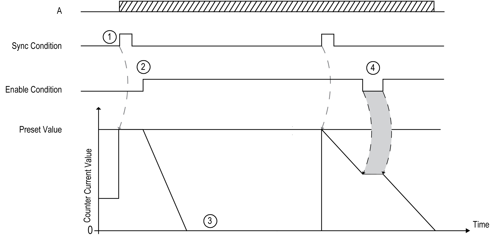

# One-shot Mode Principle Description

## Overview

The counter is activated by a synchronization edge, and the preset value is loaded.

When counting is enabled, each pulse applied to the input decrements the value. The counter stops when its value reaches 0.

The counter value remains at 0 even if new pulses are applied to the input.

A new synchronization is needed to activate the counter again.

## Principle Diagram

This table explains the stages from the preceding graphic:

| Stage | Action |
| --- | --- |
| 1 | On the rising edge of the Sync condition, the preset value is loaded in the counter (regardless of the value of the counter at the time) and the counter is initialized. |
| 2 | When the Enable condition = 1, the counter value decrements on each pulse on input A until it reaches 0. |
| 3 | The counter waits until the next rising edge of the Sync condition.  **Note:** At this point, pulses on input A have no effect on the counter. |
| 4 | When the Enable condition = 0, the counter ignores the pulses from input A and retains its value until the Enable condition again = 1. The counter resumes counting pulses from input A on the rising edge of the Enable input from the held value. |

NOTE: Enable and Sync conditions depends on configuration. These are described in the [Enable](D-SE-0006709.html#D-SE-0006709) and [Preset](D-SE-0007189.html#D-SE-0007189) function.

EIO0000003683.02

© 2022

Schneider Electric.

All rights reserved.