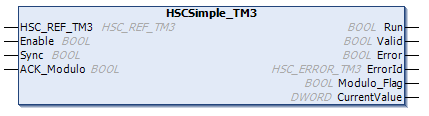

# Programming the Simple Type

## Overview

A Simple type is always managed by an `HSCSimple_TM3` function block.

NOTE: At build time, an error is detected if the `HSCSimple_TM3` function block is used to manage a different HSC type.

## Adding a HSCSimple Function Block

| Step | Description |
| --- | --- |
| 1 | Select the Libraries tab in the Software Catalog and click Libraries.  Select Intern > IODrivers > TM3 HSC > HSC > HSCSimple\_TM3 in the list. |
| 2 | Drag-and-drop the item onto the POU window. |
| 3 | Edit the default Simple type instance name to match the Instance name of the counter function block defined in the Configuration window. |

## I/O Variables Usage

The tables below describe how the different pins of the function block are used in Modulo-loop mode.

This table describes the input variables:

| Input | Type | Comment |
| --- | --- | --- |
| `HSC_REF_TM3` | `HSC_REF_TM3` | Reference to the HSC instance. |
| `Enable` | `BOOL` | `TRUE` = activates counter and takes into account pulses on the counter input. |
| `Sync` | `BOOL` | On rising edge, resets and initializes the counter. |
| `ACK_Modulo` | `BOOL` | On rising edge, resets `Modulo_Flag`. |

This table describes the output variables:

| Output | Type | Comment |
| --- | --- | --- |
| `Run` | `BOOL` | `TRUE` = indicates counter is activated. |
| `Valid` | `BOOL` | `TRUE` = indicates that output values on the function block are valid. |
| `Error` | `BOOL` | `TRUE` = indicates that an error was detected. |
| `ErrorId` | `HSC_ERROR_TM3` | Indicates the value of the error detected. See the `HSC_ERROR_TM3` enumeration. |
| `Modulo_Flag` | `BOOL` | Set to `TRUE` when the counter rolls over the `Modulo` value. |
| `CurrentValue` | `DWORD` | The value of the counter. |

EIO0000003683.02

© 2022

Schneider Electric.

All rights reserved.