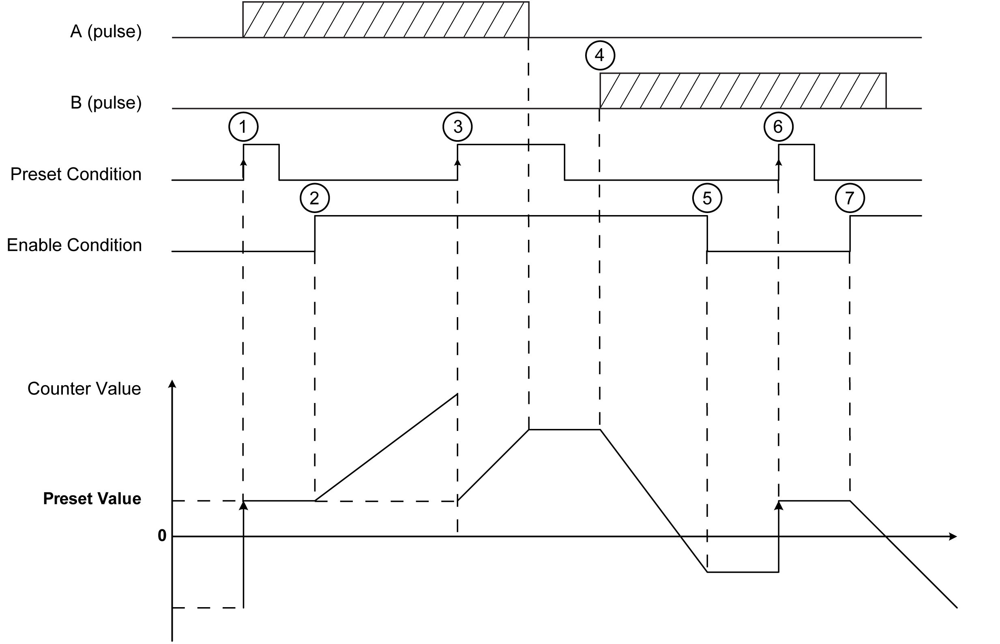

# Free-large Mode Principle Description

## Overview

The Free-large mode can be used for axis monitoring or labeling in cases where the incoming position of each part has to be known.

## Principle

In the Free-large mode, the module behaves like a standard up and down counter.

When counting is [enabled](D-SE-0006709.html#D-SE-0006709), the counter counts as follows in:

| Incrementing direction: | the counter increments. |
| Decrementing direction: | the counter decrements. |

The counter is activated by a preset edge which loads the preset value.

The current counter is stored in the capture register by using the [Capture](D-SE-0006698.html#D-SE-0006698) function.

If the counter reaches the counting limits, the counter will react according to the [Limits Management](D-SE-0007225.html#D-SE-0007225) configuration.

## Input Modes

This table shows the 8 types of input modes available:

| Input Mode | Comment |
| --- | --- |
| A = Up, B = Down | default mode  The counter increments on A and decrements on B. |
| A = Pulse, B = Direction | If there is a rising edge on A and B is true, then the counter decrements.  If there is a rising edge on A and B is false, then the counter increments. |
| Normal Quadrature X1 | A physical encoder always provides 2 signals 90° shift that first allows the counter to count pulses and detect direction:   * X1: 1 count for each Encoder cycle * X2: 2 counts for each Encoder cycle * X4: 4 counts for each Encoder cycle |
| Normal Quadrature X2 |
| Normal Quadrature X4 |
| Reverse Quadrature X1 |
| Reverse Quadrature X2 |
| Reverse Quadrature X4 |

## Up Down Principle Diagram

The figures shows the A = Up, B = Down mode:

| Stage | Action |
| --- | --- |
| 1 | On the rising edge of Preset condition, the counter value is set to the preset value and the counter is activated. |
| 2 | When Enable condition = 1, each pulse on A increment the counter value. |
| 3 | On the rising edge of Preset condition, the counter value is set to the preset value. |
| 4 | When Enable condition = 1, each pulse on B decrements the counter value. |
| 5 | When Enable condition = 0, the pulses on A or B are ignored. |
| 6 | On the rising edge of Preset condition, the counter value is set to the preset value. |
| 7 | When Enable condition = 1, the pulses on B decrements the counter value. |

## Quadrature Principle Diagram

The encoder signal is counted according to the input mode selected, as shown below:

EIO0000003683.02

© 2022

Schneider Electric.

All rights reserved.