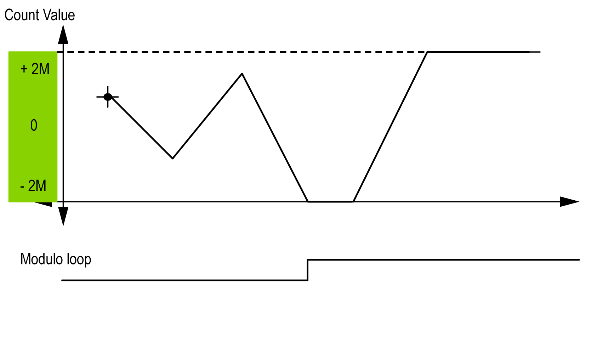
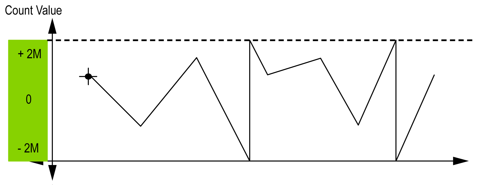

# Limits Management

## Overview

In Free-large mode, when the counter limit is reached, the counter can have 2 behaviors depending on configuration:

* Lock on limits
* Rollover

## Lock on Limits

In the case of an overflow or underflow counter, the counter value is maintained at the limit value, and the modulo loop value goes to 1.

2M value is given as:

* +2M = 2 (exp 31) -1
* -2M = -2 (exp 31)

## Rollover

In the case of overflow or underflow of the counter, the counter value goes automatically to the opposite limit value.

`Modulo_Flag` output is set to 1.

EIO0000003683.02

© 2022

Schneider Electric.

All rights reserved.