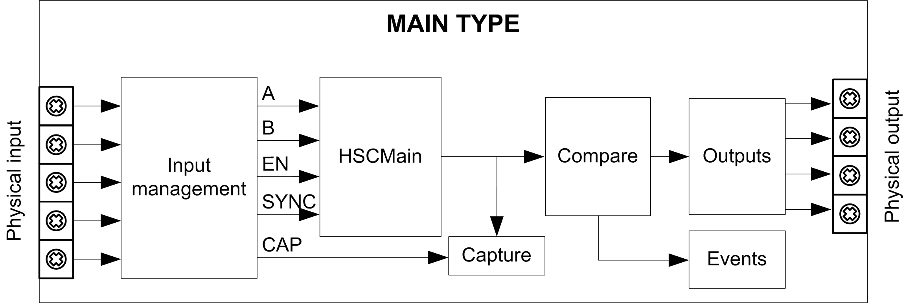

# Synopsis Diagram

## Synopsis Diagram

This diagram provides an overview of the Main type in Free-large mode:

A and B are the counting inputs of the counter.

EN is the enable input of the counter.

SYNC is the synchronization input of the counter.

CAP is the capture input of the counter.

## Optional Function

In addition to the Free-large mode, the Main type can provide the following functions:

* [Preset function](D-SE-0007189.html#D-SE-0007189)
* [Enable function](D-SE-0006709.html#D-SE-0006709)
* [Capture function](D-SE-0006698.html#D-SE-0006698)
* [Comparison function](D-SE-0006695.html#D-SE-0006695)

EIO0000003683.02

© 2022

Schneider Electric.

All rights reserved.