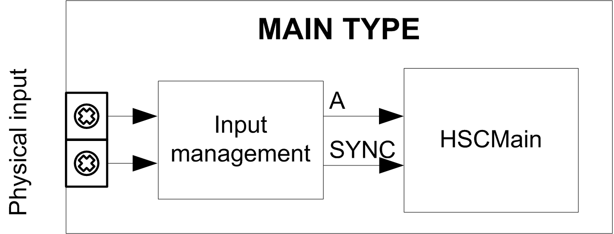

# Synopsis Diagram

## Synopsis Diagram

This diagram provides an overview of the Main type in Event Counting mode.

A is the counting input of the counter.

SYNC is the synchronization input of the counter.

## Optional Function

In addition to the Event Counting mode, the Main type provides the [Preset function](D-SE-0007189.html#D-SE-0007189).

EIO0000003683.02

© 2022

Schneider Electric.

All rights reserved.