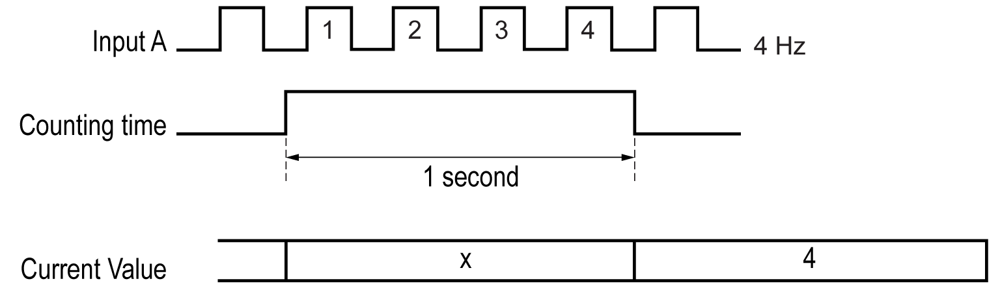

# Description

## Overview

The Frequency meter type measures an event frequency in Hz.

The Frequency meter type calculates the number of pulses in time intervals of 1 s. An updated value in Hz is available for each time base value (10, 100, or 1000 ms).

When there is a variation in the frequency, the value restoration time is 1 s with a value precision of 1 Hz.

## Operation Limits

The maximum frequency that the module can measure on the A input is 200 kHz. Beyond 200 kHz, the counting register value may decrease until it reaches 0.

The maximum duty cycle at 200 kHz is 55%.

## Synopsis Diagram

This diagram provides an overview of the Frequency meter principle:

EIO0000003683.02

© 2022

Schneider Electric.

All rights reserved.