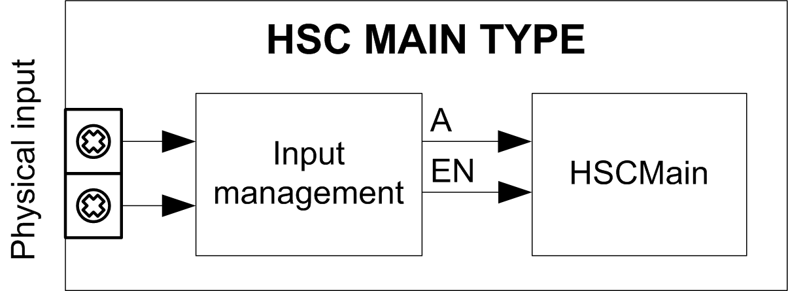

# Synopsis Diagram

## Synopsis Diagram

This diagram provides an overview of the Main type in Frequency meter type:

A is the counting input of the counter.

EN is the enable input of the counter.

## Optional Function

In addition to the Frequency meter type, the Main type can provide the [Enable function](D-SE-0006709.html#D-SE-0006709).

EIO0000003683.02

© 2022

Schneider Electric.

All rights reserved.