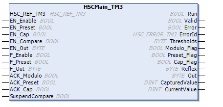

# Programming

## Overview

The Main type is always managed by an `HSCMain_TM3` function block.

NOTE: At build time, an error is detected if the `HSCMain_TM3` function block is used to manage a different HSC type.

## Adding the HSCMain Function Block

| Step | Description |
| --- | --- |
| 1 | Select the Libraries tab in the Software Catalog and click Libraries.  Select Intern > IODrivers > TM3 HSC > HSC > HSCMain\_TM3 in the list. |
| 2 | Drag-and-drop the item onto the POU window. |
| 3 | Edit the default Main type instance name to match the Instance name of the counter function block defined in the Configuration window. |

## I/O Variables Usage

The tables below describe how the different pins of the function block are used in Frequency meter type.

This table describes the input variables:

| Input | Type | Description |
| --- | --- | --- |
| `HSC_REF_TM3` | `HSC_REF_TM3` | Reference to the HSC instance. |
| `EN_Enable` | `BOOL` | If `TRUE` and the EN input is configured, authorizes the counter to be enabled using the [Enable input](D-SE-0006709.html#D-SE-0006709). |
| `EN_Preset` | `BOOL` | Not used. |
| `EN_Cap` | `BOOL` | Not used. |
| `EN_Compare` | `BOOL` | Not used. |
| `EN_Out` | `BYTE` | Not used. |
| `F_Enable` | `BOOL` | `TRUE` = activates counter and takes into account pulses on the counter input. |
| `F_Preset` | `BOOL` | On rising edge, restarts the internal timer relative to the time base. The `CurrentValue` is not preset. |
| `F_Out` | `BYTE` | Not used. |
| `ACK_Modulo` | `BOOL` | Not used. |
| `ACK_Preset` | `BOOL` | On rising edge, resets `Preset_Flag`. |
| `ACK_Cap` | `BOOL` | Not used. |
| `SuspendCompare` | `BOOL` | Not used |

This table describes the output variables:

| Outputs | Type | Comment |
| --- | --- | --- |
| `Run` | `BOOL` | `TRUE` = counter is activated. |
| `Valid` | `BOOL` | Set to `TRUE` when `CurrentValue` is valid. |
| `Error` | `BOOL` | `TRUE` = indicates that an error was detected. |
| `ErrorId` | `HSC_ERROR_TM3` | Indicates the value of the error detected. See the `HSC_ERROR_TM3` enumeration. |
| `Thresholds` | `BYTE` | Not used. |
| `Modulo_Flag` | `BOOL` | Not used. |
| `Preset_Flag` | `BOOL` | Set to 1 by the [preset of the counter](D-SE-0007189.html#D-SE-0007189) |
| `Cap_Flag` | `BOOL` | Not used. |
| `Reflex` | `BYTE` | Not used. |
| `Out` | `BYTE` | Not used. |
| `CapturedValue` | `DINT` | Not used. |
| `CurrentValue` | `DINT` | The value of the counter. |

EIO0000003683.02

© 2022

Schneider Electric.

All rights reserved.