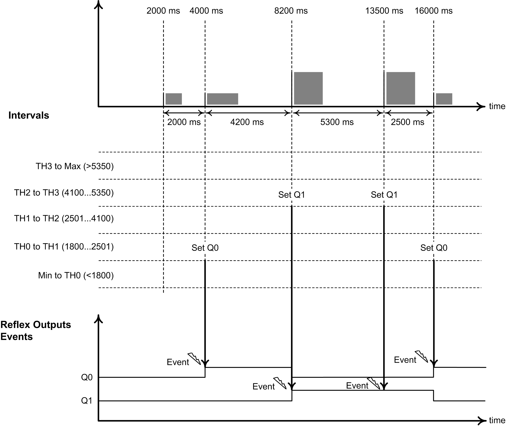

# Description

## Overview

Use the Period meter type to:

* Determine the duration of an event
* Determine the time between two events
* Set and measure the execution time for a process.

The Period meter can be used in two ways:

* Edge to opposite: Allows measurement of the duration of an event.
* Edge to edge: Allows measurement of the time between two events.

The measurement is expressed in the units defined by the Resolution parameter (0.1 µs, 1 µs, 100 µs, 1000 µs).

For example, if the counter value = 100 and the Resolution parameter is:

| 0.0001 (0.1 µs) | measurement = 0.01 ms |
| 0.001 (1 µs) | measurement = 0.1 ms |
| 0.1 (100 µs) | measurement = 10 ms |
| 1 (1000 µs) | measurement = 100 ms |

A timeout value can be specified in the configuration screen. Measurement is stopped if this timeout value is exceeded. In this case, the counting register is not valid until the next complete measurement.

The timeout value is defined in the same user-defined units (Resolution) as the measurement. When the timeout is set to 0, the timeout value is set to the maximum value.

## Edge to Opposite Mode

The Edge to Opposite mode measures the duration of an event.

When the Enable condition = 1, the measurement is taken between the rising edge and the falling edge of the A input. The counting register is updated as soon as the falling edge is detected.

## Edge to Edge Mode

The Edge to Edge mode measures the elapsed time between two events.

When the Enable condition = 1, the measurement is taken between two rising edges of the A input. The counting register is updated as soon as the second rising edge is detected.

## Enable Condition Interruption Behavior

The trend diagram below describes the behavior of the counting register when the Enable condition is interrupted:

## Threshold, Event, and Reflex Output Behavior

The values of up to 4 defined thresholds can be compared to the counter value and additional actions taken.

Reflex outputs can be set or reset when the counter value is:

* Below the smallest threshold value
* Between two threshold values
* Above the largest threshold value.

(TM3XF• expansion modules only) External events can be triggered when the counter value is:

* Below any threshold value
* Above any threshold value.
* Between two adjacent threshold values

This figure shows an example in Edge to Edge mode with 4 thresholds configured. Events are triggered and 2 reflex outputs activated (Q0 and Q1) when the measured value is between two threshold values:

## Operating Limits

This table shows the equivalent measurement duration for each configurable Resolution:

| Resolution | Max. Duration |
| --- | --- |
| 0.1 µs | 85,899 s |
| 1 µs | 429,496 s |
| 100 µs | 4,294,967 s |
| 1000 µs | 4,294,967 s |

This table shows the maximum timeout value for each configurable Resolution:

| Resolution | Max. Timeout Value |
| --- | --- |
| 0.1 µs | 858,993,459 |
| 1 µs | 429,496,729 |
| 100 µs | 42,949,672 |
| 1000 µs | 4,294,967 |

EIO0000003683.02

© 2022

Schneider Electric.

All rights reserved.