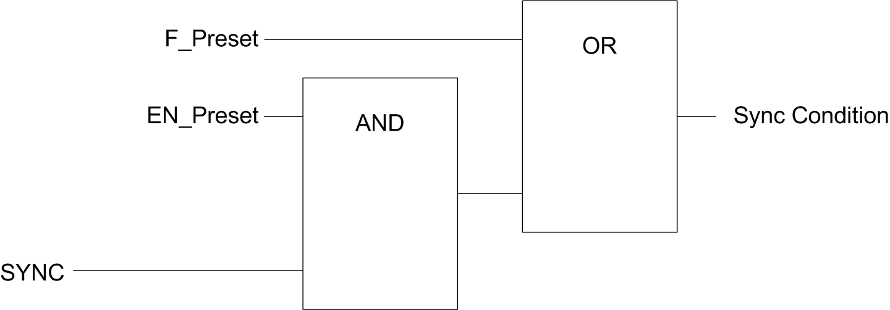

# Preset Function

## Overview

The preset function is used to set/reset the counter operation.

The preset function authorizes counting function, synchronization, and start in the following counting modes:

* One shot counter: preset and start the counter
* Free-large counter: preset and start the counter
* Modulo-loop counter: reset and start the counter
* Event counting: restart the internal time base at the beginning

NOTE: Sync condition for a Simple HSC type corresponds to the function block input `Sync`.

## Description

This function is used to synchronize the counter depending on the status and the configuration of the optional SYNC physical input and the function block inputs `F_Preset` and `EN_Preset`.

This diagram illustrates the Sync conditions of the HSC:

**EN\_Preset** input of the HSC function block

**F\_Preset** input of the HSC function block

**SYNC** physical input SYNC

The function block output `Preset_Flag` is set 1 when the Sync Condition is reached.

Either of the following events trigger the capturing of the Sync Condition:

* Rising edge of the `F_Preset` input
* Rising edge, falling edge, or rising and falling edge, of the SYNC physical input (if the SYNC input is configured, and the `EN_Preset` input is TRUE).

## Configuration

This procedure describes how to configure a preset function:

| Step | Action |
| --- | --- |
| 1 | In the Devices tree, double-click MyController > IO\_Bus > Module\_x > Counters. |
| 2 | Set the value of the Counting function parameter to HSC Main Single Phase or HSC Main Dual Phase. |
| 3 | Select the value of the Control inputs > SYNC input > Location parameter. |
| 4 | Select the value of the Control inputs > SYNC input > Filter parameter. |
| 5 | Select the value of the Control inputs > SYNC input > Preset condition parameter to specify the transition type of the SYNC physical input:   * SYNC Rising. Rising edge of the SYNC input * SYNC Falling. Falling edge of the SYNC input * SYNC Both. Both edges of the SYNC input |

EIO0000003683.02

© 2022

Schneider Electric.

All rights reserved.